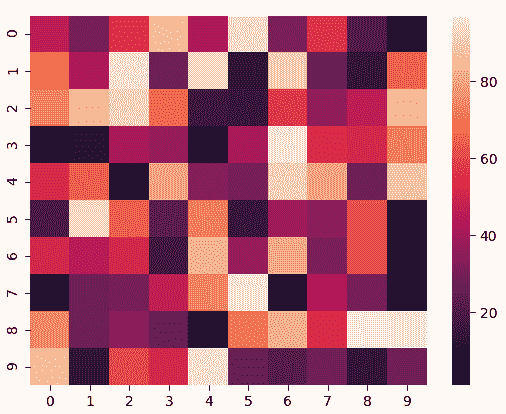
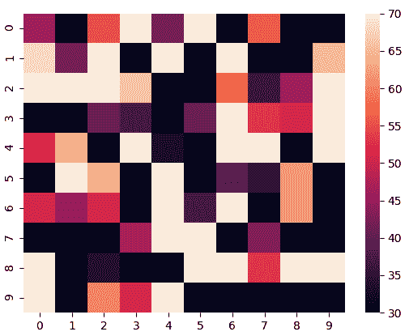
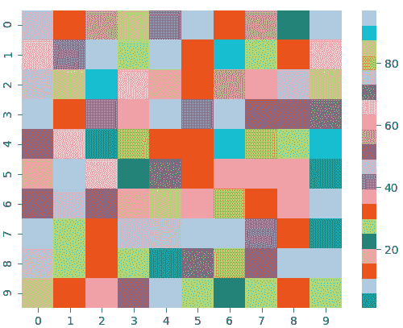

# 海伯恩热图–综合指南

> 原文:[https://www . geesforgeks . org/seaborn-heat map-a-综合-指南/](https://www.geeksforgeeks.org/seaborn-heatmap-a-comprehensive-guide/)

**热图**定义为使用颜色可视化矩阵值的数据图形表示。在这种情况下，为了表示更常见的值或更高的活动，使用更亮的颜色，基本上是红色，为了表示不太常见的值或活动值，更暗的颜色是优选的。热图也由阴影矩阵的名称定义。可以使用 seaborn.heatmap()函数绘制 Seaborn 中的热图。

### seaborn.heatmap()

> **语法:** seaborn.heatmap( *data* 、 *** 、 *vmin=None* 、 *vmax=None* 、 *cmap=None* 、 *center=None* 、*annt _ kws = None*、*线宽=0* 、 *linecolor='white'* 、
> 
> ***重要参数:***
> 
>  **   **数据:**可以强制到数组中的 2D 数据集。
> *   **vmin** 、 **vmax:** 值来锚定颜色映射，否则它们是从数据和其他关键字参数中推断出来的。
> *   **cmap:** 从数据值到颜色空间的映射。
> *   **中心:**绘制发散数据时颜色图的中心值。
> *   **注释:**如果为真，则在每个单元格中写入数据值。
> *   **fmt:** 添加注释时使用的字符串格式代码。
> *   **线宽:**将划分每个单元格的线条宽度。
> *   **线条颜色:**将划分每个单元格的线条的颜色。
> *   **cbar:** 是否绘制彩条。
> 
> 除数据之外的所有参数都是可选的。
> 
> **返回:【matplotlib.axes. _ 子图类型的对象。AxesSubplot***

*让我们用例子来理解热图。*

### *基本热图*

*用默认参数制作热图。我们将使用 NumPy 模块的[**【randint()**](https://www.geeksforgeeks.org/random-sampling-in-numpy-randint-function/)功能创建一个 10×10 的二维数据。*

## *蟒蛇 3*

```
*# importing the modules
import numpy as np
import seaborn as sn
import matplotlib.pyplot as plt

# generating 2-D 10x10 matrix of random numbers
# from 1 to 100
data = np.random.randint(low = 1,
                         high = 100,
                         size = (10, 10))
print("The data to be plotted:\n")
print(data)

# plotting the heatmap
hm = sn.heatmap(data = data)

# displaying the plotted heatmap
plt.show()*
```

***输出:***

```
*The data to be plotted:

[[46 30 55 86 42 94 31 56 21  7]
[68 42 95 28 93 13 90 27 14 65]
[73 84 92 66 16 15 57 36 46 84]
[ 7 11 41 37  8 41 96 53 51 72]
[52 64  1 80 33 30 91 80 28 88]
[19 93 64 23 72 15 39 35 62  3]
[51 45 51 17 83 37 81 31 62 10]
[ 9 28 30 47 73 96 10 43 30  2]
[74 28 34 26  2 70 82 53 97 96]
[86 13 60 51 95 26 22 29 14 29]]* 
```

**

*我们将在所有示例中使用相同的数据。*

### *锚定颜色映射*

*如果我们将 **vmin** 值设置为 30，将 **vmax** 值设置为 70，那么将只显示值在 30 和 70 之间的单元格。这被称为锚定颜色图。*

## *蟒蛇 3*

```
*# importing the modules
import numpy as np
import seaborn as sn
import matplotlib.pyplot as plt

# generating 2-D 10x10 matrix of random numbers
# from 1 to 100
data = np.random.randint(low=1,
                         high=100,
                         size=(10, 10))

# setting the parameter values
vmin = 30
vmax = 70

# plotting the heatmap
hm = sn.heatmap(data=data,
                vmin=vmin,
                vmax=vmax)

# displaying the plotted heatmap
plt.show()*
```

***输出:***

**

### *选择颜色图*

*在此，我们将查看 **cmap** 参数。Matplotlib 为我们提供了多种颜色的地图，你可以在这里查看所有的[。在我们的例子中，我们将使用**标签 20** 。](https://matplotlib.org/3.1.0/tutorials/colors/colormaps.html)*

## *蟒蛇 3*

```
*# importing the modules
import numpy as np
import seaborn as sn
import matplotlib.pyplot as plt

# generating 2-D 10x10 matrix of random numbers
# from 1 to 100
data = np.random.randint(low=1,
                         high=100,
                         size=(10, 10))

# setting the parameter values
cmap = "tab20"

# plotting the heatmap
hm = sn.heatmap(data=data,
                cmap=cmap)

# displaying the plotted heatmap
plt.show()*
```

***输出:***

**

### *彩色地图居中*

*通过将**中心**参数作为 0，将 cmap 中心化为 0。*

## *蟒蛇 3*

```
*# importing the modules
import numpy as np
import seaborn as sn
import matplotlib.pyplot as plt

# generating 2-D 10x10 matrix of random numbers
# from 1 to 100
data = np.random.randint(low=1,
                         high=100,
                         size=(10, 10))

# setting the parameter values
cmap = "tab20"
center = 0

# plotting the heatmap
hm = sn.heatmap(data=data,
                cmap=cmap,
                center=center)

# displaying the plotted heatmap
plt.show()*
```