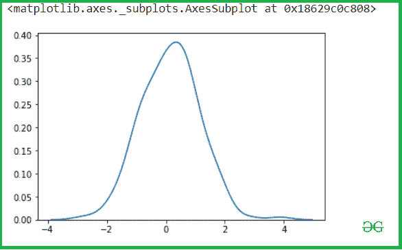
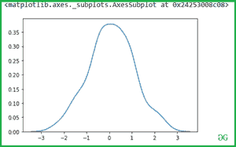
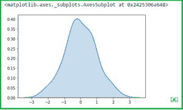
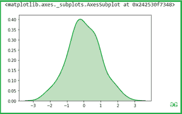
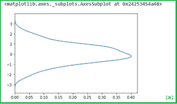

# Seaborn Kdeplot–综合指南

> 原文:[https://www . geesforgeks . org/seaborn-kdeplot-a-综合-指南/](https://www.geeksforgeeks.org/seaborn-kdeplot-a-comprehensive-guide/)

**核密度估计(KDE)图**和 Kdeplot 允许我们从一个或多个维度的数据集曲线中估计连续或非参数的概率密度函数，这意味着我们可以为多个样本创建单个图，这有助于更有效的数据可视化。

为了使用 Seaborn 模块，我们需要使用以下命令安装该模块:

```py
pip install seaborn

```

> **语法:**seaborn . kdeplot(x =无，* y =无，垂直=假，调色板=无，**kwargs)
> 
> **参数:**
> 
> **x，y :** 数据中的向量或键
> 
> **垂直:**布尔型(真或假)
> 
> **数据:**熊猫。DataFrame、numpy.ndarray、映射或序列

**我们通过一些具体的例子来学习一些参数的用法:**

首先导入相应的库

## 蟒蛇 3

```py
import pandas as pd
import seaborn as sb
import numpy as np
from matplotlib import pyplot as plt
%matplotlib inline
```

### **画一个简单的一维 kde 图像:**

让我们看看我们的变量 x 轴和 y 轴的 Kde，所以让我们把 x 变量传递给 kdeplot()方法。

## 蟒蛇 3

```py
# data x and y axis for seaborn
x= np.random.randn(200)
y = np.random.randn(200)

# Kde for x var
sns.kdeplot(x)
```

**输出:**



然后检查 y 轴后。

## 蟒蛇 3

```py
sns.kdeplot(y)
```

**输出:**



### **使用阴影填充曲线覆盖的区域:**

我们可以用阴影来突出曲线所覆盖的区域。如果为真，阴影处理将在 kde 曲线下方的区域执行，颜色控制曲线和阴影的颜色

## 蟒蛇 3

```py
sns.kdeplot(x, shade = True)
```

**输出:**



您可以使用**颜色**属性更改阴影颜色:

## 蟒蛇 3

```py
sns.kdeplot(x, shade = True , color = "Green")
```

**输出:**



### **使用垂直绘制表示是在 X 轴还是在 Y 轴上绘制**

## 蟒蛇 3

```py
sns.kdeplot(x, vertical = True)
```

**输出:**



### **两个变量的二元 Kdeplot:**

简单地将这两个变量传递给 seaborn.kdeplot()方法。

## 蟒蛇 3

```py
sns.kdeplot(x,y)
```