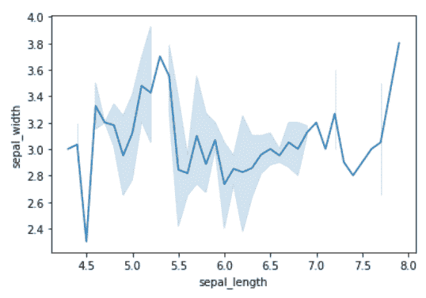
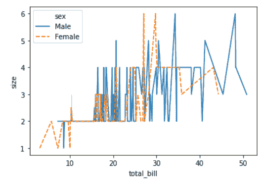

# Python 中的 seaborn.lineplot()方法

> 原文:[https://www . geesforgeks . org/seaborn-line plot-in-method-python/](https://www.geeksforgeeks.org/seaborn-lineplot-method-in-python/)

[Seaborn](https://www.geeksforgeeks.org/plotting-graph-using-seaborn-python/) 是基于 [matplotlib](https://www.geeksforgeeks.org/python-introduction-matplotlib/) 的 Python 数据可视化库。它提供了一个高级界面，用于绘制吸引人且信息丰富的统计图形。颜色突出，各层很好地融合在一起，轮廓贯穿始终，整体包装不仅具有良好的美学品质，而且也为我们提供了有意义的见解。

## seaborn.lineplot()

用几个语义分组的可能性画一个线图。使用色调、大小和样式参数，可以显示不同数据子集的 x 和 y 之间的关系。这些参数控制使用什么视觉语义来识别不同的子集。通过使用所有三种语义类型，可以独立显示多达三个维度，但是这种风格的情节很难解释，并且通常是无效的。使用冗余语义(即同一变量的色调和样式)有助于使图形更易于访问。

> **语法:**SNS . line plot(x =无，y =无，色相=无，大小=无，样式=无，数据=无，调色板=无，色相 _ 顺序=无，色相 _ 范数=无，大小=无，大小 _ 顺序=无，大小 _ 范数=无，破折号=真，标记=无，样式 _ 顺序=无，单位=无，估计器= '均值'，ci=95，n_boot=1000，排序=真，err_style='band '，err _ kws =无，图例
> 
> **参数:**
> 
> **x，y:** 输入数据变量；必须是数字。可以直接传递数据或引用数据中的列。
> 
> **色调:**将产生不同颜色线条的分组变量。可以是分类的，也可以是数字的，尽管颜色映射在后一种情况下会有不同的表现。
> 
> **样式:**分组变量，将产生具有不同破折号和/或标记的线条。可以有数字数据类型，但将始终被视为分类数据类型。
> 
> **数据:**整齐的(“长格式”)数据帧，其中每一列是一个变量，每一行是一个观察值。
> 
> **标记:**确定如何为不同级别的样式变量绘制标记的对象。
> 
> **图例:**如何绘制图例。如果“简短”，数字“色调”和“大小”变量将以均匀间隔的值的样本表示。

下面是上述方法的实现，并附有一些例子:

**例 1:**

## 蟒蛇 3

```
# importing packages
import seaborn as sns
import matplotlib.pyplot as plt

# loading dataset
data = sns.load_dataset("iris")

# draw lineplot
sns.lineplot(x="sepal_length", y="sepal_width", data=data)
plt.show()
```

**输出:**



**例 2 :**

## 蟒蛇 3

```
# importing packages
import seaborn as sns
import matplotlib.pyplot as plt

# loading dataset
data = sns.load_dataset("tips")

# draw lineplot
# hue by sex
# style to hue
sns.lineplot(x="total_bill", y="size",
             hue="sex", style="sex",
             data=data)

plt.show()
```

**输出:**

