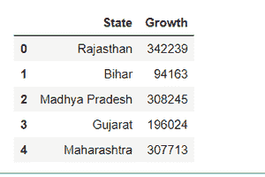

# 海鸟–在条形图中对酒吧进行分类

> 原文:[https://www.geeksforgeeks.org/seaborn-sort-bars-in-barplot/](https://www.geeksforgeeks.org/seaborn-sort-bars-in-barplot/)

**先决条件:** [海伯恩](https://www.geeksforgeeks.org/introduction-to-seaborn-python/)[酒吧地块](https://www.geeksforgeeks.org/barplot-using-seaborn-in-python/)

在本文中，我们将看到如何使用 python 中的 Seaborn 对 barplot 中的酒吧进行排序。

*Seaborn* 是一个神奇的可视化库，用于在 Python 中绘制统计图形。它提供了漂亮的默认样式和调色板，使统计图更有吸引力。它建立在 [matplotlib](https://www.geeksforgeeks.org/python-introduction-matplotlib/) 库的基础上，也与[熊猫](https://www.geeksforgeeks.org/introduction-to-pandas-in-python/)的数据结构紧密结合。

### **进场:**

*   导入模块。
*   创建*数据框。*
*   创建一个*条形图*。
*   用*数据框排序*数据框*列。*
*   将排序*数据框*显示到*条形图*中。

### **那么，让我们实现使用 seaborn 在 barplot 中对条形图进行排序，步骤基于上述方法。**

**第一步:**进口所需包裹。

## 蟒蛇 3

```py
# Import module
import pandas as pd
import numpy as np
import matplotlib.pyplot as plt
import seaborn as sns
```

**第二步:**创建*数据框*创建*条形图*。

## 蟒蛇 3

```py
# Initialize data
State = ["Rajasthan", "Bihar", "Madhya Pradesh",
         "Gujarat", "Maharashtra"]
growth = [342239, 94163, 308245, 196024, 307713]

# Create a pandas dataframe
df = pd.DataFrame({"State": State,
                   "Growth": growth})

# Display Dataframe
df
```

**输出:**



**步骤 3:** 用这个*数据框*创建一个*条形图*。

## 蟒蛇 3

```py
# make barplot
sns.barplot(x='State', y="Growth", data=df)
```