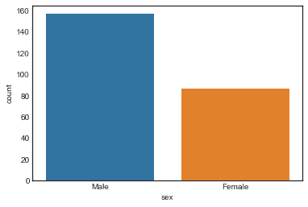
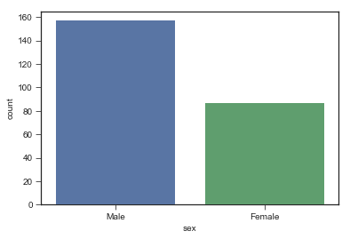
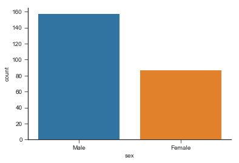
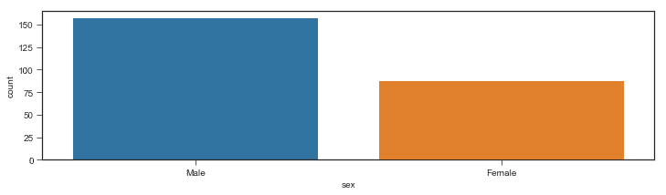
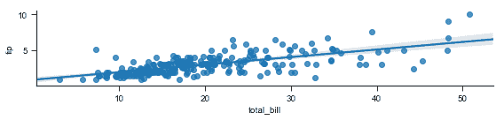
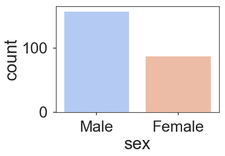

# 海鸟|款式和颜色

> 原文:[https://www.geeksforgeeks.org/seaborn-style-and-color/](https://www.geeksforgeeks.org/seaborn-style-and-color/)

Seaborn 是 python 中的一个统计绘图库。它有漂亮的默认样式。本文讨论了如何在海边设计不同类型的地块。

## 海鸟体形风格

这会影响轴的颜色、网格是否默认启用以及其他美学元素。

**造型主题的方式如下:**

*   白色
*   黑暗
*   白色网格
*   暗网格
*   滴答声

**设置背景为白色:**

在 countplot 的帮助下给定样式，默认情况下数据集出现在 seaborn 中。load_dataset()函数用于加载数据集。set_style()函数用于打印样式。

## 蟒蛇 3

```py
import seaborn as sns
import matplotlib.pyplot as plt

# load the tips dataset present by default in seaborn
tips = sns.load_dataset('tips')
sns.set_style('white')

# make a countplot
sns.countplot(x ='sex', data = tips)
```

**输出:**



**将背景设置为刻度:**

将地块设定为 set_style 时，地块的两侧会出现记号(“记号”)。调色板属性用于设置条的颜色。它有助于区分数据块。

## 蟒蛇 3

```py
import seaborn as sns
import matplotlib.pyplot as plt

tips = sns.load_dataset('tips')
sns.set_style('ticks')
sns.countplot(x ='sex', data = tips, palette = 'deep')
```

**输出:**



**设置背景为暗格:**

当设置为 set_style('darkgrid ')时，Darkgrid 会出现在绘图的侧面。调色板属性用于设置条的颜色。它有助于区分数据块。

## 蟒蛇 3

```py
import seaborn as sns
import matplotlib.pyplot as plt

# load the tips dataset present by default in seaborn
tips = sns.load_dataset('tips')
sns.set_style('darkgrid')

# make a countplot
sns.countplot(x ='sex', data = tips)
```

**输出:**


**设置背景为白格子:**

当设置为 set_style('白色网格')时，白色网格会出现在绘图的侧面。调色板属性用于设置条的颜色。它有助于区分数据块。

## 蟒蛇 3

```py
import seaborn as sns
import matplotlib.pyplot as plt

# load the tips dataset present by default in seaborn
tips = sns.load_dataset('tips')
sns.set_style('whitegrid')

# make a countplot
sns.countplot(x ='sex', data = tips)
```

**输出:**


## 移除轴刺

**despine()** 是默认情况下从图的右侧和上部移除刺的功能。sns.despine(左= True)有助于从左侧移除脊柱。

## 蟒蛇 3

```py
import seaborn as sns
import matplotlib.pyplot as plt

tips = sns.load_dataset('tips')
sns.countplot(x ='sex', data = tips)
sns.despine()
```

输出



## 尺寸和外观

**非网格图:**图形()是一个 matplotlib 函数，用于绘制图形。figsize 用于设置图形的大小。

## 蟒蛇 3

```py
import seaborn as sns
import matplotlib.pyplot as plt

tips = sns.load_dataset('tips')
plt.figure(figsize =(12, 3))
sns.countplot(x ='sex', data = tips)
```

**输出:**



**网格类型图:**此示例显示了来自数据集的 tips 与 total_bill 的回归图。lmplot 代表线性模型图，用于创建回归图。x ='total_bill '将 x 轴设置为 total_bill。y='tip '将 y 轴设置为 tips。size=2 用于表示地块的大小(高度)。aspect 用于设置宽度，保持宽度不变。

## 蟒蛇 3

```py
import seaborn as sns
import matplotlib.pyplot as plt

tips = sns.load_dataset('tips')
sns.lmplot(x ='total_bill', y ='tip', size = 2, aspect = 4, data = tips)
```

**输出:**



## 规模和背景

**set_context()** 允许我们覆盖默认参数。这会影响标签、线条和其他情节元素的大小，但不会影响整体风格。

上下文为:

*   海报
*   纸
*   笔记本
*   讨论

**示例 1:** 使用海报。

## 蟒蛇 3

```py
import seaborn as sns
import matplotlib.pyplot as plt

tips = sns.load_dataset('tips')
sns.set_context('poster', font_scale = 2)
sns.countplot(x ='sex', data = tips, palette ='coolwarm')
```

**输出:**



**例 2:** 用纸。

## 蟒蛇 3

```py
import seaborn as sns
import matplotlib.pyplot as plt

tips = sns.load_dataset('tips')
sns.set_context('paper', font_scale = 2)
sns.countplot(x ='sex', data = tips, palette = 'coolwarm')
```