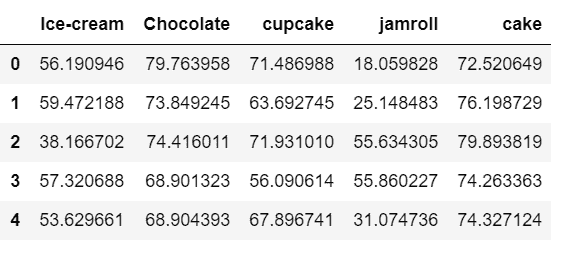

# 用 Python 中的 Seaborn 对箱线图进行平均排序

> 原文:[https://www . geesforgeks . org/sort-box plot-by-mean-with-seaborn-in-python/](https://www.geeksforgeeks.org/sort-boxplot-by-mean-with-seaborn-in-python/)

[Seaborn](https://www.geeksforgeeks.org/introduction-to-seaborn-python/) 是一个神奇的可视化库，用于在 Python 中绘制统计图形。它提供了漂亮的默认样式和调色板，使统计图更有吸引力。它建立在 [matplotlib](https://www.geeksforgeeks.org/python-introduction-matplotlib/) 库的基础上，也与[熊猫](https://www.geeksforgeeks.org/introduction-to-pandas-in-python/)的数据结构紧密结合。
**箱线图**是通过四分位数描绘数字数据组的视觉表示。Boxplot 也用于检测数据集中的异常值。它通过一个简单的方框和触须高效地捕获数据摘要，并允许我们轻松地跨组进行比较。Boxplot 使用第 25、50 和 75 个百分位数汇总样本数据。这些百分位数也被称为下四分位数、中位四分位数和上四分位数。

有时，我们希望根据自己的需要订购箱型图。订购箱型图的方法有很多，包括:

*   手动绘制箱线图的顺序
*   使用平均值对箱线图进行排序

在本文中，我们将讨论如何使用均值对箱线图进行排序。

### **什么样的箱线图使用平均值？**

当我们有多个组时，建议手动使用均值或中位数排序，这将很难排序。

#### 逐步方法:

*   导入库

## 蟒蛇 3

```
# import required modules
import numpy as np
import pandas as pd
import seaborn as sns
import matplotlib.pyplot as plt
```

*   创建数据集

## 蟒蛇 3

```
# creating dataset
df = pd.DataFrame({
    'Ice-cream': np.random.normal(57, 5, 100),
    'Chocolate': np.random.normal(73, 5, 100),
    'cupcake': np.random.normal(68, 8, 100),
    'jamroll': np.random.normal(37, 10, 100),
    'cake': np.random.normal(76, 5, 100),

})
df.head()
```

**输出:**



*   在对箱线图进行排序之前绘制数据。

## 蟒蛇 3

```
# plot th data into boxplot

sns.boxplot(data=df)

# Label x-axis
plt.xlabel('Desserts')

# labels y-axis
plt.ylabel('preference of people')
```