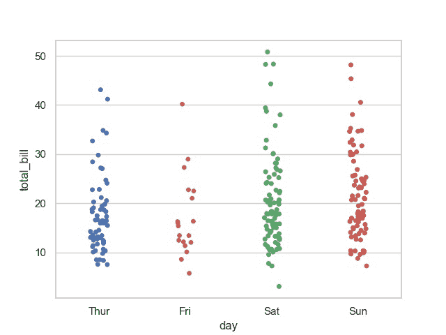
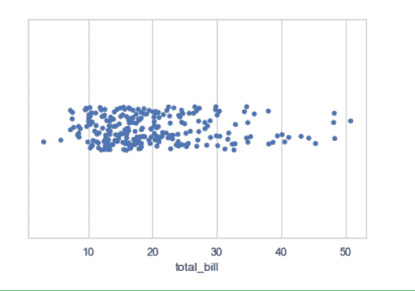

# 使用蟒蛇皮的剥离批次

> 原文:[https://www . geesforgeks . org/strippelot-use-seaborn-in-python/](https://www.geeksforgeeks.org/stripplot-using-seaborn-in-python/)

[**Seaborn**](https://www.geeksforgeeks.org/introduction-to-seaborn-python/) 是一个用 Python 进行统计图形绘制的惊人可视化库。它提供了漂亮的默认样式和调色板，使统计图更有吸引力。它建立在 matplotlib 库的基础上，也与熊猫的数据结构紧密结合。

### 带状图

带状图是单独绘制的。当所有的观测值都与一些潜在分布的表示一起显示时，它是箱线图或紫外图的一个很好的补充。它用于根据类别绘制散点图。

> **语法:**seaborn . strippelot(*，x =无，y =无，色相=无，数据=无，顺序=无，色相 _ 顺序=无，抖动=真，减淡=假，方向=无，颜色=无，调色板=无，大小=5，边缘颜色= '灰色'，线宽=0，ax =无，**kwargs)
> 
> **参数:**
> 
> *   **x，y，色调:**用于绘制长格式数据的输入。
> *   **数据:**用于绘图的数据集。
> *   **顺序:**是在中绘制分类级别的顺序。
> *   **颜色:**它是所有元素的颜色，或者是渐变调色板的种子
> 
> **返回:**该方法返回绘制了绘图的坐标轴对象。

**示例:**使用 stripplot()对“tips”数据集进行基本可视化

## 蟒蛇 3

```
import seaborn
import matplotlib.pyplot as plt

seaborn.set(style = 'whitegrid')  
tip = seaborn.load_dataset("tips")  

seaborn.stripplot(x="day", y="total_bill", data=tip)

plt.show()
```

**输出:**



## **使用剥离图**绘制单个水平条带图

如果我们只使用一个数据变量，而不是两个数据变量，那么这意味着轴将这些数据变量表示为一个轴。

x 表示 x 轴，y 表示 y 轴。

**语法:**

```
seaborn.stripplot(x)
```

**代码:**

## 蟒蛇 3

```
# Python program to illustrate
# Stripplot using inbuilt data-set
# given in seaborn

# importing the required module
import seaborn
import matplotlib.pyplot as plt

# use to set style of background of plot
seaborn.set(style = 'whitegrid')

# loading data-set
tips = seaborn.load_dataset("tips")
seaborn.stripplot(x=tips["total_bill"])
```

**输出:**



## **使用抖动参数**绘制带状图

抖动可用于提供沿水平轴的位移，这在有大簇数据点时非常有用。您可以指定抖动量(统一随机变量支持宽度的一半)，或者使用“真”作为良好的默认值。

**语法:**

> seaborn . stripe lot(x，y，数据，抖动)

**代码:**

## 蟒蛇 3

```
# Python program to illustrate
# Stripplot using inbuilt data-set
# given in seaborn

# importing the required module
import seaborn
import matplotlib.pyplot as plt

# use to set style of background of plot
seaborn.set(style = 'whitegrid')

# loading data-set
tips = seaborn.load_dataset("tips")

seaborn.stripplot(x="day", y="total_bill", data=tips, jitter=0.1)
```