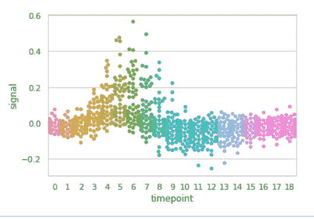
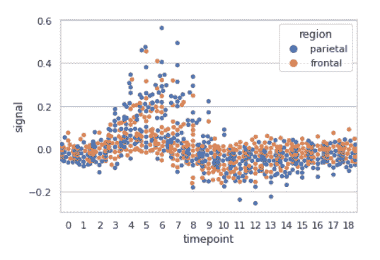
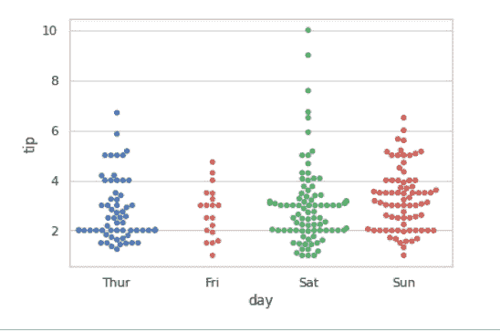

# 使用 Python 中的 Seaborn 进行群集绘图

> 原文:[https://www . geesforgeks . org/swarm plot-use-seaborn-in-python/](https://www.geeksforgeeks.org/swarmplot-using-seaborn-in-python/)

Seaborn 是一个用 Python 绘制统计图形的惊人可视化库。它提供了漂亮的默认样式和调色板，使统计图更有吸引力。它建立在 matplotlib 库的顶部，也与熊猫的数据结构紧密结合。

## 群体图

Seaborn swarmplot 可能类似于 stripplot，只是调整了点，因此不会相互重叠，因为这有助于更好地表示值的分布。群体图可以单独绘制，但它也是对盒子的一个很好的补充，因为相关的名称将被用来注释轴。这种情节有时被称为“蜂群”。

> **语法:**seaborn . swarmplot(x =无，y =无，色相=无，数据=无，顺序=无，色相 _ 顺序=无，减淡=假，方向=无，颜色=无，调色板=无，大小=5，边缘颜色= '灰色'，线宽=0，ax =无，**kwargs)
> 
> **参数:**
> **x，y，色相:**用于绘制长格式数据的输入。
> **数据:**用于绘图的数据集。
> **颜色:**所有元素的颜色
> **大小:**标记的半径，以磅为单位。

**示例 1:** 使用 swarmplot()
对“fmri”数据集进行基本可视化

## 蟒蛇 3

```py
import seaborn

seaborn.set(style='whitegrid')
fmri = seaborn.load_dataset("fmri")

seaborn.swarmplot(x="timepoint",
                  y="signal",
                  data=fmri)
```

**输出:**



**例 2:** 根据类别对数据点进行分组，这里是区域和事件。

## 蟒蛇 3

```py
import seaborn

seaborn.set(style='whitegrid')
fmri = seaborn.load_dataset("fmri")

seaborn.swarmplot(x="timepoint",
                  y="signal",
                  hue="region",
                  data=fmri)
```

**输出:**



**示例 3:** 使用群图()对“tips”数据集进行基本可视化

## 蟒蛇 3

```py
import seaborn

seaborn.set(style='whitegrid')
tip = seaborn.load_dataset('tips')

seaborn.swarmplot(x='day', y='tip', data=tip)
```

**输出:**



## 将不同属性的变量分组

**1。仅使用一个轴绘制单个水平群体图:**

如果我们只使用一个数据变量，而不是两个数据变量，那么这意味着轴将这些数据变量表示为一个轴。

x 表示 x 轴，y 表示 y 轴。

**语法:**

```py
seaborn.swarmplot(x)

```

## 蟒蛇 3

```py
# Python program to illustrate
# swarmplot using inbuilt data-set
# given in seaborn

# importing the required module
import seaborn

# use to set style of background of plot
seaborn.set(style="whitegrid")

# loading data-set
tips = seaborn.load_dataset("tips")

seaborn.swarmplot(x=tips["total_bill"])
```