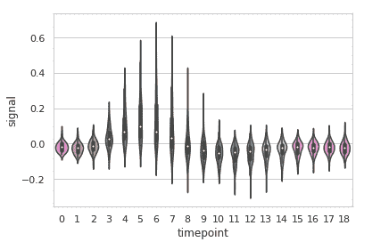
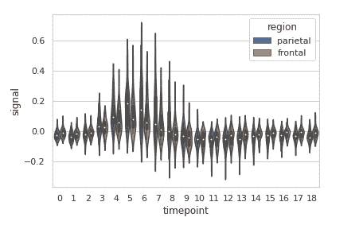
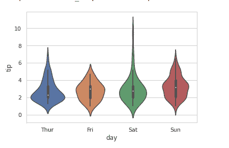
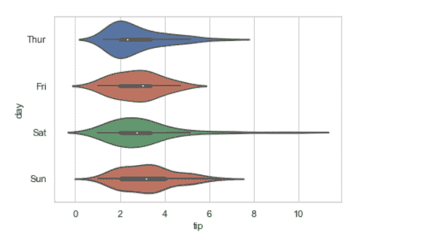

# 使用 Python 中的 Seaborn 的 Violinplot】

> 原文:[https://www . geeksforgeeks . org/violinplot-using-seaborn-in-python/](https://www.geeksforgeeks.org/violinplot-using-seaborn-in-python/)

[**Seaborn**](https://www.geeksforgeeks.org/introduction-to-seaborn-python/) 是一个用 Python 进行统计图形绘制的惊人可视化库。它提供了漂亮的默认样式和调色板，使统计图更有吸引力。它建立在 matplotlib 库的顶部，也与熊猫的数据结构紧密结合。

## 小提琴情节

一个小提琴情节扮演一个类似的活动，通过触须或方块情节进行。因为它显示了一个或多个分类变量的若干定量数据。在几个单元显示多个数据可能是一种有效且有吸引力的方式。“宽格式”数据框有助于维护可以在图表上绘制的每个数字列。可以使用 NumPy 或 Python 对象，但熊猫对象更好，因为相关名称将用于注释轴。

> **语法:**seaborn . violinplot(x =无，y =无，色相=无，数据=无，顺序=无，色相 _ 顺序=无，bw='scott '，cut=2，scale='area '，scale_hue=True，gridsize=100，width=0.8，inner='box '，split=False，dodge=True，orient =无，线宽=无，color =无，调色板=无，饱和度=0.75，ax =无，**kwargs)
>  ****数据:**用于绘图的数据集。
> **比例:**用来缩放每把小提琴宽度的方法。**

**返回:**该方法返回绘制了绘图的坐标轴对象。
**示例 1:** 使用 violinplot()
对“fmri”数据集进行基本可视化

## 蟒蛇 3

```
import seaborn

seaborn.set(style = 'whitegrid')
fmri = seaborn.load_dataset("fmri")

seaborn.violinplot(x ="timepoint",
             y ="signal",
             data = fmri)
```

**输出:**



**例 2:** 根据类别对数据点进行分组，这里是区域和事件。

## 蟒蛇 3

```
import seaborn

seaborn.set(style = 'whitegrid')
fmri = seaborn.load_dataset("fmri")

seaborn.violinplot(x ="timepoint",
             y ="signal",
             hue ="region",
             style ="event",
             data = fmri)
```

**输出:**



**示例 3:** 使用 lineplot()
对“tips”数据集进行基本可视化

## 蟒蛇 3

```
import seaborn

seaborn.set(style = 'whitegrid') 
tip = seaborn.load_dataset('tips')

seaborn.violinplot(x ='day', y ='tip', data = tip)
```

**输出:**



## 将 Seaborn violinplot 中具有不同属性的变量分组:

**1。** **仅使用一个轴绘制单个水平蜂群图:**

如果我们只使用一个数据变量，而不是两个数据变量，那么这意味着轴将这些数据变量表示为一个轴。

x 表示 x 轴，y 表示 y 轴。

**语法:**

```
seaborn.violinplot(x)

```

**代码:**

## 蟒蛇 3

```
# Python program to illustrate
# violinplot using inbuilt data-set
# given in seaborn

# importing the required module
import seaborn

# use to set style of background of plot
seaborn.set(style="whitegrid")

# loading data-set
tips = seaborn.load_dataset("tips")

seaborn.violinplot(x=tip["total_bill"])
```

**输出:**


**2。** **画横小提琴:**

在上面的例子中，我们看到了如何绘制一个单水平小提琴图，这里可以执行多个水平图，用另一个轴交换数据变量。

## 蟒蛇 3

```
# Python program to illustrate
# violinplot using inbuilt data-set
# given in seaborn

# importing the required module
import seaborn

# use to set style of background of plot
seaborn.set(style="whitegrid")

# loading data-set
tips = seaborn.load_dataset("tips")

seaborn.violinplot(x="tip", y="day", data=tip)
```

**输出:**



**3。使用色调参数:**

虽然点是以二维绘制的，但是可以通过根据第三个变量给点着色来将另一个维度添加到图中。

**语法:**

> sns.violinplot(x，y，色调，数据)

## 蟒蛇 3

```
# Python program to illustrate
# violinplot using inbuilt data-set
# given in seaborn

# importing the required module
import seaborn

# use to set style of background of plot
seaborn.set(style="whitegrid")

# loading data-set
tips = seaborn.load_dataset("tips")

seaborn.violinplot(x="day", y="total_bill", hue="time", data=tips)
```