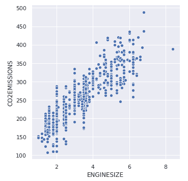
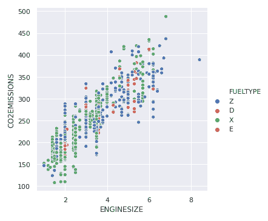
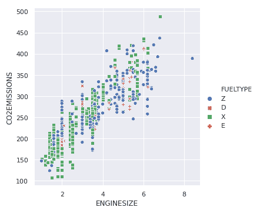
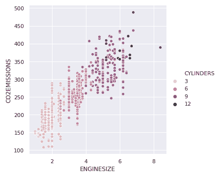
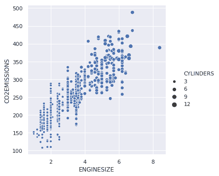

# 用海伯恩散点图可视化变量之间的关系

> 原文:[https://www . geeksforgeeks . org/visualizing-变量之间的关系-带散点图的海洋生物/](https://www.geeksforgeeks.org/visualizing-relationship-between-variables-with-scatter-plots-in-seaborn/)

为了理解数据集中的变量如何相互关联，以及这种关系如何依赖于其他变量，我们执行统计分析。这种统计分析有助于可视化趋势并识别数据集中的各种模式。在 Seaborn 中可以用来得到两个变量之间关系的函数之一是 **`relplot()`** 。

Relplot()将 FacetGrid 与两个轴级函数 **[【散点图】(](https://www.geeksforgeeks.org/scatterplot-using-seaborn-in-python/)** 和 **[lineplot()](https://www.geeksforgeeks.org/lineplot-using-seaborn-in-python/)** 中的任何一个结合在一起。散点图是 relplot()的默认类型。利用这一点，我们可以通过点云来可视化两个变量的联合分布。我们可以用各种方法在海底绘制散点图。最常见的是当两个变量都是数字时。

**示例:**我们来看一个数据集的示例，该数据集由不同车辆的二氧化碳排放数据组成。要获取数据集，请单击此处。

```
# import libraries
import pandas as pd
import numpy as np
import matplotlib.pyplot as plt
import seaborn as sns

# set grid style
sns.set(style ="darkgrid")

# import dataset
dataset = pd.read_csv('FuelConsumption.csv')
```

让我们绘制基本散点图，以可视化目标变量“二氧化碳排放量”和“发动机尺寸”之间的关系

```
sns.relplot(x ="ENGINESIZE", y ="CO2EMISSIONS",
            data = dataset);
```

**输出:**


我们可以通过向图中添加另一个维度来再添加一个可视化变量。这可以通过使用“色调”来完成，它给第三个变量的点着色，从而给它添加一个意义。

```
sns.relplot(x ="ENGINESIZE", y ="CO2EMISSIONS", 
            hue ="FUELTYPE", data = dataset);
```

**输出:**


为了突出显示不同的类，我们可以添加标记样式

```
sns.relplot(x ="ENGINESIZE", y ="CO2EMISSIONS",
            hue ="FUELTYPE", style ="FUELTYPE", 
            data = dataset);
```

**输出:**


在前面的例子中，色调语义是一个分类变量，所以它有一个默认的定性调色板。但是如果我们使用数字变量而不是分类变量，那么使用的默认调色板是顺序的，也可以修改。

```
sns.relplot(x ="ENGINESIZE", y ="CO2EMISSIONS",
            hue ="CYLINDERS", data = dataset);
```

**输出:**


我们还可以改变第三个变量的点数。

```
sns.relplot(x ="ENGINESIZE", y ="CO2EMISSIONS", 
            size ="CYLINDERS", data = dataset);
```

**输出:**
