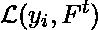
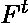
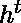
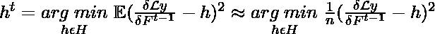
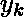
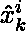
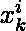
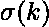

# cat boost–ml

> 哎哎哎:# t0]https://www . geeksforgeeks . org/cat boost-ml/

**梯度提升**是一种集成机器学习算法，通常用于解决分类和回归问题。它易于使用，可以很好地处理异构数据，甚至相对较小的数据。它本质上是从众多弱学习者中创造出一个强学习者。

**CatBoost** 或者分类 boosting 是 Yandex 开发的开源 Boosting 库。除了回归和分类，CatBoost 还可以用于排名、推荐系统、预测甚至个人助理。

现在，梯度增强采用加法形式，在给定损失函数的情况下，它以贪婪的方式迭代构建一系列近似。这里我们要强调的是，损失函数有两个输入值，i 第预期输出值 y i ，以及估计 y i 的 t 第函数 F t 。假设我们已经构造了函数 F t ，我们可以通过找到另一个函数来改进我们对 y i 的估计，其中是步长，函数是从函数族 H 中选择的基本预测值，以便最小化预期损失。也就是。通过使用泰勒近似或负梯度来接近最小化，例如。CatBoost 对这种梯度增强技术进行了改进。

假设有一个包含 n 个样本的数据集 D。每个样本在向量 x 中具有 m 组特征，以及实值目标 y

#### 处理分类特征:

数据集通常包含分类特征，并且有各种技术来处理增强树中的分类特征。与其他梯度增强算法(需要数字数据)不同，CatBoost **自动处理分类特征**。处理分类数据的最常见的技术之一是热编码，但是它在许多特性下变得不可行。为了解决这一问题，特征按照目标统计数据按类别分组(估计每个类别的目标值)。目标统计可以用不同的方法计算:贪婪、坚持、遗漏一个和有序。CatBoost 使用**命令** **进行目标统计。**

贪婪方法对一个类别组的目标取平均值。但是它受到目标泄漏的影响，因为目标值被用于计算分类变量的表示，然后使用这些特征进行预测(使用目标计算)。保持方法试图通过分割训练数据集来减少这种情况。但这大大降低了训练数据的有效利用。漏掉一个排除了目标样本，但不是很有效。有序目标统计受到在线学习算法的启发，在线学习算法及时地按顺序获得训练样本。它引入了人工时间，即训练实例的随机排列。它将仅依赖于过去遇到的训练示例(在人工时间内，样本出现在特定样本之前)，从而避免目标泄漏。

数学上，D 的第 k 个元素的第 I 个分类变量的目标估计可以表示为，

，其中 a > 0

当 CatBoost 输入向量 x 的 i 第分量 j 等于输入向量 x 的 i 第分量 k 时，指示器功能取值 1。这里我们使用 k 作为第 k 个元素，按照我们用随机排列放在 D 上的顺序，我取整数值 1 到 k-1。参数 a 和 p(先验)避免了方程的欠流。if 条件确保在对值进行编码时，在计算 x i 的值时排除 y k 的值。该技术还确保使用每个示例的所有可用过去来计算其目标统计数据，从而对分类变量进行编码。

#### 有序升压

梯度增强算法通常有过度收敛的趋势。由于集成是在同一数据集上基于基础学习者迭代构建的，因此会影响模型的泛化能力。

当我们使用有序目标统计来编码分类变量时，损失函数 L 相对于函数 F t-1 的偏导数(梯度)也是随机变量，因为我们使用随机排列来选择 D k 的元素来编码影响 F t-1 值的分类变量。因此，在我们用特定编码为计算的情况下，梯度的分布可以移动。这种条件偏移导致我们对 h t 的估计出现偏差，并对我们在评估数据上的 F t-1 时获得的指标产生负面影响，我们在训练时没有使用这些指标。这种对 F t-1 的影响被称为其泛化能力，这个问题被称为**预测偏移**。

CatBoost 引入了有序升压来避免这个问题。在有序增强中，执行训练示例的随机排列，并维护 n 个不同的支持模型(仅使用排列中的第一个 *i* 样本训练第 i 个模型)，并且在每个步骤，通过使用先前的模型残差来获得残差/误差。但是这是不可行的，因为数据是有限的，并且维护不同模型的内存要求太高。

因此，CatBoost 出于实用目的使用了一种变体。在这个变体中，所有模型共享一个树结构(分割特征序列)。也就是说，CatBoost 使用确定有序目标统计量的同一个 D k 作为确定结构或拟合决策树 h t 的数据，并使用完整的数据集 D 作为评估 h t 是否是最小化预期损失的决策树的数据。它使用多个置换来计算它可以用来找到 h 的多组剩余值，以获得 F t-1 ，并保持保证没有的值被用来计算梯度的值。从而减小梯度估计的方差(损失函数的变化率)并避免预测偏移。

#### **CatBoost 优势**

*   CatBoost 实现了不经意决策树(二叉树，其中相同的特征用于对树的每个级别进行左右拆分)，从而将每个级别拆分的特征限制为一个，这有助于减少预测时间。
*   它通过有序的目标统计有效地处理分类特征。
*   它很容易与 R 和 Python 中的包一起使用。
*   它可以有效地使用默认参数，从而减少参数调整所需的时间。

#### **参考文献:**

[papers.nips.cc/paper/2018](https://papers.nips.cc/paper/2018/file/14491b756b3a51daac41c24863285549-Paper.pdf)