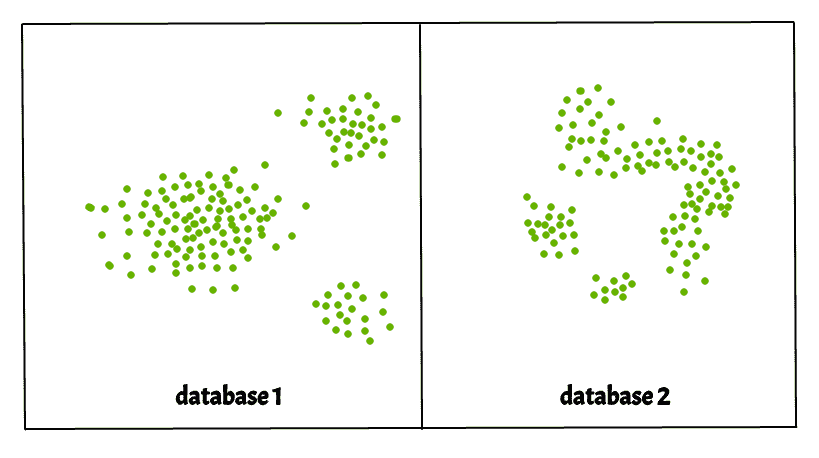
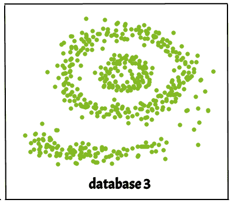
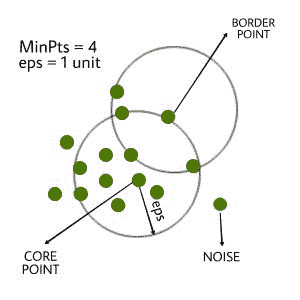
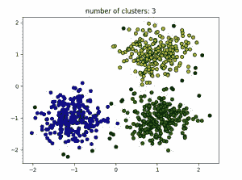
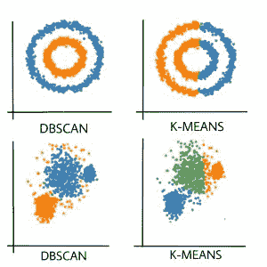
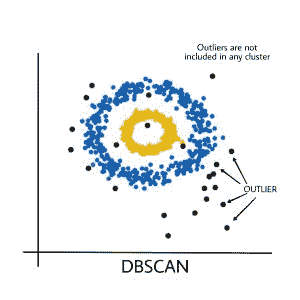

# ML 中的 DBSCAN 聚类|基于密度的聚类

> 原文:[https://www . geesforgeks . org/db scan-clustering-in-ml-density-based-clustering/](https://www.geeksforgeeks.org/dbscan-clustering-in-ml-density-based-clustering/)

聚类分析或简称为 Clustering，基本上是一种无监督的学习方法，将数据点分成若干特定的批次或组，使得同一组中的数据点具有相似的属性，而不同组中的数据点在某种意义上具有不同的属性。它包括许多基于差分进化的不同方法。
例如 K-Means(点与点之间的距离)、亲和传播(图距离)、Mean-shift(点与点之间的距离)、DBSCAN(最近点之间的距离)、高斯混合(到中心的马氏距离)、谱聚类(图距离)等。

基本上，所有的聚类方法都使用相同的方法，即首先我们计算相似性，然后我们使用它将数据点聚类成组或批次。这里我们将重点介绍**基于密度的应用空间聚类与噪声** (DBSCAN)聚类方法。

聚类是数据空间中的密集区域，由点密度较低的区域隔开。 ***DBSCAN 算法*** 就是基于这种“集群”和“噪声”的直观概念。关键思想是，对于一个簇的每个点，给定半径的邻域必须包含至少最小数量的点。



**为什么是 DBSCAN？**
划分方法(K-means，PAM 聚类)和层次聚类用于寻找球形聚类或凸形聚类。换句话说，它们只适用于紧凑且分离良好的集群。此外，它们还受到数据中噪声和异常值的严重影响。

现实生活中的数据可能包含不规则性，例如:

1.  集群可以是任意形状，如下图所示。
2.  数据可能包含噪音。



下图显示了包含非凸聚类和异常值/噪声的数据集。给定这样的数据，k-means 算法难以识别这些具有任意形状的聚类。
**DBSCAN 算法需要两个参数:**

1.  **eps** :定义数据点周围的邻域，即如果两点之间的距离小于或等于“eps”，则认为它们是邻居。如果 eps 值选择得太小，那么大部分数据将被视为异常值。如果选择非常大，那么集群将合并，并且大多数数据点将在相同的集群中。找到 eps 值的一种方法是基于 ***k 距离图*** 。
2.  **最小点**:EPS 半径内的最小邻居数(数据点)。数据集越大，必须选择更大的 MinPts 值。一般来说，最小最小点可以从数据集中的维数 D 导出，最小点> = D+1。最小值必须至少选择 3。

> **在这个算法中，我们有 3 类数据点。**
> **核心点**:一个点在 eps 内超过 MinPts 点就是一个核心点。
> **边界点:eps 中小于最小点的点，但它在核心点附近。
> **噪声或异常值**:不是核心点或边界点的点。**

****

 ****DBSCAN 算法可以抽象为以下步骤:****

1.  **找到 eps 中的所有邻居点，并确定核心点或访问过的 MinPts 邻居。**
2.  **对于每个核心点(如果尚未分配给集群)，创建一个新集群。**
3.  **递归地找出它所有的密度连通点，并把它们分配到与核心点相同的簇中。如果存在一个点 *c* ，该点在其相邻点中具有足够数量的点，并且该点 *a* 和 *b* 都在 *eps 距离*内，则该点 *a* 和 *b* 被称为密度连通。这是一个链接过程。所以，如果 *b* 是 *c* 的邻居， *c* 是 *d* 的邻居， *d* 是 *e* 的邻居，而后者又是 *a* 的邻居，就意味着 *b* 是 *a* 的邻居。**
4.  **遍历数据集中剩余的未访问点。不属于任何簇的那些点是噪声。**

****下面是伪代码的 DBSCAN 聚类算法:****

```py
DBSCAN(dataset, eps, MinPts){
# cluster index
C = 1
for each unvisited point p in dataset {
         mark p as visited
         # find neighbors
         Neighbors N = find the neighboring points of p

         if |N|>=MinPts:
             N = N U N'
             if p' is not a member of any cluster:
                 add p' to cluster C 
}
```

****以上算法在 Python 中的实现:**
这里，我们将使用 Python 库 sklearn 来计算 DBSCAN。我们还将使用 matplotlib.pyplot 库来可视化集群。
使用的数据集可以在这里[](https://drive.google.com/open?id=1b1T5yUqX7QjpJS0NcyQrOBoZM7HTcsmmnfsNAK5ghNw)**找到。****

## ****蟒蛇 3****

```py
**import matplotlib.pyplot as plt
import numpy as np
from sklearn.cluster import DBSCAN
from sklearn import metrics
from sklearn.datasets.samples_generator import make_blobs
from sklearn.preprocessing import StandardScaler
from sklearn import datasets

# Load data in X
X, y_true = make_blobs(n_samples=300, centers=4,
                       cluster_std=0.50, random_state=0)
db = DBSCAN(eps=0.3, min_samples=10).fit(X)
core_samples_mask = np.zeros_like(db.labels_, dtype=bool)
core_samples_mask[db.core_sample_indices_] = True
labels = db.labels_

# Number of clusters in labels, ignoring noise if present.
n_clusters_ = len(set(labels)) - (1 if -1 in labels else 0)

print(labels)

# Plot result

# Black removed and is used for noise instead.
unique_labels = set(labels)
colors = ['y', 'b', 'g', 'r']
print(colors)
for k, col in zip(unique_labels, colors):
    if k == -1:
        # Black used for noise.
        col = 'k'

    class_member_mask = (labels == k)

    xy = X[class_member_mask & core_samples_mask]
    plt.plot(xy[:, 0], xy[:, 1], 'o', markerfacecolor=col,
             markeredgecolor='k',
             markersize=6)

    xy = X[class_member_mask & ~core_samples_mask]
    plt.plot(xy[:, 0], xy[:, 1], 'o', markerfacecolor=col,
             markeredgecolor='k',
             markersize=6)

plt.title('number of clusters: %d' % n_clusters_)
plt.show()**
```

******输出:******

********

****黑点代表异常值。通过更改 *eps* 和 *MinPts* ，我们可以更改集群配置。
现在应该提出的问题是–*为什么要使用 DBSCAN，因为 K-Means 是聚类分析中广泛使用的方法？***** 

******K-MEANS 的劣势:******

1.  ****K-Means 只形成球状星团。当数据不是球形时(即所有方向的方差相同)，该算法会失败。**** 

********

1.  ****K-Means 算法对异常值敏感。异常值会在很大程度上扭曲 K 均值中的聚类。**** 

********

1.  ****K-Means 算法要求指定一个先验等的聚类数。****

****基本上，DBSCAN 算法克服了上述 K-Means 算法的所有缺点。DBSCAN 算法通过基于距离测量将彼此接近的数据点分组在一起来识别密集区域。
不使用 sklearn 库的上述算法的 Python 实现可以在这里找到 [dbscan_in_python](https://drive.google.com/file/d/11o7m7trPRNhSWd8sXmB975p82tAHhBmm/view?usp=drivesdk) 。

**参考文献:**
[https://en.wikipedia.org/wiki/DBSCAN](https://en.wikipedia.org/wiki/DBSCAN)
[https://sci kit-learn . org/stable/auto _ examples/cluster/plot _ dbscan . html](https://scikit-learn.org/stable/auto_examples/cluster/plot_dbscan.html)****