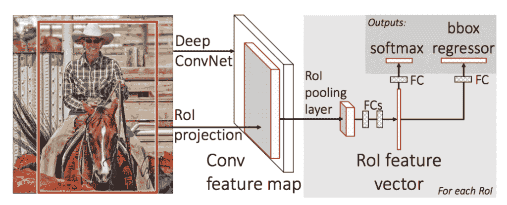
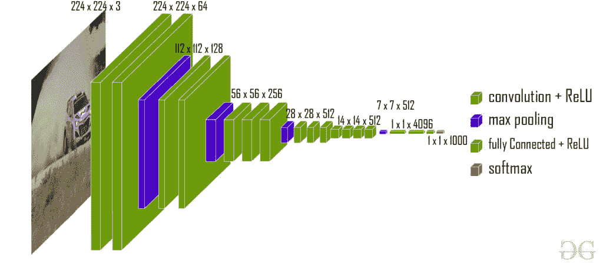
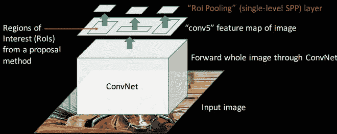
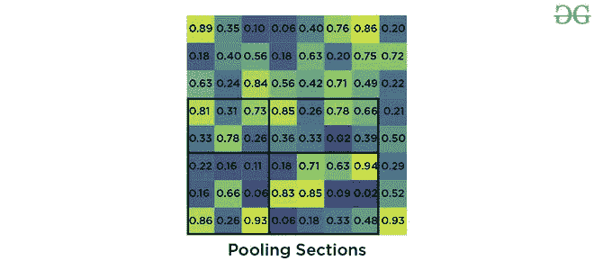
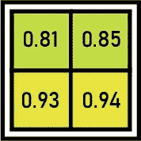
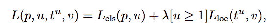
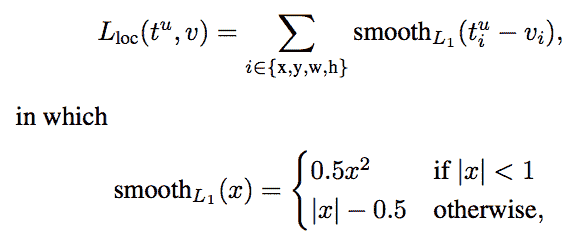
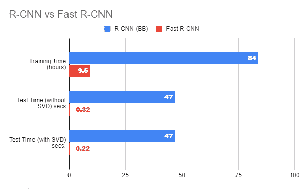

# 快速 R-CNN | ML

> 原文:[https://www.geeksforgeeks.org/fast-r-cnn-ml/](https://www.geeksforgeeks.org/fast-r-cnn-ml/)

在讨论快速有线电视新闻网之前，让我们看看快速有线电视新闻网面临的挑战

*   R-CNN 的训练非常慢，因为模型的每个部分(如 CNN、SVM 分类器、包围盒)都需要单独训练，不能并行。
*   此外，在美国有线电视新闻网中，我们需要通过深度卷积架构转发每个区域提案(每个图像多达 *~2000* 个区域提案)。这解释了训练这个模型所花费的时间
*   推理的测试时间也很高。在 R-CNN 中测试一幅图像需要 *49* 秒(连同选择性搜索区域建议生成)。

快 R-CNN 致力于解决这些问题。让我们看看快手的架构

快速无线网络体系结构

首先，我们通过选择性搜索算法生成区域建议。这种选择性搜索算法生成大约高达 *2000* 区域提议。这些区域建议(RoI 投影)与输入到 CNN 网络的输入图像相结合。该 CNN 网络生成卷积特征图作为输出。然后，对于每个对象建议，感兴趣区域(RoI)汇集层为每个特征图提取固定长度的特征向量。然后，每个特征向量被传递到 softmax 分类器和 Bbox 回归的两个层中，用于区域建议的分类和改善该对象的边界框的位置。

**快速 R-CNN 的 CNN 网络**

快速 R-CNN 实验了三个预先训练好的 ImageNet 网络，每个网络都有 *5* 最大汇集层和 *5-13* 卷积层(如 VGG-16)。在这些预先培训的网络中提出了一些变化，这些变化是:

*   该网络以这样一种方式被修改，即它两次输入图像和在该图像上生成的区域建议列表。
*   第二，完全连接层之前的最后一个汇集层(此处为 *(7*7*512)* )需要由感兴趣区域(RoI)汇集层代替。
*   第三，最后一个全连通层和 softmax 层被 softmax 分类器的两个层和具有全连通层的 *K+1* 类别特定包围盒回归器代替。

VGG-16 体系结构

该 CNN 架构获取图像(VGG-16 的尺寸= *224 x 224 x 3* )及其区域建议，并输出卷积特征图(VGG-16 的尺寸= *14 x 14 x 512* )。

**感兴趣区域汇集:**

RoI 池是 Fast R-CNN 论文中介绍的新奇事物。其目的是从非均匀输入(RoIs)中产生均匀的、固定大小的特征图。
取两个值作为输入:

*   从以前的美国有线电视新闻网图层(*14 x 14 x 512【VGG-16 中的 T1】)获得的特征地图。*
*   表示感兴趣区域的 N×4 矩阵，其中 N 是若干个 RoI，前两个代表 RoI 左上角的坐标，另外两个代表 ROi 的高度和宽度，表示为 *(r，c，h，w)* 。

假设我们有 *8*8* 特征图，我们需要提取一个大小为 *2*2* 的输出。我们将遵循以下步骤。

*   假设我们给定的 RoI 的左上角坐标为 *(0，3)* ，高度，宽度为 *(5，7)* 。

*   现在，如果我们需要将该区域建议转换为*2×2*输出块，并且我们知道池部分的维度不能被输出维度完全整除。我们将汇集固定在 *2 x 2* 维度。

*   现在，我们应用最大池操作符从我们划分的每个区域中选择最大值。

最大池输出

**训练和损失:**首先我们取每个标注有地面真值类 u 和地面真值包围盒 v 的训练感兴趣区域，然后取 softmax 分类器和包围盒回归器生成的输出，对其应用损失函数。我们定义了我们的损失函数，使得它同时考虑了分类和包围盒定位。这个损失函数称为多任务损失。其定义如下:

where **Lcls**is classification loss, **Lloc** is localization loss. lambda is balancing parameter and u is a function (the value of u=0 for background, otherwise  u=1) to make sure that loss is only calculated at when we need to define bounding box. Here, **Lcls** is the [log loss](https://www.geeksforgeeks.org/ml-log-loss-and-mean-squared-error/) and **Lloc ** is defined as

**结果与结论:**

*   快速反应-美国有线电视新闻网提供了关于 2007 年、2010 年和 2012 年挥发性有机化合物数据集的最新地图。
*   它还大大提高了检测时间 *(84 vs 9.5 小时)*和训练时间 *(47 vs 0.32 秒)*。

**快速 R-CNN 相对于 R-CNN 的优势**

*   Fast R-CNN 比 R-CNN 更快的最重要原因是，我们不需要为 CNN 模型中的每张图像通过 2000 个区域提案。相反，convNet 操作对每个图像只执行一次，并由此生成特征图。
*   因为，整个模型是一次组合和训练完成的。因此，不需要特性缓存。这也降低了训练时的磁盘内存需求。
*   在大多数类别的挥发性有机化合物 2007、 *10* 和 *12* 数据集上，快速反应堆-美国有线电视新闻网与快速反应堆-美国有线电视新闻网相比还改进了地图。

**参考文献:**

*   [快速 R-CNN 论文](https://arxiv.org/abs/1504.08083.pdf)
*   [快速 R-CNN 纸片](http://www.robots.ox.ac.uk/~tvg/publications/talks/fast-rcnn-slides.pdf)