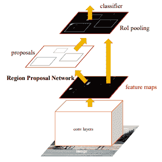
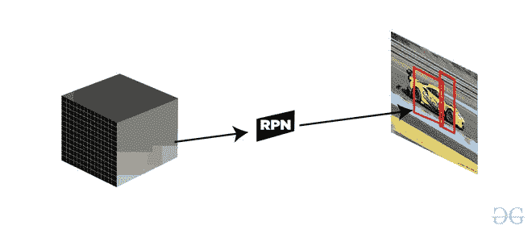
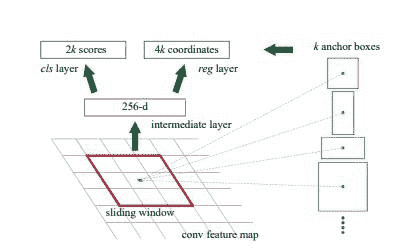
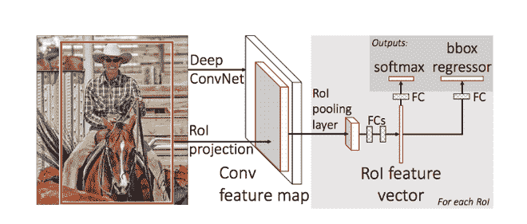
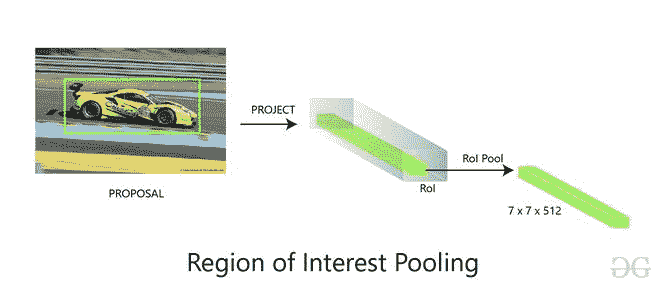
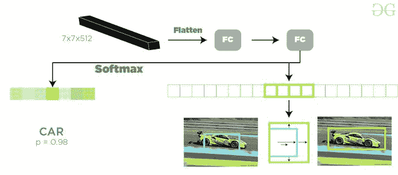

# 更快的 R-CNN | ML

> 原文:[https://www.geeksforgeeks.org/faster-r-cnn-ml/](https://www.geeksforgeeks.org/faster-r-cnn-ml/)

将有线电视新闻网的目标检测网络结构改进为快速有线电视新闻网后。网络的训练和检测时间大大减少，但网络不够快，不能用作实时系统，因为在输入图像上生成输出大约需要(2 秒)。体系结构的瓶颈是选择性搜索算法。因此 *K He 等人*提出了一种新的架构叫做 fast R-CNN。它没有使用选择性搜索，而是提出了另一种区域建议生成算法，称为区域建议网络。我们来讨论一下更快的 R-CNN 架构。



更快的有线电视新闻网架构

更快的 R-CNN 架构包含 2 个网络:

1.  区域提案网络
2.  目标检测网络

在讨论地区提案之前，我们需要研究作为该网络主干的美国有线电视新闻网架构。这种有线电视网络体系结构在区域提议网络和目标检测网络之间是通用的。我们试验了 ZF(拥有 *5* 可共享的 Conv 层)或 VGG-16(拥有 *13* 可共享的 Conv)作为他们架构的主干。两个主干网的网络跨度均为 16，这意味着在进入区域建议网络之前，尺寸为 *1000 * 600* 的图像被缩减为 *(1000/16 * 600/16)* 或近似 *(~ 62 *37)* 尺寸特征图。

**区域建议网络(RPN):**
该区域建议网络以骨干层生成的卷积特征图为输入，输出应用于输入特征图上的滑动窗口卷积生成的锚点。



区域规划图功能

**锚:**
对于每个滑动窗口，网络生成最大数量的 k 锚框。默认情况下， *(128*128、256*256 和 512*512)* 和*的 *3* 宽高比的值为 9* ( *3* 比例为*(1:1、1:2 和 2:1)】*。因此，对于 *W * H* 的卷积特征图，我们得到 *N = W* H* k* 锚框。这些区域建议然后被传递到 *3*3* 卷积和 *1* 填充和 *256(对于 ZF)* 或 *512(对于 VGG-16 )* 输出通道的中间层。从该层生成的输出被传递到两层 *1*1* 卷积、分类层和回归层。回归层有 *4*N (W * H * (4*k))* 输出参数(表示包围盒的坐标)，分类层有 *2*N (W * H * (2*k))* 输出参数(表示有无对象的概率)。



锚点生成

**训练和损失函数(RPN) :**
首先，我们去掉所有的跨界锚点，这样，它们就不会增加损失函数。典型的 *1000*600* 形象，大概有 *20000(~ 60*40*9)* 主播。如果我们去掉跨界主播，那么每张图片大概还剩下 *6000* 个主播。本文还根据非最大值抑制的分类和 IoU 使用了非最大值抑制。这里他们用的是 *0.7* 的固定 IoU。这也将锚的数量减少到了 *2000* 。使用非最大值抑制的优点是它也不会伤害准确性。RPN 可以通过反向传播和随机梯度下降进行端到端的训练。它从单个图像的锚点生成每个小批量。它不对每个锚训练损失函数，而是选择 *256* 随机锚，正负样本 s 的比例为 *1:1* 。如果图像包含< 128 个阳性样本，则使用更多的阴性样本。对于训练 rpn，首先，我们需要分配二进制类标签(不管相关的锚点包含对象还是背景)。在更快的 R-CNN 论文中，作者使用了两个条件来为主播分配一个正标签。这些是:

*   那些与地面真实盒具有最高交集的锚，或
*   一种锚，其 IoU 与任何地面真值框的重叠高于 0.7。

与 IoU 重叠的负标签为<0.3 for all ground truth boxes. Those anchors which does not have either positive or negative label does not contribute to training. Now Loss function is defined as follows :

<center>

</center>

```py
where, 
pi = predicted probability of anchors contains an object or not.
pi* = ground truth value of anchors contains and object or not.
ti = coordinates of predicted anchors.
ti* = ground truth coordinate associated with bounding boxes. 
Lcls = Classifier Loss (binary log loss over two classes).
Lreg = Regression Loss (Here, Lreg  = R(ti-ti*) where R is smooth L1 loss)
Ncls = Normalization parameter of mini-batch size (~256).
Nreg = Normalization parameter of regression (equal to number of anchor locations ~2400).
 In order to make n=btoh loss parameter equally weighted right.
```

**目标检测网络:**
Fast R-CNN 中使用的目标检测网络与 Fast R-CNN 中使用的非常相似。它还与作为骨干网络的 VGG-16 兼容。它还使用 RoI 池层进行固定大小的区域建议，使用 softmax 分类器的两个层，边界框回归器也用于预测对象及其边界框。



快速无线网络体系结构

**RoI 汇集:**
我们将区域建议生成的输出作为输入，传递到 RoI 汇集层，这个 RoI 汇集层的功能与在 Fast R-CNN 中执行的相同，将 RPN 生成的不同大小的区域建议制作成固定大小的特征图。我们在本文中详细讨论了 RoI 池。该 RoI 汇集层生成大小为 *(7*7*D)* (其中*D = ZF 的 256 和 VGG 的 512-16*)的输出。



**Softmax 和 Bounding Box 回归图层:**
在 RoI pooling 中生成的大小为 *(7 * 7 * D)* 的特征图随后被发送到两个完全连接的图层，这些完全连接的图层将特征图展平，然后将输出发送到两个平行的完全连接的图层中，每个图层都分配有不同的任务:

*   第一层是 *N+1* 输出参数的软最大值层( *N* 是类别标签和背景的数量)，用于预测区域建议中的对象。第二层是边界框回归层，具有 *4* N* 输出参数。该层回归图像中对象的边界框位置。

*

软最大分类器和包围盒回归器* 

***训练(完整架构):**
我们已经讨论了训练 RPN，但是在这一部分，我们将讨论训练整个架构。《快速反应-美国有线电视新闻网》论文的作者使用了一种叫做 4 步交替训练法的方法。这种方法如下*

*   *我们首先用 ImageNet 权重初始化主干 CNN 网络，并为区域提案微调这些权重。现在，我们如上所述训练了 RPN。*
*   *我们分别使用由 RPN 网络生成的建议来训练目标检测网络。在这一部分中，主干网也用 ImageNet 权重初始化，直到现在它还没有连接到 RPN 网络。*
*   *RPN 现在用来自探测器网络的权重初始化。这一次，只有 RPN 独有的层的权重被微调。*
*   *使用新的微调 RPN，快速 R-CNN 探测器进行微调。同样，只有探测器网络特有的层被微调，并且公共层权重被固定。*

***结果与结论:***

*   *由于快速反应网络体系结构的瓶颈是带有选择性搜索的区域建议生成。更快的美国有线电视新闻网用自己的地区提案网取代了它。该区域建议网络与选择性网络相比速度更快，并且在训练时还改进了区域建议生成模型。这也有助于我们减少总体检测时间，相比之下，快速有线电视新闻网(VGG-16 网络)的检测时间为 0.2 秒，而快速有线电视新闻网的检测时间为 2.3 秒。*
*   *当使用 COCO、VOC 2007 和 VOC 2012 数据集进行训练时，更快的 R-CNN(与 RPN 和 VGG 共享)在 VOC 2007 测试数据集上生成 78.8%*对 70%*的 mAP***
*   ***与选择性搜索相比，区域提议网络(RPN)对地图的改进也有一定的贡献。***

*****参考文献:*****

*   ***[快速 R-CNN 论文](https://arxiv.org/pdf/1504.08083.pdf)***
*   ***[更快的 R-CNN 论文](https://arxiv.org/pdf/1506.01497.pdf)***