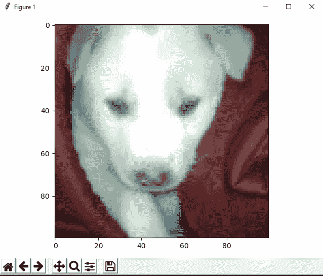

# 用 Python 中的 Scikit-image 进行图像处理

> 原文:[https://www . geesforgeks . org/入门-sci kit-image-image-processing-python/](https://www.geeksforgeeks.org/getting-started-scikit-image-image-processing-python/)

***scikit-image*** 是一个图像处理 Python 包，与 NumPy 数组一起工作，NumPy 数组是图像处理算法的集合。让我们讨论如何将图像处理成一组信息，以及它在现实世界中的一些应用。

**sci kit-image 的重要特性:**

> 简单有效的图像处理和计算机视觉技术工具。
> 每个人都可以访问，并且可以在各种环境中重用。
> 建立在 NumPy、SciPy 和 matplotlib 之上。
> 开源、商业可用——BSD 许可证。

**注意:**在安装 scikit-image 之前，请确保 NumPy 和 SciPy 已预安装。现在，安装 scikit-image 最简单的方法是使用`pip`:

```
pip install -U scikit-image

```

撇除的大部分功能都存在于子模块中。图像表示为数字阵列，例如灰度二维图像的二维阵列。

**代码#1 :**

```
# Python3 program to process 
# images using skikit-image

# importing data from skimage
from skimage import data

camera = data.camera() 

# An image with 512 rows
# and 512 columns
type(camera) 

print(camera.shape)
```

输出:

```
numpy.ndarray
(512, 512)

```

**代码# 2:**skip age . data 子模块提供了一组返回示例图像的函数。

```
# Python3 program to process 
# images using skikit-image

# importing filters and
# data from skimage
from skimage import filters
from skimage import data

# Predefined function to fetch data
coins = data.coins() 

# way to find threshold
threshold_value = filters.threshold_otsu(coins) 

print(threshold_value)
```

输出:

```
107

```

**代码#3 :** 从图像文件中加载自己的图像作为 NumPy 数组。

```
# Python3 program to process 
# images using skikit-image
import os

# importing io from skimage
import skimage
from skimage import io

# way to load car image from file
file = os.path.join(skimage.data_dir, 'cc.jpg')

cars = io.imread(file)

# way to show the input image
io.imshow(cars)
io.show()
```

**输出:**


**应用:**

*   医学图像分析。
*   用于检测的图像分类。