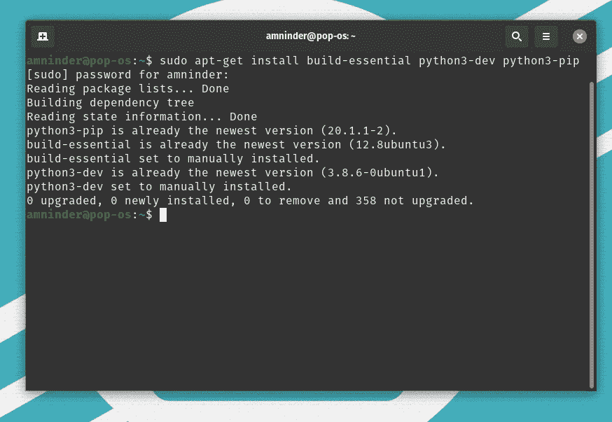
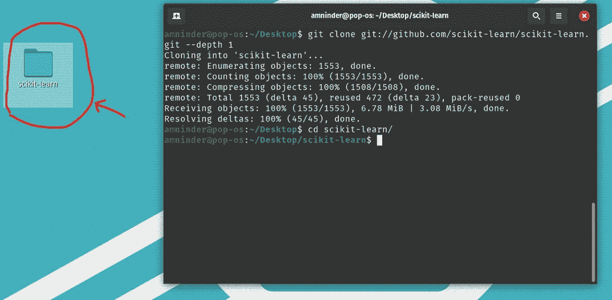
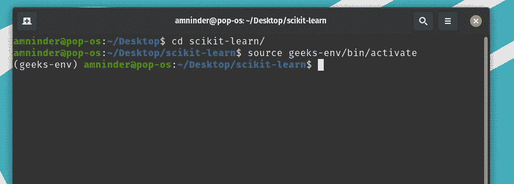
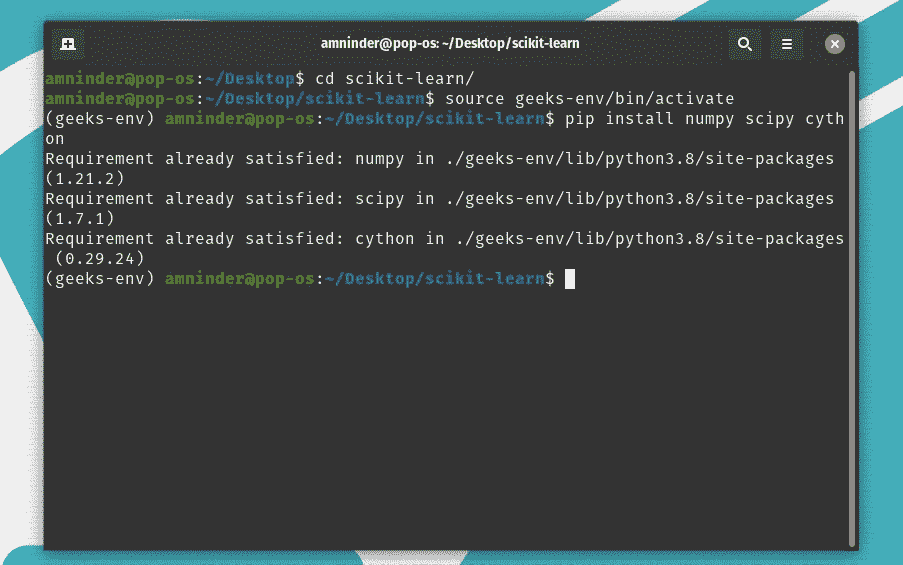
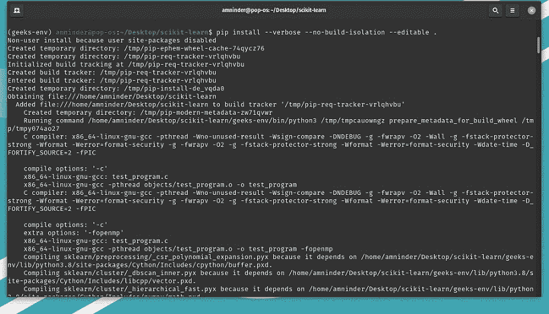
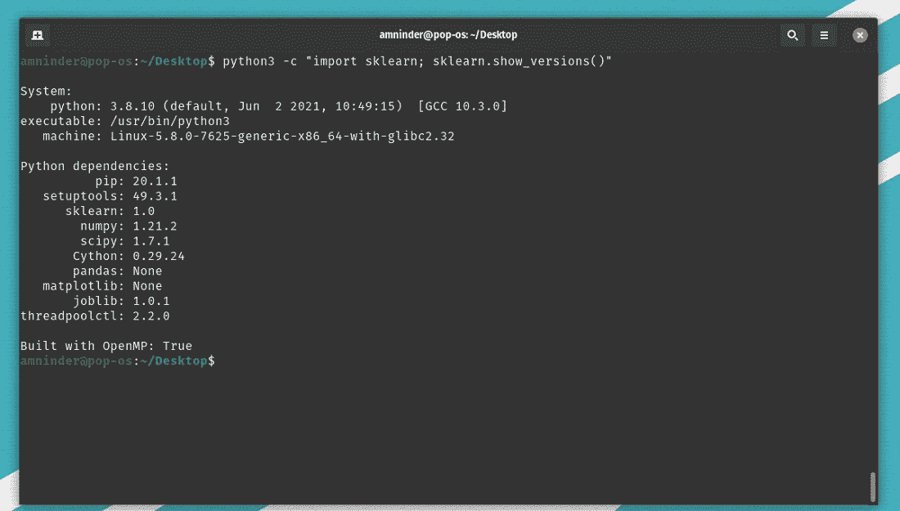
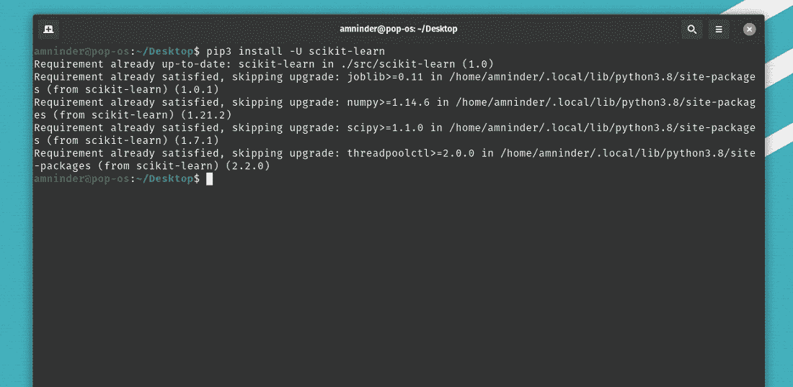
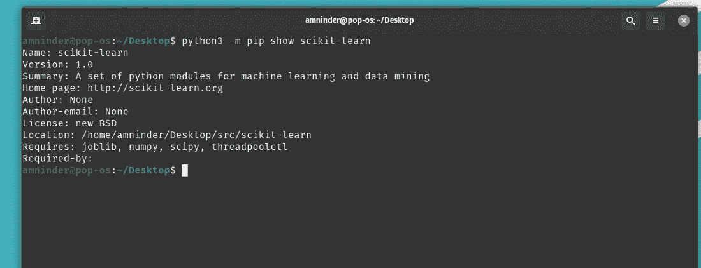

# 如何在 Linux 上安装 Scikit-Learn？

> 原文:[https://www . geesforgeks . org/how-install-sci kit-learn-on-Linux/](https://www.geeksforgeeks.org/how-to-install-scikit-learn-on-linux/)

在本文中，我们将看到如何在 Linux 上安装 Scikit-Learn。Scikit-Learn 是一个用于预测数据分析的 python 开源库。它建立在 NumPy、SciPy 和 matplotlib 上。它是用 Python、Cython、C 和 C++语言编写的。它适用于 Linux、Unix、Windows 和 Mac。

## 方法 1:安装 Scikit-从源代码中学习

**步骤 1:** 安装 python3 和构建 Scikit-learn 的基本依赖关系。

> sudo apt-get install build-本质 python3-dev python3-pip



安装 python

**第 2 步**:获取 scikit-learn 存储库，并使用以下命令克隆它。

```
git clone git://github.com/scikit-learn/scikit-learn.git --depth 1
cd scikit-learn
```



下载 Scikit-学习

**步骤 3:** 为 Scikit-learn 的单独安装创建一个虚拟环境。

要安装 python3-virtualenv 工具，如果您还没有安装的话。

```
sudo apt install python3.8-venv
```

运行以下命令来创建和激活虚拟环境。

```
python3 -m venv geeks-env
```

这将创建一个名为 geeks-env 的虚拟环境

```
source geeks-env/bin/activate
```



激活虚拟环境

上述命令将激活虚拟环境。

**步骤 4:** 现在，安装 NumPy、SciPy 和 Cython，并在可编辑模式下用 pip 构建包:

```
pip install numpy scipy cython
```



安装 NumPy、SciPy 和 Cython

构建包:

```
pip install --verbose --no-build-isolation --editable .
```



从源头开始建设

**步骤 5:** 验证安装。

```
python3 -c "import sklearn; sklearn.show_versions()"
```



验证安装

## **方法 2:安装 Scikit-使用 pip 命令学习**

**步骤 1:** 使用以下 pip 安装命令安装 Scikit-learn:

```
pip3 install -U scikit-learn
```



安装 scikit 学习

**第 2 步**:运行以下命令验证安装:

```
python3 -m pip show scikit-learn
```



成功安装 scikit-learn