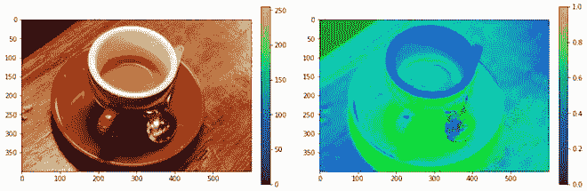
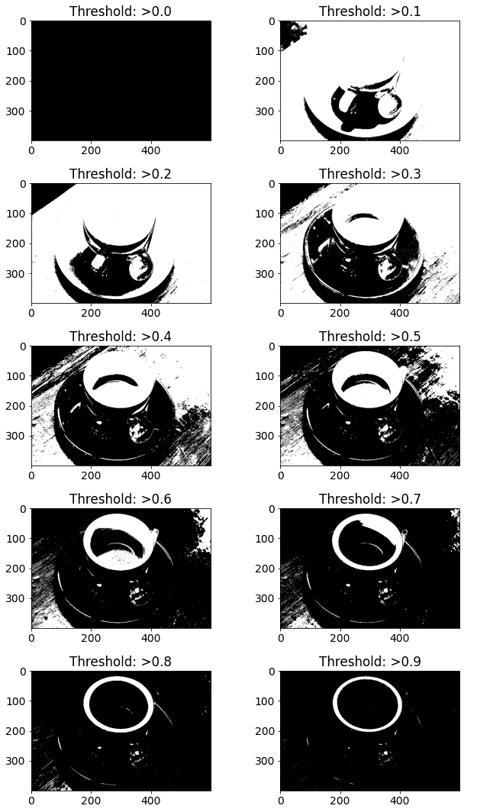
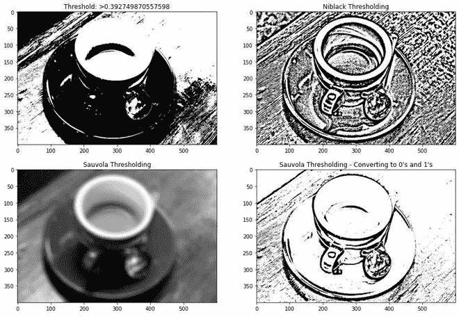
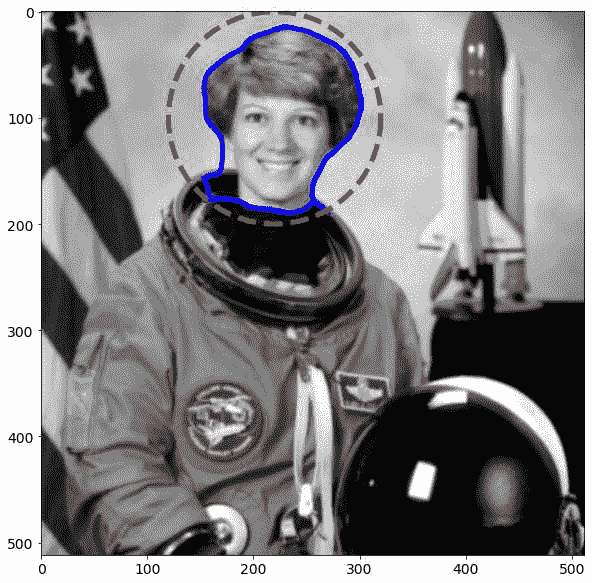
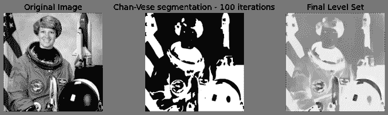
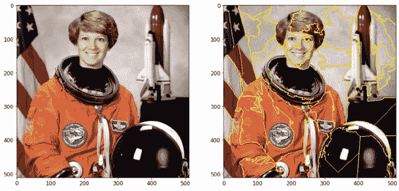
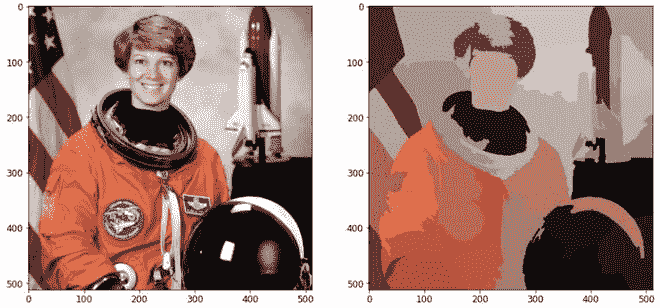
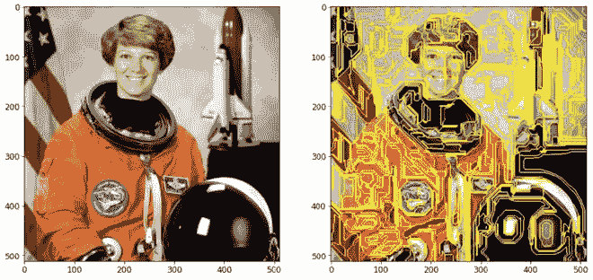

# 使用 Python 的 scikit-image 模块进行图像分割

> 原文:[https://www . geeksforgeeks . org/image-segmentation-use-python-sci kit-image-module/](https://www.geeksforgeeks.org/image-segmentation-using-pythons-scikit-image-module/)

将图像分割成多个层的过程被称为图像分割，该过程由智能的逐像素遮罩表示。它包括合并、分块和从集成级别分离图像。将图片分割成具有相似属性的图像对象集合是图像处理的第一步。Scikit-Image 是 Python 中最流行的图像处理工具/模块。

## **安装**

要安装此模块，请在终端中键入以下命令。

```
pip install scikit-image
```

## **转换图像格式**

### **RGB 到灰度**

skimage 包的 rgb2gray 模块用于将 3 通道 rgb 图像转换为 1 通道单色图像。为了应用滤波器和其他处理技术，预期的输入是二维向量，即单色图像。

**skimage.color.rgb2gray()** 函数用于将 rgb 图像转换为灰度格式

> **语法:** skimage.color.rgb2gray(图像)
> 
> **参数:**图像:图像–RGB 格式
> 
> **返回:**图像–灰度格式

**代码:**

## 蟒蛇 3

```
# Importing Necessary Libraries
from skimage import data
from skimage.color import rgb2gray
import matplotlib.pyplot as plt

# Setting the plot size to 15,15
plt.figure(figsize=(15, 15))

# Sample Image of scikit-image package
coffee = data.coffee()
plt.subplot(1, 2, 1)

# Displaying the sample image
plt.imshow(coffee)

# Converting RGB image to Monochrome
gray_coffee = rgb2gray(coffee)
plt.subplot(1, 2, 2)

# Displaying the sample image - Monochrome
# Format
plt.imshow(gray_coffee, cmap="gray")
```

**输出:**


将 3 通道图像数据转换为 1 通道图像数据

**说明:**通过使用 rgb2gray()函数，将形状(400，600，3)的 3 通道 rgb 图像转换为形状(400，300)的单通道单色图像。我们将使用灰度图像来正确实现阈值函数。每个像素的红色、绿色和蓝色像素值的平均值来获得灰度值是将彩色图片 3D 阵列转换为灰度 2D 阵列的简单方法。这通过组合每个色带的亮度或亮度贡献来创建可接受的灰度近似。

### [**RGB 转 HSV**](https://www.geeksforgeeks.org/program-change-rgb-color-model-hsv-color-model/)

HSV(色调、饱和度、值)颜色模型将 RGB 基本颜色重新映射到人类更容易理解的维度。RGB 颜色空间描述了一种颜色中红色、绿色和蓝色的比例。在 HSV 颜色系统中，颜色是根据色调、饱和度和值来定义的。

**skimage.color.rgb2hsv()** 函数用于将 rgb 图像转换为 hsv 格式

> **语法:** skimage.color.rgb2hsv(图像)
> 
> **参数:**图像:图像–RGB 格式
> 
> **返回:**图像–HSV 格式

**代码:**

## 蟒蛇 3

```
# Importing Necessary Libraries
from skimage import data
from skimage.color import rgb2hsv
import matplotlib.pyplot as plt

# Setting the plot size to 15,15
plt.figure(figsize=(15, 15))

# Sample Image of scikit-image package
coffee = data.coffee()
plt.subplot(1, 2, 1)

# Displaying the sample image
plt.imshow(coffee)

# Converting RGB Image to HSV Image
hsv_coffee = rgb2hsv(coffee)
plt.subplot(1, 2, 2)

# Displaying the sample image - HSV Format
hsv_coffee_colorbar = plt.imshow(hsv_coffee)

# Adjusting colorbar to fit the size of the image
plt.colorbar(hsv_coffee_colorbar, fraction=0.046, pad=0.04)
```

**输出:**



将 RGB 颜色格式转换为 HSV 颜色格式

## **监督分割**

为了进行这种类型的分割，需要外部输入。这包括设定阈值、转换格式和纠正外部偏见。

### **阈值分割-手动输入**

范围从 0 到 255 的外部像素值用于将图片与背景分离。这将导致修改后的图片大于或小于指定的阈值。

## 蟒蛇 3

```
# Importing Necessary Libraries
# Displaying the sample image - Monochrome Format
from skimage import data
from skimage import filters
from skimage.color import rgb2gray
import matplotlib.pyplot as plt

# Sample Image of scikit-image package
coffee = data.coffee()
gray_coffee = rgb2gray(coffee)

# Setting the plot size to 15,15
plt.figure(figsize=(15, 15))

for i in range(10):

  # Iterating different thresholds
  binarized_gray = (gray_coffee > i*0.1)*1
  plt.subplot(5,2,i+1)

  # Rounding of the threshold
  # value to 1 decimal point
  plt.title("Threshold: >"+str(round(i*0.1,1)))

  # Displaying the binarized image
  # of various thresholds
  plt.imshow(binarized_gray, cmap = 'gray')

plt.tight_layout()
```

**输出:**



**解释:**该阈值化的第一步通过将图像从 0–255 归一化到 0–1 来实现。阈值是固定的，根据比较，如果评估为真，那么我们将结果存储为 1，否则为 0。该全局二值化图像可以用于检测边缘以及分析对比度和色差。

### **使用轮廓过滤器模块通过阈值分割**

尼布拉克和索沃拉阈值技术是专门为提高显微图像质量而开发的。这是一种局部阈值化方法，根据滑动窗口中每个像素的局部平均值和标准偏差来改变阈值。Otsu 的阈值技术通过迭代所有可能的阈值并计算阈值两侧(即前景或背景)样本点的离差度量来工作。目标是确定可能的最小前景和背景扩散。

**skim age . filters . threshold _ otsu()**函数基于 Otsu 的方法返回阈值。

> **语法:**skimage . filters . threshold _ Otsu(图像)
> 
> **参数:**
> 
> *   **图像:**图像–单色格式
> *   **nbins :** 直方图计算所需的箱数
> *   **hist :** 直方图，必须根据该直方图计算阈值
> 
> **返回:阈值:**更大的像素强度

**skip age . filters . threshold _ niblack()**函数是一个局部阈值函数，它根据 Niblack 的方法为每个像素返回一个阈值。

> **语法:**skig . filters . threshold _ nib lack(图像)
> 
> **参数:**
> 
> *   **图像:**图像–单色格式
> *   **窗口大小:**窗口大小–奇数
> *   **k :** 一个正参数
> 
> **返回:阈值:**等于图像形状的阈值蒙版

**skim age . filters . threshold _ sauvala()**函数是一个局部阈值函数，根据 sauvala 的方法返回每个像素的阈值。

> **语法:**skimage . filters . threshold _ sauvala(图像)
> 
> **参数:**
> 
> *   **图像:**图像–单色格式
> *   **窗口大小:**窗口大小–奇数
> *   **k :** 一个正参数
> *   **r :** 正参数–标准偏差的动态范围
> 
> **返回:阈值:**等于图像形状的阈值蒙版

**代码:**

## 蟒蛇 3

```
# Importing necessary libraries
from skimage import data
from skimage import filters
from skimage.color import rgb2gray
import matplotlib.pyplot as plt

# Setting plot size to 15, 15
plt.figure(figsize=(15, 15))

# Sample Image of scikit-image package
coffee = data.coffee()
gray_coffee = rgb2gray(coffee)

# Computing Otsu's thresholding value
threshold = filters.threshold_otsu(gray_coffee)

# Computing binarized values using the obtained
# threshold
binarized_coffee = (gray_coffee > threshold)*1
plt.subplot(2,2,1)
plt.title("Threshold: >"+str(threshold))

# Displaying the binarized image
plt.imshow(binarized_coffee, cmap = "gray")

# Computing Ni black's local pixel
# threshold values for every pixel
threshold = filters.threshold_niblack(gray_coffee)

# Computing binarized values using the obtained
# threshold
binarized_coffee = (gray_coffee > threshold)*1
plt.subplot(2,2,2)
plt.title("Niblack Thresholding")

# Displaying the binarized image
plt.imshow(binarized_coffee, cmap = "gray")

# Computing Sauvola's local pixel threshold
# values for every pixel - Not Binarized
threshold = filters.threshold_sauvola(gray_coffee)
plt.subplot(2,2,3)
plt.title("Sauvola Thresholding")

# Displaying the local threshold values
plt.imshow(threshold, cmap = "gray")

# Computing Sauvola's local pixel
# threshold values for every pixel - Binarized
binarized_coffee = (gray_coffee > threshold)*1
plt.subplot(2,2,4)
plt.title("Sauvola Thresholding - Converting to 0's and 1's")

# Displaying the binarized image
plt.imshow(binarized_coffee, cmap = "gray")
```

**输出**



**解释:**这些局部阈值化技术使用平均值和标准偏差作为它们的主要计算参数。它们的最终局部像素值也由其他正参数来表示。这样做是为了确保对象和背景之间的分离。


其中\bar x 和\sigma 分别代表像素强度的平均值和标准偏差。

### **活动轮廓分割**

能量泛函约简的概念是活动轮廓法的基础。活动轮廓是一种分割方法，它使用能量和限制将感兴趣的像素与图片的其余部分分开，以便进一步处理和分析。术语“活动轮廓”是指分割过程中的模型。

**skimage . segmentation . active _ contour()**通过将蛇拟合到图像特征来实现活动轮廓的功能

> **语法:**skimage . segmentation . active _ contour(图像，蛇)
> 
> **参数:**
> 
> *   **图像:**图像
> *   **蛇:**初始蛇坐标–用于包围特征
> *   **阿尔法:**蛇长状
> *   **β:**蛇光滑的形状
> *   **w_line :** 控制吸引力–亮度
> *   **w_edge :** 控制吸引力–边缘
> *   **γ:**显式时间步长
> 
> **返回:** ***蛇:**用输入参数的大小*优化蛇

**代码:**

## 蟒蛇 3

```
# Importing necessary libraries
import numpy as np
import matplotlib.pyplot as plt
from skimage.color import rgb2gray
from skimage import data
from skimage.filters import gaussian
from skimage.segmentation import active_contour

# Sample Image of scikit-image package
astronaut = data.astronaut()
gray_astronaut = rgb2gray(astronaut)

# Applying Gaussian Filter to remove noise
gray_astronaut_noiseless = gaussian(gray_astronaut, 1)

# Localising the circle's center at 220, 110
x1 = 220 + 100*np.cos(np.linspace(0, 2*np.pi, 500))
x2 = 100 + 100*np.sin(np.linspace(0, 2*np.pi, 500))

# Generating a circle based on x1, x2
snake = np.array([x1, x2]).T

# Computing the Active Contour for the given image
astronaut_snake = active_contour(gray_astronaut_noiseless,
                                 snake)

fig = plt.figure(figsize=(10, 10))

# Adding subplots to display the markers
ax = fig.add_subplot(111)

# Plotting sample image
ax.imshow(gray_astronaut_noiseless)

# Plotting the face boundary marker
ax.plot(astronaut_snake[:, 0],
        astronaut_snake[:, 1],
        '-b', lw=5)

# Plotting the circle around face
ax.plot(snake[:, 0], snake[:, 1], '--r', lw=5)
```

**输出:**



**说明:**活动轮廓模型是图像分割中的动态方法之一，它使用图像的能量限制和压力来分离感兴趣的区域。对于分割，活动轮廓为目标对象的每个部分建立不同的边界或曲率。主动轮廓模型是一种用于最小化由外力和内力产生的能量函数的技术。外力被指定为曲线或曲面，而内力被定义为图片数据。外力是允许初始轮廓自动转换成图片中对象形式的力。

### **Chan-Vese 分段**

众所周知的 Chan-Vese 迭代分割方法将一幅图片分割成类内方差最低的两组。该算法使用迭代进化的集合来最小化能量，其特征在于对应于来自分割区域之外的总平均值的强度变化的总和的权重、来自特征向量内的总平均值的差值的总和、以及与分割区域边缘的长度成正比的项。

**skimage . segmentation . Chan _ Vese()**函数用于使用边界未明确定义的 Chan-Vese 算法分割对象。

> **语法:**skimage . segmentation . chan _ vese(图像)
> 
> **参数:**
> 
> *   **图像:**图像
> *   **亩:**重量–边长
> *   **λ1:**重量–与平均值的差异
> *   **公差:**水平集变化的公差
> *   **最大迭代次数:**最大迭代次数
> *   **extended_output :** 返回 3 个值的元组
> 
> **返回:**
> 
> *   **分割:**分割图像
> *   **φ:**最终等级设置
> *   **能量:**显示能量的演化

**代码:**

## 蟒蛇 3

```
import matplotlib.pyplot as plt
from skimage.color import rgb2gray
from skimage import data, img_as_float
from skimage.segmentation import chan_vese
fig, axes = plt.subplots(1, 3, figsize=(10, 10))

# Sample Image of scikit-image package
astronaut = data.astronaut()
gray_astronaut = rgb2gray(astronaut)

# Computing the Chan VESE segmentation technique
chanvese_gray_astronaut = chan_vese(gray_astronaut,
                                    max_iter=100,
                                    extended_output=True)

ax = axes.flatten()

# Plotting the original image
ax[0].imshow(gray_astronaut, cmap="gray")
ax[0].set_title("Original Image")

# Plotting the segmented - 100 iterations image
ax[1].imshow(chanvese_gray_astronaut[0], cmap="gray")
title = "Chan-Vese segmentation - {} iterations".
format(len(chanvese_gray_astronaut[2]))

ax[1].set_title(title)

# Plotting the final level set
ax[2].imshow(chanvese_gray_astronaut[1], cmap="gray")
ax[2].set_title("Final Level Set")
plt.show()
```

**输出:**



**说明:**活动轮廓的 Chan-Vese 模型是一种强大且通用的方法，用于分割各种图片，包括一些难以使用“传统”方法分割的图片，例如阈值法或基于梯度的方法。这种模型通常用于医学成像，特别是大脑、心脏和气管分割。该模型基于能量最小化问题，该问题可以重铸在水平集公式中，以使问题更容易解决。

## **无监督分割**

### **标记边界**

这种技术产生的图像在标记区域之间具有突出显示的边界，其中图片是使用 SLIC 方法分割的。

**skimage . segmentation . mark _ boundaries()**功能是返回带有标注区域之间边界的图像。

> **语法:**撇去.分割.标记 _ 边界(图像)
> 
> **参数:**
> 
> *   **图像:**图像
> *   **label_img :** 带标记区域的标签阵列
> *   **颜色:**边界的 RGB 颜色
> *   **轮廓 _ 颜色:**周围边界的 RGB 颜色
> 
> **返回:标记:**标记有边界的图像

**代码:**

## 蟒蛇 3

```
# Importing required boundaries
from skimage.segmentation import slic, mark_boundaries
from skimage.data import astronaut

# Setting the plot figure as 15, 15
plt.figure(figsize=(15, 15))

# Sample Image of scikit-image package
astronaut = astronaut()

# Applying SLIC segmentation
# for the edges to be drawn over
astronaut_segments = slic(astronaut,
                          n_segments=100,
                          compactness=1)

plt.subplot(1, 2, 1)

# Plotting the original image
plt.imshow(astronaut)

# Detecting boundaries for labels
plt.subplot(1, 2, 2)

# Plotting the ouput of marked_boundaries
# function i.e. the image with segmented boundaries
plt.imshow(mark_boundaries(astronaut, astronaut_segments))
```

**输出:**



**说明:**我们将图像聚类为 100 个紧密度= 1 的片段，这个分割的图像将作为 mark_boundaries()函数的标记数组。聚类图像的每个片段由整数值区分，mark_boundaries 的结果是标签之间的叠加边界。

### **简单线性迭代聚类**

该方法通过基于像素的颜色相似性和邻近性来组合图像平面中的像素，生成超像素。简单线性迭代聚类是分割超像素的最新方法，它只需要很少的计算能力。简而言之，该技术将像素聚集在五维色彩和图像平面空间中，以创建小的、几乎均匀的超像素。

**skim age . segmentation . slic()**函数用于使用 k-means 聚类对图像进行分割。

> **语法:**skip age . segmentation . slic(图像)
> 
> **参数:**
> 
> *   **图像:**图像
> *   **n_segments :** 标签数量
> *   **紧凑度:**平衡色彩和空间接近度。
> *   **最大迭代次数:**最大迭代次数
> 
> **返回:标签:**指示段标签的整数掩码。

**代码:**

## 蟒蛇 3

```
# Importing required libraries
from skimage.segmentation import slic
from skimage.data import astronaut
from skimage.color import label2rgb

# Setting the plot size as 15, 15
plt.figure(figsize=(15,15))

# Sample Image of scikit-image package
astronaut = astronaut()

# Applying Simple Linear Iterative
# Clustering on the image
# - 50 segments & compactness = 10
astronaut_segments = slic(astronaut,
                          n_segments=50,
                          compactness=10)
plt.subplot(1,2,1)

# Plotting the original image
plt.imshow(astronaut)
plt.subplot(1,2,2)

# Converts a label image into
# an RGB color image for visualizing
# the labeled regions.
plt.imshow(label2rgb(astronaut_segments,
                     astronaut,
                     kind = 'avg'))
```

**输出:**



**说明:**这种技术通过根据像素的颜色相似度和接近度对图片平面中的像素进行分组来创建超像素。这是在 5 维空间中完成的，其中 XY 是像素位置。因为 CIELAB 空间中两种颜色之间的最大可能距离受到限制，但是 XY 平面上的空间距离取决于图片大小，所以我们必须对空间距离进行归一化，以便在这个 5D 空间中应用欧几里德距离。因此，创建了一种考虑超像素大小的新距离度量，以将像素聚集在这个 5D 空间中。

### **费尔岑斯瓦尔布的细分**

计算了 Felsenszwalb 的有效的基于图的图像分割。它使用基于最小生成树的快速聚类对图像网格上的 RGB 图片进行过分割。这可用于隔离特征和识别边缘。该算法使用像素之间的欧几里德距离。skim age . segmentation . felzenszwalb()函数用于计算 Felsenszwalb 高效的基于图的图像分割。

> **语法:**skimage . segmentation . felzenszwalb(图像)
> 
> **参数:**
> 
> *   **图像:**输入图像
> *   **等级:**更高的值–更大的集群
> *   **σ:**高斯核的宽度
> *   **最小尺寸:**最小组件尺寸
> 
> **返回:segment_mask :** 指示段标签的整数掩码。

**代码:**

## 蟒蛇 3

```
# Importing the required libraries
from skimage.segmentation import felzenszwalb
from skimage.color import label2rgb
from skimage.data import astronaut

# Setting the figure size as 15, 15
plt.figure(figsize=(15,15))

# Sample Image of scikit-image package
astronaut = astronaut()

# computing the Felzenszwalb's
# Segmentation with sigma = 5 and minimum
# size = 100
astronaut_segments = felzenszwalb(astronaut,
                                  scale = 2,
                                  sigma=5,
                                  min_size=100)

# Plotting the original image
plt.subplot(1,2,1)
plt.imshow(astronaut)

# Marking the boundaries of
# Felzenszwalb's segmentations
plt.subplot(1,2,2)
plt.imshow(mark_boundaries(astronaut,
                           astronaut_segments))
```

**输出:**



带有 mark_boundaries()函数


不带 mark_boundaries()函数

**解释:**在图片网格上使用快速的、基于最小树结构的聚类，创建多通道图像的过分割。参数标度决定了观察水平。越来越小的零件与越来越大的规模相关联。高斯核的直径是σ，用于在分割前平滑图像。缩放是控制生成的片段数量及其大小的唯一方法。图片中各个片段的大小可能会根据局部对比度发生显著变化。

还有许多其他有监督和无监督的图像分割技术。这有助于限制单个特征、前景隔离、降噪，并有助于更直观地分析图像。为了产生有效的结果，在建立神经网络模型之前对图像进行分割是一种良好的做法。