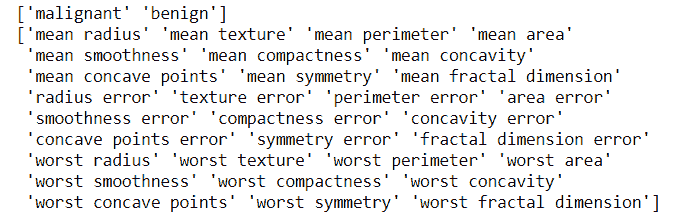
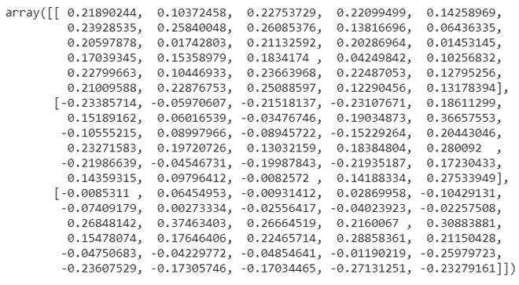
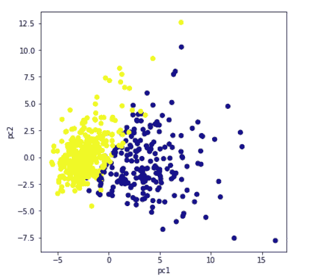
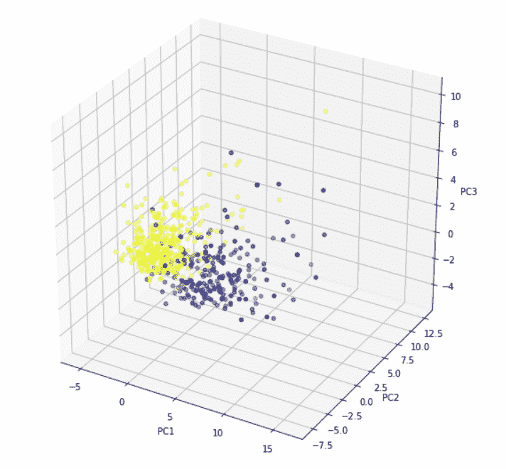

# 用 scikit-learn 在 Python 中实现 PCA

> 原文:[https://www . geesforgeks . org/impering-PCA-in-python-with-sci kit-learn/](https://www.geeksforgeeks.org/implementing-pca-in-python-with-scikit-learn/)

在本文中，我们将通过 scikit-learn 了解 Python 中的主成分分析。让我们一步步开始学习。

**为什么是 PCA？**

*   当有许多输入属性时，很难将数据可视化。在机器学习领域有一个非常著名的术语“维数灾难”。
*   基本上，它指的是数据集中属性的数量越多，就会对机器学习模型的准确性和训练时间产生不利影响。
*   主成分分析是解决这个问题的一种方法，用于更好的数据可视化和提高准确性。

**PCA 是如何工作的？**

*   主成分分析是在应用任何最大似然算法之前执行的无监督预处理任务。主成分分析基于“正交线性变换”，这是一种将数据集的属性投影到新坐标系中的数学技术。描述最大方差的属性称为第一主成分，位于第一个坐标。
*   同样，在描述方差时排在第二位的属性称为第二主成分，依此类推。简而言之，完整的数据集可以用主成分来表示。通常，90%以上的方差由两/三个主成分来解释。
*   因此，主成分分析(PCA)通过选择最重要的属性来获取数据集的最大信息，从而将数据从高维空间转换到低维空间。

**Python 实现:**

*   要在 Scikit learn 中实施主成分分析，在应用主成分分析之前对数据进行标准化/规范化是至关重要的。
*   主成分分析是从 sklearn.decomposition 导入的，我们需要选择所需数量的主成分。
*   通常，为了更好的可视化，n_components 被选择为 2，但这很重要，并且取决于数据。
*   通过拟合和变换方法，传递属性。
*   主成分的值可以使用成分来检查，而每个主成分解释的方差可以使用解释的方差比来计算。

**1。导入所有库**

## 蟒蛇 3

```
# import all libraries
import pandas as pd
import numpy as np
import matplotlib.pyplot as plt
%matplotlib inline
from sklearn.decomposition import PCA
from sklearn.preprocessing import StandardScaler
```

**2。加载数据**

从 sklearn.datasets 中加载乳腺癌数据集。很明显，该数据集有 569 个数据项，30 个输入属性。有两种输出类别——良性和恶性。由于有 30 个输入特征，无法可视化这些数据

## 蟒蛇 3

```
#import the breast _cancer dataset
from sklearn.datasets import load_breast_cancer
data=load_breast_cancer()
data.keys()

# Check the output classes
print(data['target_names'])

# Check the input attributes
print(data['feature_names'])
```

**输出:**



**3 .申请 PCA〔t1〕**

*   在主成分分析之前，标准化数据集。
*   从 sklearn.decomposition 导入 PCA。
*   选择主成分的数量。

让我们选择它为 3。执行这段代码后，我们知道 x 的维度是(569，3)，而实际数据的维度是(569，30)。因此，很明显，通过主成分分析，维度的数量已经从 30 个减少到 3 个。如果我们选择 n_components=2，维度将减少到 2。

## 蟒蛇 3

```
# construct a dataframe using pandas
df1=pd.DataFrame(data['data'],columns=data['feature_names'])

# Scale data before applying PCA
scaling=StandardScaler()

# Use fit and transform method
scaling.fit(df1)
Scaled_data=scaling.transform(df1)

# Set the n_components=3
principal=PCA(n_components=3)
principal.fit(Scaled_data)
x=principal.transform(Scaled_data)

# Check the dimensions of data after PCA
print(x.shape)
```

**输出:**

```
(569,3)
```

**4。检查组件**

principal.components_ 提供一个数组，其中行数表示主成分的数量，而列数等于实际数据中的特征数量。我们可以很容易地看到有三行，因为 n_components 被选为 3。但是，与实际数据一样，每行有 30 列。

## 蟒蛇 3

```
# Check the values of eigen vectors
# prodeced by principal components
principal.components_
```



**5。绘制组件图(可视化)**

绘制主成分图，以实现更好的数据可视化。虽然我们取了 n_components =3，但这里我们分别使用前两个主成分和 3 个主成分绘制了一个 2d 图和 3d 图。对于三个主要组成部分，我们需要绘制一个三维图形。颜色显示了原始数据集的两个输出类——良性和恶性。很明显，主成分显示了两个输出类之间的明显分离。

## 蟒蛇 3

```
plt.figure(figsize=(10,10))
plt.scatter(x[:,0],x[:,1],c=data['target'],cmap='plasma')
plt.xlabel('pc1')
plt.ylabel('pc2')
```

**输出:**



对于三个主要组成部分，我们需要绘制一个三维图形。x[:，0]表示第一个主成分。类似地，x[:，1]和 x[:，2]表示第二和第三主成分。

## 蟒蛇 3

```
# import relevant libraries for 3d graph
from mpl_toolkits.mplot3d import Axes3D
fig = plt.figure(figsize=(10,10))

# choose projection 3d for creating a 3d graph
axis = fig.add_subplot(111, projection='3d')

# x[:,0]is pc1,x[:,1] is pc2 while x[:,2] is pc3
axis.scatter(x[:,0],x[:,1],x[:,2], c=data['target'],cmap='plasma')
axis.set_xlabel("PC1", fontsize=10)
axis.set_ylabel("PC2", fontsize=10)
axis.set_zlabel("PC3", fontsize=10)
```

**输出:**



**6。计算方差比**

explained _ variation _ ratio 提供了主成分解释多少变化的概念。

## 蟒蛇 3

```
# check how much variance is explained by each principal component
print(principal.explained_variance_ratio_)
```

**输出:**

```
array([0.44272026, 0.18971182, 0.09393163])
```