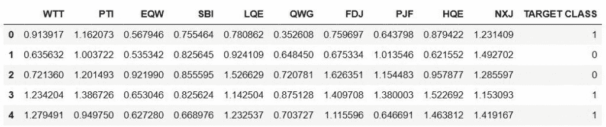
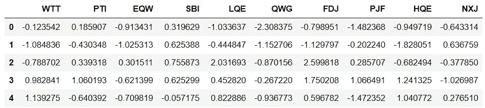
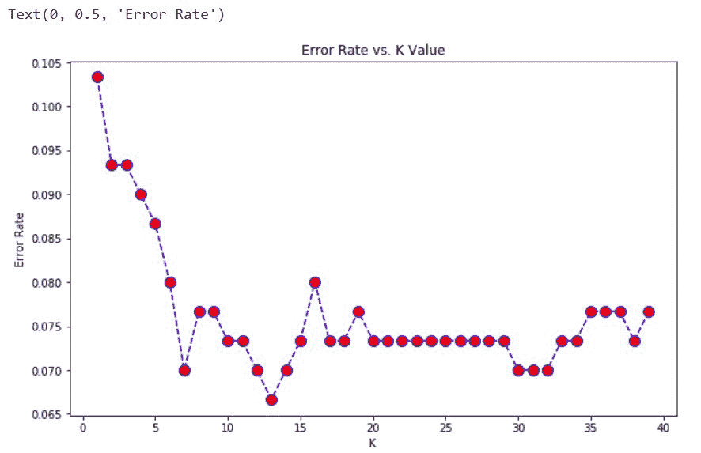

# 用 Python K 最近邻| ML

> 原文:[https://www . geesforgeks . org/k-最近邻-带-python-ml/](https://www.geeksforgeeks.org/k-nearest-neighbors-with-python-ml/)

**它是如何工作的？**
[K-近邻](https://www.geeksforgeeks.org/k-nearest-neighbours/)是机器学习中最基本但又必不可少的分类算法之一。它属于监督学习领域，在模式识别、数据挖掘和入侵检测中有着广泛的应用。

K 近邻(KNN)算法是一种简单、易于实现的监督机器学习算法，可用于解决分类和回归问题。

KNN 算法假设相似的东西存在于非常接近的地方。换句话说，相似的事物彼此靠近。KNN 抓住了相似性的概念(有时被称为距离、接近或接近)，这与我们在童年时可能学过的一些数学有关——计算图形上各点之间的距离。还有其他计算距离的方法，根据我们正在解决的问题，一种方法可能更可取。然而，直线距离(也称为欧几里德距离)是一个流行和熟悉的选择。

由于它是非参数的，也就是说，它不会对数据的分布做出任何潜在的假设(与 GMM 等其他算法相反，后者假设给定数据为高斯分布)，因此在现实场景中可以广泛使用。

***本文使用 [sklearn 库](https://www.geeksforgeeks.org/learning-model-building-scikit-learn-python-machine-learning-library/)演示了样本随机数据上 K 近邻的图解。***

**前提条件:**[【num py】](https://www.geeksforgeeks.org/numpy-in-python-set-1-introduction/)、[【熊猫】](https://www.geeksforgeeks.org/python-data-analysis-using-pandas/)、[【matplot lib】](https://www.geeksforgeeks.org/python-introduction-matplotlib/)、[硬化](https://www.geeksforgeeks.org/learning-model-building-scikit-learn-python-machine-learning-library/)

我们得到了一个随机数据集，其中一个特征作为目标类。我们将尝试使用 KNN 创建一个模型，该模型基于要素直接预测新数据点的类别。

**Import Libraries:**

```py
import pandas as pd
import seaborn as sns
import matplotlib.pyplot as plt
import numpy as np
```

让我们首先用多特征可视化我们的数据。

**获取数据:**

将 index_col=0 设置为使用第一列作为索引。

```py
df = pd.read_csv("Data", index_col = 0)

df.head()
```

**输出:**


**标准化变量:**
因为 KNN 分类器通过识别最接近的观测值来预测给定测试观测值的类别，所以变量的规模很重要。任何大规模的变量都会比小规模的变量对观测值之间的距离产生更大的影响，从而对 KNN 分类器产生更大的影响。

```py
from sklearn.preprocessing import StandardScaler

scaler = StandardScaler()

scaler.fit(df.drop('TARGET CLASS', axis = 1))
scaled_features = scaler.transform(df.drop('TARGET CLASS', axis = 1))

df_feat = pd.DataFrame(scaled_features, columns = df.columns[:-1])
df_feat.head()
```

**输出:**


**列车测试从 sklearn 库中拆分数据并使用 KNN 模型:**

```py
from sklearn.model_selection import train_test_split

X_train, X_test, y_train, y_test = train_test_split(
      scaled_features, df['TARGET CLASS'], test_size = 0.30)

# Remember that we are trying to come up
# with a model to predict whether
# someone will TARGET CLASS or not.
# We'll start with k = 1.

from sklearn.neighbors import KNeighborsClassifier

knn = KNeighborsClassifier(n_neighbors = 1)

knn.fit(X_train, y_train)
pred = knn.predict(X_test)

# Predictions and Evaluations
# Let's evaluate our KNN model ! 
from sklearn.metrics import classification_report, confusion_matrix
print(confusion_matrix(y_test, pred))

print(classification_report(y_test, pred))
```

**输出:**

```py
[[133  16]
 [ 15 136]]

                 precision    recall  f1-score   support

           0       0.90      0.89      0.90       149
           1       0.89      0.90      0.90       151

    accuracy                           0.90       300
   macro avg       0.90      0.90      0.90       300
weighted avg       0.90      0.90      0.90       300

```

**选择一个 *K* 值:**

让我们继续使用手肘法来选择一个好的 *K* 值

```py
error_rate = []

# Will take some time
for i in range(1, 40):

    knn = KNeighborsClassifier(n_neighbors = i)
    knn.fit(X_train, y_train)
    pred_i = knn.predict(X_test)
    error_rate.append(np.mean(pred_i != y_test))

plt.figure(figsize =(10, 6))
plt.plot(range(1, 40), error_rate, color ='blue',
                linestyle ='dashed', marker ='o',
         markerfacecolor ='red', markersize = 10)

plt.title('Error Rate vs. K Value')
plt.xlabel('K')
plt.ylabel('Error Rate')
```

**输出:**


在这里，我们可以看到，大致在 K>15 之后，错误率倾向于在 0.07-0.08 之间徘徊。让我们用它来重新训练模型，并检查分类报告。

```py
# FIRST A QUICK COMPARISON TO OUR ORIGINAL K = 1
knn = KNeighborsClassifier(n_neighbors = 1)

knn.fit(X_train, y_train)
pred = knn.predict(X_test)

print('WITH K = 1')
print('\n')
print(confusion_matrix(y_test, pred))
print('\n')
print(classification_report(y_test, pred))

# NOW WITH K = 15
knn = KNeighborsClassifier(n_neighbors = 15)

knn.fit(X_train, y_train)
pred = knn.predict(X_test)

print('WITH K = 15')
print('\n')
print(confusion_matrix(y_test, pred))
print('\n')
print(classification_report(y_test, pred))
```

**输出:**

```py
WITH K=1

[[133  16]
 [ 15 136]]

               precision    recall  f1-score   support

           0       0.90      0.89      0.90       149
           1       0.89      0.90      0.90       151

    accuracy                           0.90       300
   macro avg       0.90      0.90      0.90       300
weighted avg       0.90      0.90      0.90       300

WITH K=15

[[133  16]
 [  6 145]]

               precision    recall  f1-score   support

           0       0.96      0.89      0.92       149
           1       0.90      0.96      0.93       151

    accuracy                           0.93       300
   macro avg       0.93      0.93      0.93       300
weighted avg       0.93      0.93      0.93       300

```

**太好了！**通过调整到更好的 *K 值*，我们能够从我们的模型中挤出更多的性能。