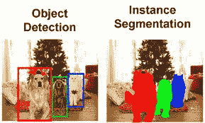
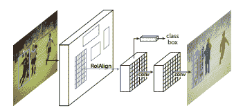
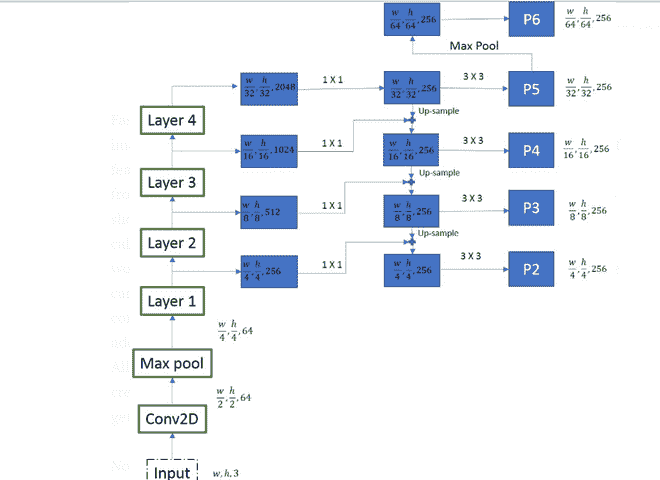
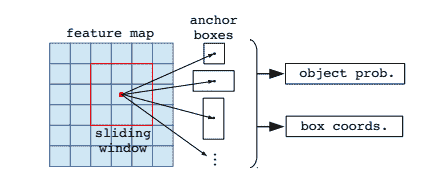
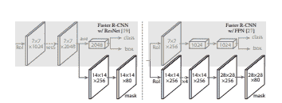
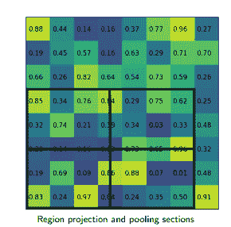
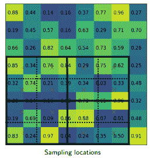

# 口罩 R-CNN | ML

> 原文:[https://www.geeksforgeeks.org/mask-r-cnn-ml/](https://www.geeksforgeeks.org/mask-r-cnn-ml/)

较快的 R-CNN 和 YOLO 擅长检测输入图像中的物体。它们的检测时间也非常短，可以用于实时系统。然而，有一个挑战是无法用物体检测来解决的，由 YOLO 和 fast R-CNN 生成的边界框没有给出任何关于物体形状的指示。

**实例分割:**
该分割识别每个实例(图像中存在的每个对象的出现，并用不同的像素给它们着色)。它的基本工作是对每个像素位置进行分类，并为图像中的每个对象生成分割遮罩。这种方法对图像中的对象有更多的了解，因为它在识别对象的同时保持了这些对象的安全性。

实例分段(来源:[链接](http://vision.stanford.edu/teaching/cs231b_spring1415/slides/ssearch_schuyler.pdf)

**Mask R-CNN 架构:** Mask R-CNN 由*何等*于 2017 年提出。它与 fast R-CNN 非常相似，只是有另一个层来预测分割。区域建议生成的阶段在两个架构中都是相同的，第二阶段在并行预测类中工作，生成边界框，并为每个 RoI 输出一个二进制掩码。

它包括–

*   中枢网络
*   区域提案网络
*   掩模表示
*   ROI align(ROI 对齐)

**骨干网:**
Mask R-CNN 的作者在两种骨干网上进行了实验。第一种是标准的 ResNet 架构(ResNet-C4)，另一种是带有特征金字塔网络的 ResNet。标准的资源网体系结构与美国有线电视新闻网的相似，但是 FPN 的资源网提出了一些修改。这包括多层 RoI 生成。这种多层特征金字塔网络生成不同规模的 RoI，提高了以前 ResNet 架构的准确性。

在每一层，特征地图的大小减少一半，特征地图的数量增加一倍。我们从四个层*(层–1、2、3 和 4)* 获取输出。为了生成最终的特征图，我们使用了一种称为自上而下路径的方法。我们从最上面的特征图 *(w/32，h/32，256)* 开始，通过高端操作，一路向下到更大的特征图。在向上采样之前，我们还应用 *1*1* 卷积将通道数降低到 *256* 。然后，它被逐元素添加到上一次迭代的上采样输出中。所有输出经过*3×3*卷积层，生成最终的 *4 特征图(P2、P3、P4、P5)* 。*第 5 个*特征图 *(P6)* 由 *P5* 的最大汇集操作生成。

**区域建议网络:**
上一层生成的所有卷积特征图都经过一个 *3*3* 卷积层。然后，这个的输出被传递到两个平行的分支，这两个分支确定对象分数并回归边界框坐标。

这里，我们只对一个特征金字塔使用一个锚点步幅和 *3* 锚点比率(因为我们已经有了不同大小的特征图来检查不同大小的对象)。

**遮罩表示:**
遮罩包含对象的空间信息。因此，与分类和包围盒回归层不同，我们不能将输出折叠到完全连接的层来改进，因为它需要来自上面层的像素到像素的对应。面具 R-CNN 使用完全连接的网络来预测面具。该 ConvNet 将 RoI 作为输入，并输出 *m*m* 遮罩表示。我们还升级了该掩码，以便对输入图像进行推理，并使用 *1*1* 卷积将通道减少到 *256* 。为了为这个预测掩码的全连接网络生成输入，我们使用了 RoIAlign。RoIAlign 的目的是将区域建议网络生成的不同大小的特征图转换成固定大小的特征图。面具 R-CNN 的论文提出了建筑的两种变体。在一种变型中，掩码生成 CNN 的输入在应用 RoIAlign 之后传递(ResNet C4)，但是在另一种变型中，输入刚好在完全连接的层之前传递(FPN 网络)。

(来源:[链接](https://lmb.informatik.uni-freiburg.de/lectures/seminar_brox/seminar_ss17/maskrcnn_slides.pdf))

这个掩码生成分支是全卷积网络，它输出一个 *K * (m*m)* ，其中 *K* 是类的数量(每个类一个) *m=14* 代表 *ResNet-C4，28 代表 ResNet_FPN* 。

**RoI Align:**
RoI align 的动机与 RoI 池的动机相同，从区域提案中生成固定大小的感兴趣区域。其工作步骤如下:
 <centre></centre>

给定大小为 *h*w* 的上一个卷积图层的特征图，将该特征图划分为大小相等的 *M * N* 网格(我们不会只取整数值)。

 <centre></centre>

掩码 R-CNN 推理速度在 *2 fps* 左右，考虑到架构中增加了分段分支，这个速度还是不错的。

**应用:**
由于其产生分段掩模的附加能力，其被用于许多计算机视觉应用，例如:

*   人体姿态估计
*   自动驾驶汽车
*   无人机图像映射等。

**参考:**

*   [口罩 R-CNN 纸](https://arxiv.org/pdf/1703.06870.pdf)
*   [口罩 R-CNN 幻灯片](https://lmb.informatik.uni-freiburg.de/lectures/seminar_brox/seminar_ss17/maskrcnn_slides.pdf)