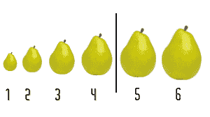
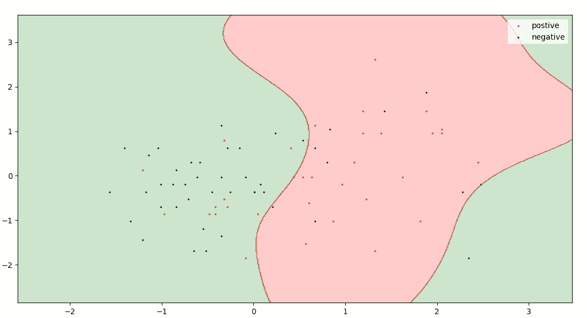
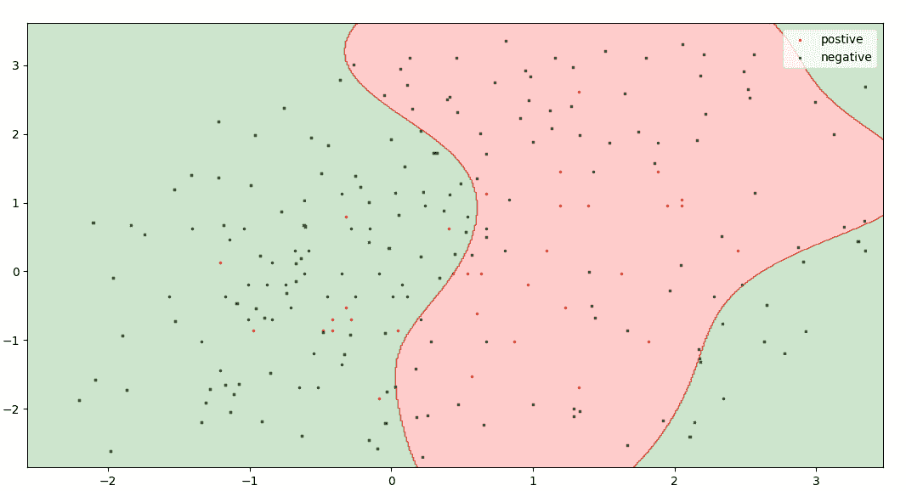

# ML |主动学习

> 原文:[https://www.geeksforgeeks.org/ml-active-learning/](https://www.geeksforgeeks.org/ml-active-learning/)

**什么是主动学习？**
主动学习是监督机器学习的特例。该方法用于构建高性能分类器，同时通过主动选择有价值的数据点来保持训练数据集的大小最小。

**我们应该在哪里应用主动学习？**

1.  我们有非常少量或大量的数据集。
2.  未标记数据集的标注需要耗费人力、时间和金钱。
3.  我们的处理能力有限。

**例**

在某个星球上，有各种不同大小的水果(1-5 个)，有的有毒，有的没有。判断水果有毒与否的唯一标准是它的大小。我们的任务是训练一个分类器来预测给定的水果是否有毒。我们唯一的信息是，1 号的水果是无毒的，5 号的水果是有毒的，在特定的大小之后，所有的水果都是有毒的。



第一种方法是检查水果的每个大小，这需要花费时间和资源。

第二种方法是应用二分搜索法并找到过渡点(决策边界)。这种方法使用较少的数据，并给出与线性搜索相同的结果。

```
 General Algorithm : 

1\. train classifier with the initial training dataset
2\. calculate the accuracy
3\. while(accuracy < desired accuracy):
4\.    select the most valuable data points (in general points close to decision boundary)
5\.    query that data point/s (ask for a label) from human oracle
6\.    add that data point/s to our initial training dataset
7\.    re-train the model
8\.    re-calculate the accuracy
```

**逼近主动学习算法**
**1。查询综合**

*   通常，当我们的数据集非常小时，会使用这种方法。
*   这种方法我们从给定的 n 维空间中选择任何不确定的点。我们不在乎那个点的存在。



在这个查询中，合成可以从 3*3 的二维平面中挑选任何一点(有价值的)。

*   有时，甲骨文很难对查询的数据点进行注释。


这些是由查询合成方法为训练用于手写识别的模型生成的一些查询。注释这些查询非常困难。

**2。取样**

*   当我们有一个大数据集时，使用这种方法。
*   在这种方法中，我们将数据集分成三部分:训练集；测试集；无标签池(讽刺)[5%；25%, 70%].
*   这个训练数据集是我们的初始数据集，用于初始训练我们的模型。
*   这种方法从这个未标记的池中选择有价值的/不确定的点，这确保了所有的查询都可以被人工 oracle 识别



黑点代表未标记的池，联合红色、绿色点代表训练数据集。

这是一个主动学习模型，它根据一个点出现在课堂上的概率来决定有价值的点。在[逻辑回归](https://www.geeksforgeeks.org/understanding-logistic-regression/)中，最接近阈值的点(即概率= 0.5)是最不确定的点。所以，我选择 0.47 到 0.53 之间的概率作为不确定性的范围。
可以从[这里](https://archive.ics.uci.edu/ml/machine-learning-databases/spambase/spambase.data)下载数据集。

## 蟒蛇 3

```
import numpy as np
import pandas as pd
from statistics import mean
from sklearn.impute import SimpleImputer
from sklearn.preprocessing import StandardScaler
from sklearn.linear_model import LogisticRegression
from sklearn.model_selection import train_test_split

# split dataset into test set, train set and unlabel pool
def split(dataset, train_size, test_size):
    x = dataset[:, :-1]
    y = dataset[:, -1]
    x_train, x_pool, y_train, y_pool = train_test_split(
        x, y, train_size = train_size)
    unlabel, x_test, label, y_test = train_test_split(
        x_pool, y_pool, test_size = test_size)
    return x_train, y_train, x_test, y_test, unlabel, label

if __name__ == '__main__':
    # read dataset
    dataset = pd.read_csv("./spambase.csv").values[:, ]

    # imputing missing data
    imputer = SimpleImputer(missing_values = 0, strategy ="mean")
    imputer = imputer.fit(dataset[:, :-1])
    dataset[:, :-1] = imputer.transform(dataset[:, :-1])

    # feature scaling
    sc = StandardScaler()
    dataset[:, :-1] = sc.fit_transform(dataset[:, :-1])

    # run both models 100 times and take the average of their accuracy
    ac1, ac2 = [], []  # arrays to store accuracy of different models

    for i in range(100):
        # split dataset into train(5 %), test(25 %), unlabel(70 %)
        x_train, y_train, x_test, y_test, unlabel, label = split(
            dataset, 0.05, 0.25)

        # train model by active learning
        for i in range(5):
            classifier1 = LogisticRegression()
            classifier1.fit(x_train, y_train)
            y_probab = classifier1.predict_proba(unlabel)[:, 0]
            p = 0.47 # range of uncertanity 0.47 to 0.53
            uncrt_pt_ind = []
            for i in range(unlabel.shape[0]):
                if(y_probab[i] >= p and y_probab[i] <= 1-p):
                    uncrt_pt_ind.append(i)
            x_train = np.append(unlabel[uncrt_pt_ind, :], x_train, axis = 0)
            y_train = np.append(label[uncrt_pt_ind], y_train)
            unlabel = np.delete(unlabel, uncrt_pt_ind, axis = 0)
            label = np.delete(label, uncrt_pt_ind)
        classifier2 = LogisticRegression()
        classifier2.fit(x_train, y_train)
        ac1.append(classifier2.score(x_test, y_test))

        ''' split dataset into train(same as generated by our model),
        test(25 %), unlabel(rest) '''
        train_size = x_train.shape[0]/dataset.shape[0]
        x_train, y_train, x_test, y_test, unlabel, label = split(
            dataset, train_size, 0.25)

        # train model without active learning
        classifier3 = LogisticRegression()
        classifier3.fit(x_train, y_train)
        ac2.append(classifier3.score(x_test, y_test))

    print("Accuracy by active model :", mean(ac1)*100)
    print("Accuracy by random sampling :", mean(ac2)*100)

'''
This code is contributed by Raghav Dalmia
https://github.com / raghav-dalmia
'''
```

**输出:**

```
Accuracy by active model : 80.7
Accuracy by random sampling : 79.5
```

有几种模型可以选择最有价值的点。其中一些是:

1.  [委员会查询](https://link.springer.com/chapter/10.1007/11811305_107)
2.  [查询合成和最近邻搜索](https://www.sciencedirect.com/science/article/pii/S0925231214008145)
3.  [基于大利润的启发式算法](https://ieeexplore.ieee.org/document/5742970)
4.  [基于后验概率的启发式方法](https://ieeexplore.ieee.org/document/5742970)

参考资料:[伯尔斯](https://doi.org/10.2200/S00429ED1V01Y201207AIM018)T2 关于人工智能和机器学习的主动学习综合讲座