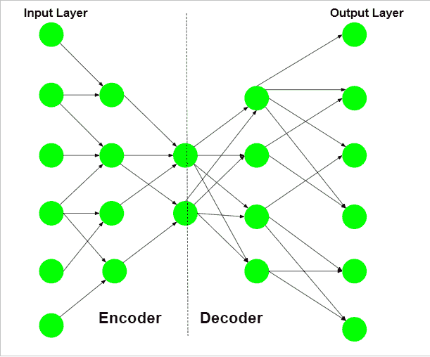
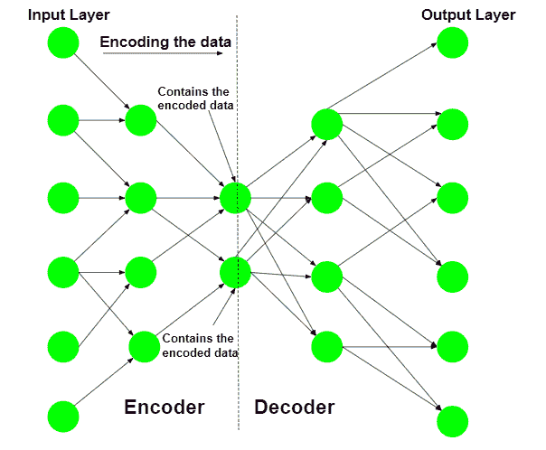
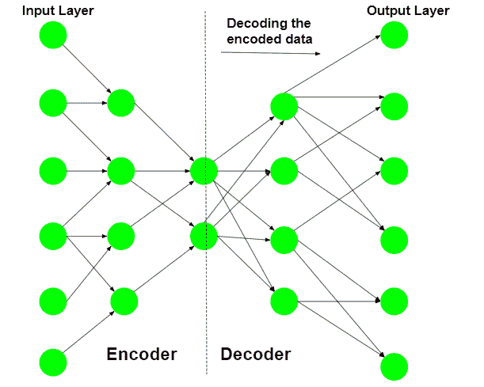
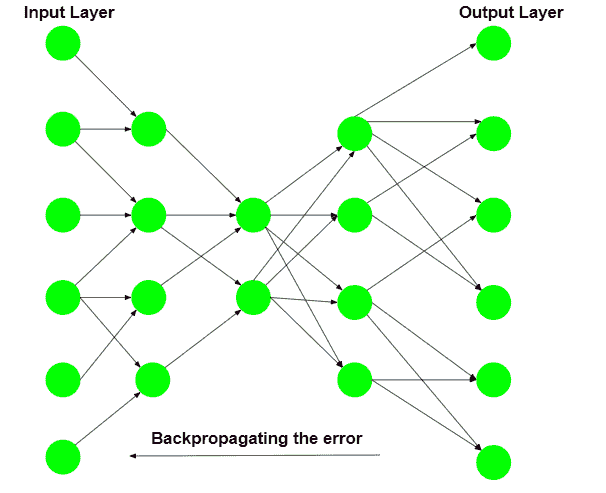
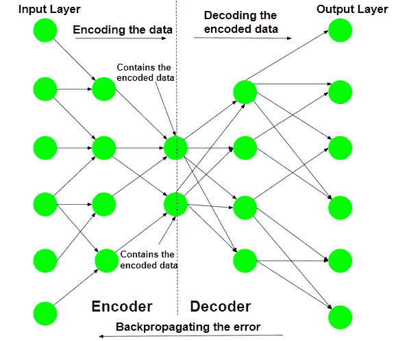
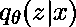
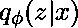

# ML |自动编码器

> 原文:[https://www.geeksforgeeks.org/ml-auto-encoders/](https://www.geeksforgeeks.org/ml-auto-encoders/)

**神经网络**的一个典型应用是监督学习。它包括训练数据**包含一个输出标签**。神经网络试图学习从给定输入到给定输出标签的映射。但是如果输出标签被输入向量本身代替了呢？然后网络将尝试找到从输入到自身的映射。这将是一个平凡映射的恒等式。

**但如果不允许网络简单复制输入，那么网络将被迫只捕捉显著特征**。这种限制为未知的神经网络开辟了一个不同的应用领域。主要应用是降维和特定数据压缩。

首先在给定的输入上训练网络。该网络试图从它拾取的特征中重构给定的输入，并给出作为输出的输入的近似值。训练步骤包括误差的计算和误差的反向传播。自动编码器的典型架构类似于瓶颈。

自动编码器的示意结构如下:

网络的编码器部分用于**编码，有时甚至用于数据压缩**目的，尽管与其他通用压缩技术如 JPEG 相比，它**不是很有效。编码是通过网络的编码器部分实现的，该部分在每一层中具有数量逐渐减少的隐藏单元**。因此，这一部分被迫只提取数据中最重要和最具代表性的特征。网络的后半部分执行**解码功能**。该部分在每一层中具有越来越多的隐藏单元**，因此试图从编码数据中重建原始输入。******

**因此，自动编码器是一种无监督学习技术。**

****训练用于数据压缩的自动编码器:**对于数据压缩过程，压缩最重要的方面是压缩数据重建的可靠性。这一要求决定了自动编码器的结构是一个瓶颈。**

****第一步:对输入数据进行编码****

**自动编码器首先尝试使用初始化的权重和偏差对数据进行编码。**

****

****第二步:解码输入数据****

**自动编码器试图从编码数据中重建原始输入，以测试编码的可靠性。**

****

****步骤 3:反向传播错误****

**在重建之后，计算损失函数以确定编码的可靠性。产生的错误被反向传播。**

****

**多次重复上述训练过程，直到达到可接受的重建水平。**

****

**在训练过程之后，仅保留自动编码器的编码器部分，以对训练过程中使用的类似类型的数据进行编码。**

**约束网络的不同方法如下**

*   ****保持较小的隐藏层:**如果每个隐藏层的大小保持尽可能小，那么网络将被迫只拾取数据的代表性特征，从而对数据进行编码。**
*   ****正则化:**在该方法中，**将损失项添加到成本函数中**，这鼓励网络以不同于复制输入的方式进行训练。**
*   ****去噪:**约束网络的另一种方法是**向输入**添加噪声，并教网络如何从数据中去除噪声。**
*   ****调整激活函数:**该方法涉及**改变各个节点的激活函数，使得大部分节点处于休眠状态**，从而有效减小隐藏层的大小。**

**自动编码器的不同变体是:-**

*   ****去噪自动编码器:**这种类型的自动编码器在部分损坏的输入上工作，并训练以恢复原始的未失真图像。如上所述，这种方法是限制网络简单复制输入的有效方法。**
*   ****稀疏自动编码器:**这种类型的自动编码器通常包含比输入更多的隐藏单元，但一次只允许有几个处于活动状态。这种特性被称为网络的稀疏性。网络的稀疏性可以通过手动调零所需的隐藏单元、调整激活函数或在成本函数中添加损失项来控制。**
*   ****变分自动编码器:**这种类型的自动编码器对潜在变量的分布做出强假设，并在训练过程中使用**随机梯度变分贝叶斯**估计器。它假设数据是由**定向图形模型**生成的，并试图学习条件属性的近似，其中和分别是编码器和解码器的参数。**