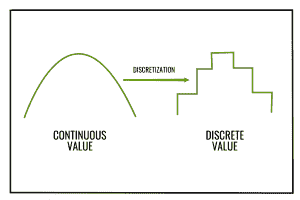

# ML |宁滨或离散化

> 原文:[https://www.geeksforgeeks.org/ml-binning-or-discretization/](https://www.geeksforgeeks.org/ml-binning-or-discretization/)

现实世界的数据往往很嘈杂。有噪声的数据是含有大量额外无意义信息的数据，称为噪声。数据清理(或数据清理)例程试图消除噪声，同时识别数据中的异常值。

有以下三种数据平滑技术–

1.  **宁滨:**宁滨方法通过查询排序后的数据值的“邻域”，即其周围的值，来平滑该值。
2.  **回归:**它使数据值符合一个函数。线性回归包括找到“最佳”线来拟合两个属性(或变量)，以便一个属性可以用来预测另一个属性。
3.  **异常值分析:**异常值可以通过聚类来检测，例如，相似的值被组织成组，或“聚类”。直观地，落在该组聚类之外的值可以被认为是异常值。

**数据平滑的宁滨方法–**
这里我们关注的是数据平滑的宁滨方法。在这种方法中，首先对数据进行排序，然后将排序后的值分配到多个*桶*或*箱*中。由于宁滨方法参考了值的邻域，所以它们执行局部平滑。

基本上有两种类型的绑定方法–

1.  **Equal width (or distance) binning :** The simplest binning approach is to partition the range of the variable into k equal-width intervals. The interval width is simply the range [A, B] of the variable divided by k,

    ```
    w = (B-A) / k
    ```

    因此，i <sup>第</sup>区间范围将是`[A + (i-1)w, A + iw]`，其中 i = 1，2，3…..k
    偏斜的数据用这种方法处理不好。

2.  **等深度(或等频率)宁滨:**在等频率宁滨中，我们将变量的范围[A，B]划分为包含(大约)相等数量点的区间；由于重复的值，相等的频率可能是不可能的。

#### 如何对数据进行平滑处理？

有三种方法可以执行平滑–

1.  **通过面元手段平滑:**在通过面元手段平滑中，面元中的每个值都被面元的平均值所代替。
2.  **按箱中值平滑:**在此方法中，每个箱值都被其箱中值替换。
3.  **按面元边界平滑:**在按面元边界平滑中，给定面元中的最小值和最大值被标识为面元边界。然后，每个箱值被最接近的边界值替换。

价格排序数据(美元):2、6、7、9、13、20、21、25、30

```
Partition using equal frequency approach:
Bin 1 : 2, 6, 7
Bin 2 : 9, 13, 20
Bin 3 : 21, 24, 30

Smoothing by bin mean :
Bin 1 : 5, 5, 5
Bin 2 : 14, 14, 14
Bin 3 : 25, 25, 25

Smoothing by bin median :
Bin 1 : 6, 6, 6
Bin 2 : 13, 13, 13
Bin 3 : 24, 24, 24

Smoothing by bin boundary :
Bin 1 : 2, 7, 7
Bin 2 : 9, 9, 20
Bin 3 : 21, 21, 30

```

宁滨也可以作为 ***的离散化手法*** 。这里，离散化是指将连续属性、特征或变量转换或划分为离散化或名义属性/特征/变量/区间的过程。
例如，属性值可以通过应用*等宽*或*等频*宁滨离散化，然后用箱均值或中值替换每个箱值，分别如通过箱均值平滑或通过箱中值平滑。然后，连续值可以被转换为标称值或离散值，该值与其对应的箱的值相同。


下面是 Python 实现:

## bin _ 均值

```
import numpy as np
from sklearn.linear_model import LinearRegression
from sklearn import linear_model
# import statsmodels.api as sm
import statistics
import math
from collections import OrderedDict

x =[]
print("enter the data")
x = list(map(float, input().split()))

print("enter the number of bins")
bi = int(input())

# X_dict will store the data in sorted order
X_dict = OrderedDict()
# x_old will store the original data
x_old ={}
# x_new will store the data after binning
x_new ={}

for i in range(len(x)):
    X_dict[i]= x[i]
    x_old[i]= x[i]

x_dict = sorted(X_dict.items(), key = lambda x: x[1])

# list of lists(bins)
binn =[]
# a variable to find the mean of each bin
avrg = 0

i = 0
k = 0
num_of_data_in_each_bin = int(math.ceil(len(x)/bi))

# performing binning
for g, h in X_dict.items():
    if(i<num_of_data_in_each_bin):
        avrg = avrg + h
        i = i + 1
    elif(i == num_of_data_in_each_bin):
        k = k + 1
        i = 0
        binn.append(round(avrg / num_of_data_in_each_bin, 3))
        avrg = 0
        avrg = avrg + h
        i = i + 1
rem = len(x)% bi
if(rem == 0):
    binn.append(round(avrg / num_of_data_in_each_bin, 3))
else:
    binn.append(round(avrg / rem, 3))

# store the new value of each data
i = 0
j = 0
for g, h in X_dict.items():
    if(i<num_of_data_in_each_bin):
        x_new[g]= binn[j]
        i = i + 1
    else:
        i = 0
        j = j + 1
        x_new[g]= binn[j]
        i = i + 1
print("number of data in each bin")
print(math.ceil(len(x)/bi))

for i in range(0, len(x)):
    print('index {2} old value {0} new value {1}'.format(x_old[i], x_new[i], i))
```

## bin _ 中位数

```
import numpy as np
from sklearn.linear_model import LinearRegression
from sklearn import linear_model
# import statsmodels.api as sm
import statistics
import math
from collections import OrderedDict

x =[]
print("enter the data")
x = list(map(float, input().split()))

print("enter the number of bins")
bi = int(input())

# X_dict will store the data in sorted order
X_dict = OrderedDict()
# x_old will store the original data
x_old ={}
# x_new will store the data after binning
x_new ={}

for i in range(len(x)):
    X_dict[i]= x[i]
    x_old[i]= x[i]

x_dict = sorted(X_dict.items(), key = lambda x: x[1])

# list of lists(bins)
binn =[]
# a variable to find the mean of each bin
avrg =[]

i = 0
k = 0
num_of_data_in_each_bin = int(math.ceil(len(x)/bi))
# performing binning
for g, h in X_dict.items():
    if(i<num_of_data_in_each_bin):
        avrg.append(h)
        i = i + 1
    elif(i == num_of_data_in_each_bin):
        k = k + 1
        i = 0
        binn.append(statistics.median(avrg))
        avrg =[]
        avrg.append(h)
        i = i + 1

binn.append(statistics.median(avrg))

# store the new value of each data
i = 0
j = 0
for g, h in X_dict.items():
    if(i<num_of_data_in_each_bin):
        x_new[g]= round(binn[j], 3)
        i = i + 1
    else:
        i = 0
        j = j + 1
        x_new[g]= round(binn[j], 3)
        i = i + 1

print("number of data in each bin")
print(math.ceil(len(x)/bi))
for i in range(0, len(x)):
    print('index {2} old value {0} new value {1}'.format(x_old[i], x_new[i], i))
```

## 箱边界

```
import numpy as np
from sklearn.linear_model import LinearRegression
from sklearn import linear_model
# import statsmodels.api as sm
import statistics
import math
from collections import OrderedDict

x =[]
print("enter the data")
x = list(map(float, input().split()))

print("enter the number of bins")
bi = int(input())

# X_dict will store the data in sorted order
X_dict = OrderedDict()
# x_old will store the original data
x_old ={}
# x_new will store the data after binning
x_new ={}

for i in range(len(x)):
    X_dict[i]= x[i]
    x_old[i]= x[i]

x_dict = sorted(X_dict.items(), key = lambda x: x[1])

# list of lists(bins)
binn =[]
# a variable to find the mean of each bin
avrg =[]

i = 0
k = 0
num_of_data_in_each_bin = int(math.ceil(len(x)/bi))

for g, h in X_dict.items():
    if(i<num_of_data_in_each_bin):
        avrg.append(h)
        i = i + 1
    elif(i == num_of_data_in_each_bin):
        k = k + 1
        i = 0
        binn.append([min(avrg), max(avrg)])
        avrg =[]
        avrg.append(h)
        i = i + 1
binn.append([min(avrg), max(avrg)])

i = 0
j = 0

for g, h in X_dict.items():
    if(i<num_of_data_in_each_bin):
        if(abs(h-binn[j][0]) >= abs(h-binn[j][1])):
            x_new[g]= binn[j][1]
            i = i + 1
        else:
            x_new[g]= binn[j][0]
            i = i + 1
    else:
        i = 0
        j = j + 1
        if(abs(h-binn[j][0]) >= abs(h-binn[j][1])):
            x_new[g]= binn[j][1]
        else:
            x_new[g]= binn[j][0]
        i = i + 1

print("number of data in each bin")
print(math.ceil(len(x)/bi))
for i in range(0, len(x)):
    print('index {2} old value  {0} new value  {1}'.format(x_old[i], x_new[i], i))
```

**参考:**https://en.wikipedia.org/wiki/Data_binning