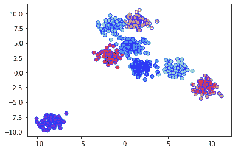

# ML | BIRCH 聚类

> 原文:[https://www.geeksforgeeks.org/ml-birch-clustering/](https://www.geeksforgeeks.org/ml-birch-clustering/)

像 K-means 聚类这样的聚类算法不能非常有效地执行聚类，并且很难用有限的资源(如内存或较慢的中央处理器)处理大型数据集。因此，随着数据集大小的增加，常规聚类算法在运行时间和质量方面都不能很好地扩展。这就是 BIRCH 集群的优势所在。

**使用层次结构的平衡迭代约简和聚类(BIRCH)** 是一种聚类算法，它可以通过首先生成大数据集的小而紧凑的摘要来聚类大数据集，该摘要保留了尽可能多的信息。然后对较小的摘要进行聚类，而不是对较大的数据集进行聚类。

BIRCH 通常用于补充其他聚类算法，方法是创建其他聚类算法现在可以使用的数据集摘要。然而，BIRCH 有一个主要缺点——它只能处理度量属性。**度量属性**是其值可以在欧几里德空间中表示的任何属性，即不应该存在分类属性。

在实现 BIRCH 之前，我们必须了解两个重要的术语:**聚类特征(CF)和 CF–Tree**
**聚类特征(CF):**
BIRCH 将大数据集总结成更小、更密集的区域，称为聚类特征(CF)条目。形式上，聚类特征条目被定义为有序三元组， *(N，LS，SS)* ，其中“N”是聚类中数据点的数量，“LS”是数据点的线性和，“SS”是聚类中数据点的平方和。一个 CF 条目可能由其他 CF 条目组成。

**CF 树:**
CF 树是我们到目前为止一直在谈论的实际紧凑表示。CF 树是每个叶节点包含一个子簇的树。CF 树中的每个条目都包含一个指向子节点的指针和一个由子节点中的 CF 条目之和组成的 CF 条目。每个叶节点中有最大数量的条目。这个最大数值叫做 ***阈值*** 。我们将进一步了解这个阈值是什么。

**BIRCH 算法参数:**

*   ***阈值*** :阈值是指一个子簇在 CF 树的叶节点中能够容纳的最大数据点数量。
*   ***分支因子*** :该参数指定每个节点(内部节点)中 CF 子簇的最大数量。
*   ***n_clusters*** :整个 BIRCH 算法完成后返回的聚类数，即最终聚类步骤后的聚类数。如果设置为无，则不执行最后的聚类步骤，并返回中间聚类。

**Python 中 BIRCH 的实现:**
为了这个例子，我们将使用 scikit-learn 的`make_blobs()`方法生成一个用于聚类的数据集。要了解 make_blobs()的更多信息，您可以参考以下链接:[https://sci kit-learn . org/stable/modules/generated/sklearn . dataset . make _ blobs . html](https://scikit-learn.org/stable/modules/generated/sklearn.datasets.make_blobs.html)

**代码:用 600 个随机生成的样本创建 8 个聚类，然后将结果绘制成散点图。**

```py
# Import required libraries and modules
import matplotlib.pyplot as plt
from sklearn.datasets.samples_generator import make_blobs
from sklearn.cluster import Birch

# Generating 600 samples using make_blobs
dataset, clusters = make_blobs(n_samples = 600, centers = 8, cluster_std = 0.75, random_state = 0)

# Creating the BIRCH clustering model
model = Birch(branching_factor = 50, n_clusters = None, threshold = 1.5)

# Fit the data (Training)
model.fit(dataset)

# Predict the same data
pred = model.predict(dataset)

# Creating a scatter plot
plt.scatter(dataset[:, 0], dataset[:, 1], c = pred, cmap = 'rainbow', alpha = 0.7, edgecolors = 'b')
plt.show()
```

**输出图:**

<center></center>