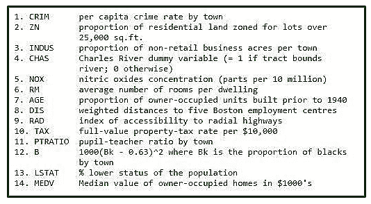
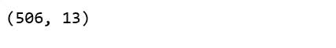
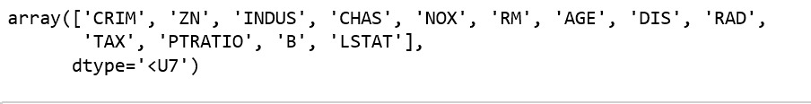

# ML |波士顿住房卡格尔挑战与线性回归

> 原文:[https://www . geesforgeks . org/ml-Boston-housing-kaggle-challenge-with-linear-revolution/](https://www.geeksforgeeks.org/ml-boston-housing-kaggle-challenge-with-linear-regression/)

**波士顿住房数据:**该数据集取自 StatLib 图书馆，由卡内基梅隆大学维护。该数据集涉及住房城市波士顿的房价。提供的数据集有 506 个实例，包含 13 个要素。
数据集描述取自



让我们建立线性回归模型，预测房价
输入库和数据集。

## 蟒蛇 3

```
# Importing Libraries
import numpy as np
import pandas as pd
import matplotlib.pyplot as plt

# Importing Data
from sklearn.datasets import load_boston
boston = load_boston()
```

输入波士顿数据并获取要素名称的形状

## 蟒蛇 3

```
boston.data.shape
```



## 蟒蛇 3

```
boston.feature_names
```



将数据从 nd-array 转换为数据帧，并将特征名称添加到数据中

## 蟒蛇 3

```
data = pd.DataFrame(boston.data)
data.columns = boston.feature_names

data.head(10)
```