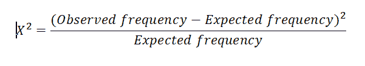

# ML |特征选择卡方检验

> 原文:[https://www . geesforgeks . org/ml-chi-square-test-for-feature-selection/](https://www.geeksforgeeks.org/ml-chi-square-test-for-feature-selection/)

特征选择也称为属性选择，是从数据集中*提取最相关的特征*，然后应用机器学习算法以获得模型更好性能的过程。大量不相关的特征会成倍增加训练时间，增加过拟合的风险。

**特征提取的卡方检验:**
*卡方*检验用于数据集中的分类特征。我们计算每个特征和目标之间的卡方，并选择具有最佳卡方得分的期望数量的特征。它确定样本的两个分类变量之间的关联是否反映了它们在人群中的真实关联。
卡方得分由:

**给出，其中–**

> **观测频率** =类的观测数量
> **期望频率** =如果特征和目标之间没有关系，则类的期望观测数量。

卡方特征选择的 Python 实现:

```py
# Load libraries
from sklearn.datasets import load_iris
from sklearn.feature_selection import SelectKBest
from sklearn.feature_selection import chi2

# Load iris data
iris_dataset = load_iris()

# Create features and target
X = iris_dataset.data
y = iris_dataset.target

# Convert to categorical data by converting data to integers
X = X.astype(int)

# Two features with highest chi-squared statistics are selected
chi2_features = SelectKBest(chi2, k = 2)
X_kbest_features = chi2_features.fit_transform(X, y)

# Reduced features
print('Original feature number:', X.shape[1])
print('Reduced feature number:', X_kbest.shape[1])
```

**输出:**

```py
Original feature number: 4
Reduced feature number : 2
```