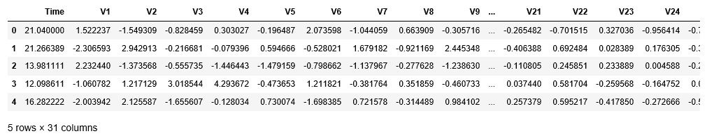
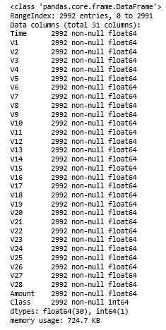
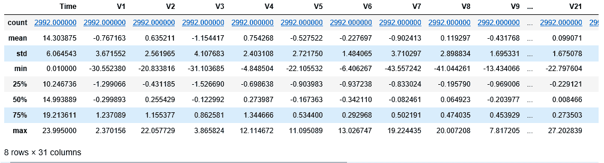
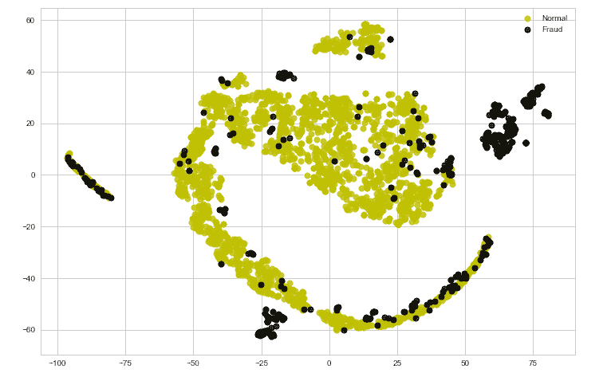
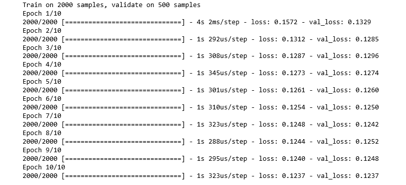
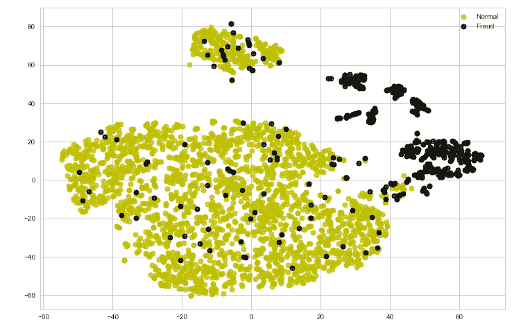
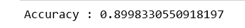
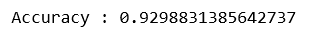

# ML |使用自动编码器对数据进行分类

> 原文:[https://www . geesforgeks . org/ml-分类-数据-使用自动编码器/](https://www.geeksforgeeks.org/ml-classifying-data-using-an-auto-encoder/)

**先决条件:** [构建自动编码器](https://www.geeksforgeeks.org/building-an-auto-encoder-using-keras/)

本文将演示如何使用自动编码器对数据进行分类。下面使用的数据是**信用卡交易**数据，用于预测给定交易是否具有欺诈性。数据可以从[这里](https://www.kaggle.com/mlg-ulb/creditcardfraud)下载。

**步骤 1:加载所需的库**

```
import pandas as pd 
import numpy as np
from sklearn.model_selection import train_test_split 
from sklearn.linear_model import LogisticRegression
from sklearn.svm import SVC
from sklearn.metrics import accuracy_score
from sklearn.preprocessing import MinMaxScaler 
from sklearn.manifold import TSNE
import matplotlib.pyplot as plt
import seaborn as sns
from keras.layers import Input, Dense
from keras.models import Model, Sequential
from keras import regularizers
```

**第二步:加载数据**

```
# Changing the working location to the location of the data
cd C:\Users\Dev\Desktop\Kaggle\Credit Card Fraud

# Loading the dataset
df = pd.read_csv('creditcard.csv')

# Making the Time values appropriate for future work
df['Time'] = df['Time'].apply(lambda x : (x / 3600) % 24)

# Separating the normal and fraudulent transactions
fraud = df[df['Class']== 1]
normal = df[df['Class']== 0].sample(2500)

# Reducing the dataset because of machinery constraints
df = normal.append(fraud).reset_index(drop = True)

# Separating the dependent and independent variables
y = df['Class']
X = df.drop('Class', axis = 1)
```

**第三步:探索数据**

a)

```
df.head()
```



b)

```
df.info()
```



c)

```
df.describe()
```



**第 4 步:定义一个效用函数来绘制数据**

```
def tsne_plot(x, y):

    # Setting the plotting background
    sns.set(style ="whitegrid")

    tsne = TSNE(n_components = 2, random_state = 0)

    # Reducing the dimensionality of the data
    X_transformed = tsne.fit_transform(x)

    plt.figure(figsize =(12, 8))

    # Building the scatter plot
    plt.scatter(X_transformed[np.where(y == 0), 0], 
                X_transformed[np.where(y == 0), 1],
                marker ='o', color ='y', linewidth ='1',
                alpha = 0.8, label ='Normal')
    plt.scatter(X_transformed[np.where(y == 1), 0],
                X_transformed[np.where(y == 1), 1],
                marker ='o', color ='k', linewidth ='1',
                alpha = 0.8, label ='Fraud')

    # Specifying the location of the legend
    plt.legend(loc ='best')

    # Plotting the reduced data
    plt.show()
```

**第五步:可视化原始数据**

```
tsne_plot(X, y)
```



请注意，数据目前不容易分离。在接下来的步骤中，我们将尝试使用自动编码器对数据进行编码，并分析结果。

**第六步:清理数据，使其适合自动编码器**

```
# Scaling the data to make it suitable for the auto-encoder
X_scaled = MinMaxScaler().fit_transform(X)
X_normal_scaled = X_scaled[y == 0]
X_fraud_scaled = X_scaled[y == 1]
```

**步骤 7:建立自动编码器神经网络**

```
# Building the Input Layer
input_layer = Input(shape =(X.shape[1], ))

# Building the Encoder network
encoded = Dense(100, activation ='tanh',
                activity_regularizer = regularizers.l1(10e-5))(input_layer)
encoded = Dense(50, activation ='tanh',
                activity_regularizer = regularizers.l1(10e-5))(encoded)
encoded = Dense(25, activation ='tanh',
                activity_regularizer = regularizers.l1(10e-5))(encoded)
encoded = Dense(12, activation ='tanh',
                activity_regularizer = regularizers.l1(10e-5))(encoded)
encoded = Dense(6, activation ='relu')(encoded)

# Building the Decoder network
decoded = Dense(12, activation ='tanh')(encoded)
decoded = Dense(25, activation ='tanh')(decoded)
decoded = Dense(50, activation ='tanh')(decoded)
decoded = Dense(100, activation ='tanh')(decoded)

# Building the Output Layer
output_layer = Dense(X.shape[1], activation ='relu')(decoded)
```

**步骤 8:定义和训练自动编码器**

```
# Defining the parameters of the Auto-encoder network
autoencoder = Model(input_layer, output_layer)
autoencoder.compile(optimizer ="adadelta", loss ="mse")

# Training the Auto-encoder network
autoencoder.fit(X_normal_scaled, X_normal_scaled, 
                batch_size = 16, epochs = 10, 
                shuffle = True, validation_split = 0.20)
```



**第九步:保留自动编码器的编码器部分进行数据编码**

```
hidden_representation = Sequential()
hidden_representation.add(autoencoder.layers[0])
hidden_representation.add(autoencoder.layers[1])
hidden_representation.add(autoencoder.layers[2])
hidden_representation.add(autoencoder.layers[3])
hidden_representation.add(autoencoder.layers[4])
```

**步骤 10:编码数据并可视化编码数据**

```
# Separating the points encoded by the Auto-encoder as normal and fraud
normal_hidden_rep = hidden_representation.predict(X_normal_scaled)
fraud_hidden_rep = hidden_representation.predict(X_fraud_scaled)

# Combining the encoded points into a single table 
encoded_X = np.append(normal_hidden_rep, fraud_hidden_rep, axis = 0)
y_normal = np.zeros(normal_hidden_rep.shape[0])
y_fraud = np.ones(fraud_hidden_rep.shape[0])
encoded_y = np.append(y_normal, y_fraud)

# Plotting the encoded points
tsne_plot(encoded_X, encoded_y)
```



请注意，在对数据进行编码之后，数据已经接近于线性可分离。因此，在某些情况下，数据编码有助于使数据的分类边界为线性。为了对这一点进行数值分析，我们将对编码数据拟合线性**逻辑回归**模型，对原始数据拟合**支持向量分类器**。

**第 11 步:将原始数据和编码数据拆分成训练和测试数据**

```
# Splitting the encoded data for linear classification
X_train_encoded, X_test_encoded, y_train_encoded, y_test_encoded = train_test_split(encoded_X, encoded_y, test_size = 0.2)

# Splitting the original data for non-linear classification
X_train, X_test, y_train, y_test = train_test_split(X, y, test_size = 0.2)
```

**步骤 12:建立逻辑回归模型并评估其性能**

```
# Building the logistic regression model
lrclf = LogisticRegression()
lrclf.fit(X_train_encoded, y_train_encoded)

# Storing the predictions of the linear model
y_pred_lrclf = lrclf.predict(X_test_encoded)

# Evaluating the performance of the linear model
print('Accuracy : '+str(accuracy_score(y_test_encoded, y_pred_lrclf)))
```



**步骤 13:建立支持向量分类器模型并评估其性能**

```
# Building the SVM model
svmclf = SVC()
svmclf.fit(X_train, y_train)

# Storing the predictions of the non-linear model
y_pred_svmclf = svmclf.predict(X_test)

# Evaluating the performance of the non-linear model
print('Accuracy : '+str(accuracy_score(y_test, y_pred_svmclf)))
```



因此，性能度量支持上述观点，即由于线性逻辑回归模型的性能非常接近非线性支持向量分类器模型的性能，所以编码数据有时对于使数据线性可分是有用的。