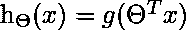

# ML |逻辑回归中的成本函数

> 原文:[https://www . geesforgeks . org/ml-成本-功能-在逻辑回归中/](https://www.geeksforgeeks.org/ml-cost-function-in-logistic-regression/)

在线性回归的情况下，成本函数是–

![  J(\Theta) = \frac{1}{m} \sum_{i = 1}^{m} \frac{1}{2} [h_{\Theta}(x^{(i)}) - y^{(i)}]^{2}  ](img/639c3429fc56211273af82e372683060.png "Rendered by QuickLaTeX.com")

但是对于逻辑回归来说，

