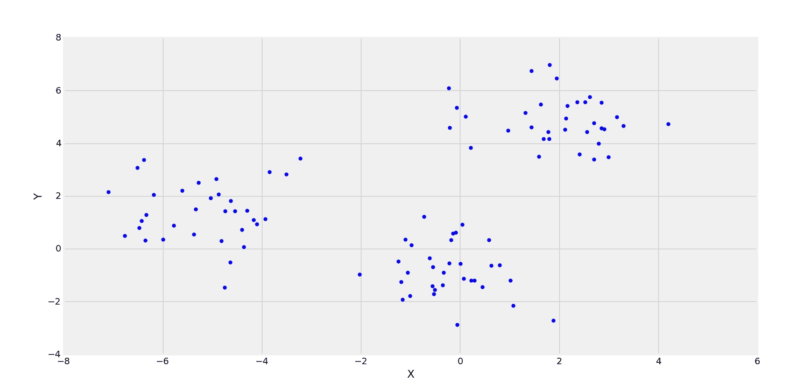
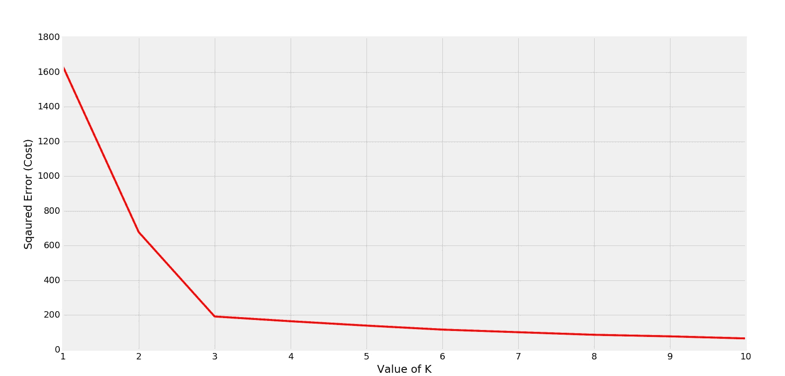
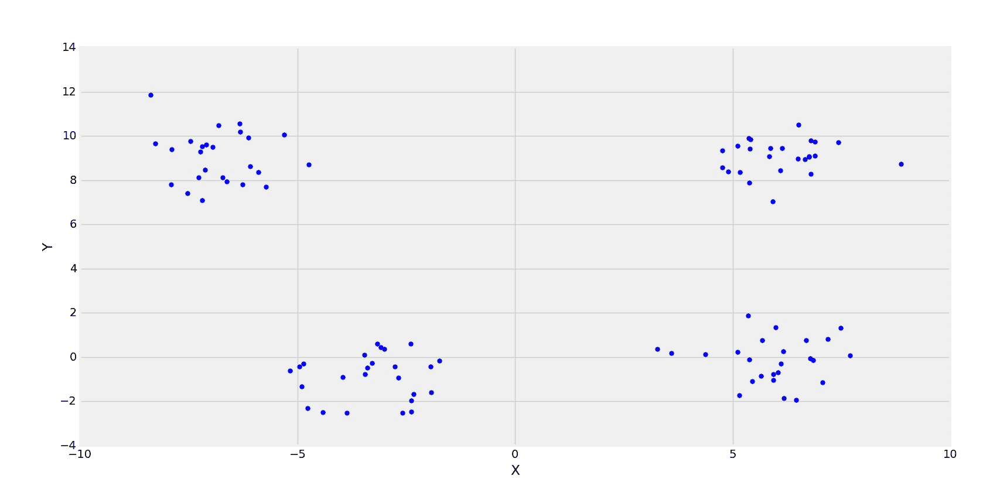
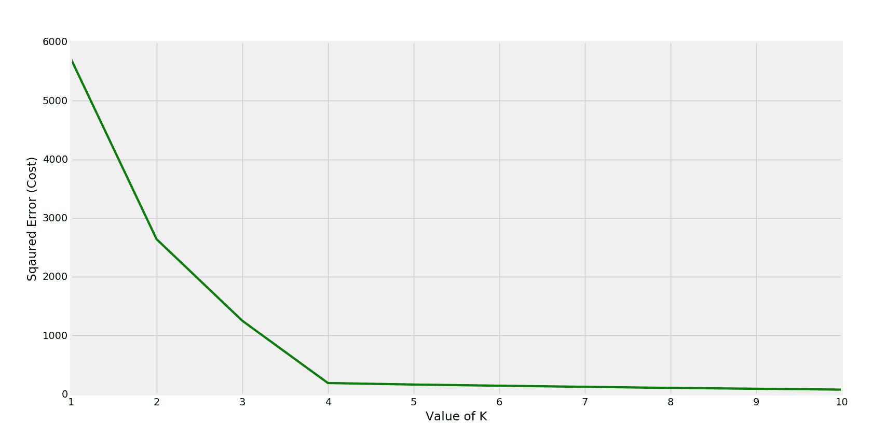
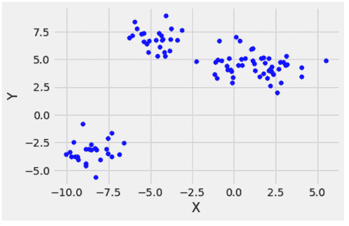
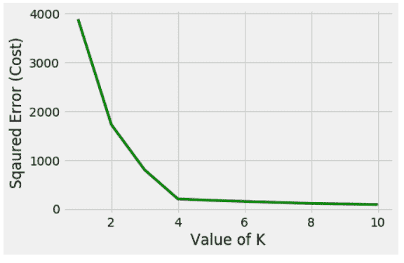

# ML |确定 K 均值聚类中 K 的最优值

> 原文:[https://www . geeksforgeeks . org/ml-确定 k-in-k-means-clustering/](https://www.geeksforgeeks.org/ml-determine-the-optimal-value-of-k-in-k-means-clustering/)

先决条件: [K-Means 聚类|简介](https://www.geeksforgeeks.org/k-means-clustering-introduction/)
有一种流行的方法称为**肘形法**，用于确定 K 的最优值以执行 K-Means 聚类算法。这种方法背后的基本思想是，它通过改变 *k* 来绘制各种成本值。随着 *K* 值的增加，集群中的元素会越来越少。所以平均失真会降低。元素数量越少意味着越接近质心。所以，这种扭曲下降最多的点是**肘点**。



3 个集群正在形成

在上图中，它清楚地观察到，点的分布正在形成 3 个集群。现在，让我们看看不同 k 值的平方误差(成本)图



K=3 时形成弯头

显然，弯头是在 K=3 时形成的。所以执行 K-Means 的最佳值将是 3。
另一个有 4 个簇的例子。



4 簇

对应成本图-



K=4 时形成弯头

在这种情况下，k 的最佳值是 4。(可从分散的点观察到)。
下面是 Python 实现:

## 蟒蛇 3

```py
import matplotlib.pyplot as plt
from matplotlib import style
from sklearn.cluster import KMeans
from sklearn.datasets.samples_generator import make_blobs

style.use("fivethirtyeight")

# make_blobs() is used to generate sample points
# around c centers (randomly chosen)
X, y = make_blobs(n_samples = 100, centers = 4,
                cluster_std = 1, n_features = 2)

plt.scatter(X[:, 0], X[:, 1], s = 30, color ='b')

# label the axes
plt.xlabel('X')
plt.ylabel('Y')

plt.show()
plt.clf() # clear the figure
```

**输出:**



## 蟒蛇 3

```py
cost =[]
for i in range(1, 11):
    KM = KMeans(n_clusters = i, max_iter = 500)
    KM.fit(X)

    # calculates squared error
    # for the clustered points
    cost.append(KM.inertia_)    

# plot the cost against K values
plt.plot(range(1, 11), cost, color ='g', linewidth ='3')
plt.xlabel("Value of K")
plt.ylabel("Squared Error (Cost)")
plt.show() # clear the plot

# the point of the elbow is the
# most optimal value for choosing k
```

**输出:**

