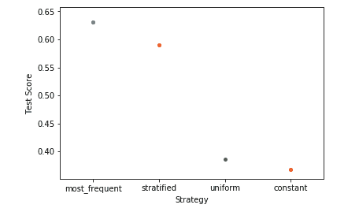
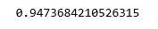

# ML |使用 sklearn 的虚拟分类器

> 原文:[https://www . geesforgeks . org/ml-dummy-classifiers-using-sklearn/](https://www.geeksforgeeks.org/ml-dummy-classifiers-using-sklearn/)

虚拟分类器是一种分类器，它不会对数据产生任何洞察，并且只使用简单的规则对给定的数据进行分类。分类器的行为完全独立于训练数据，因为训练数据中的趋势被完全忽略，而是使用策略之一来预测类别标签。
它仅用作其他分类器的简单基线，即任何其他分类器都有望在给定数据集上表现更好。它对于肯定存在类不平衡的数据集特别有用。它基于这样一种理念，即任何分类问题的分析方法都应该优于随机猜测方法。

**下面是虚拟分类器用来预测类别标签的一些策略–**

1.  **最频繁:**分类器总是预测训练数据中最频繁的类标签。
2.  **分层:**它通过尊重训练数据的类分布来生成预测。它不同于“最频繁”策略，因为它将概率与作为最频繁类标签的每个数据点相关联。
3.  **均匀:**随机均匀生成预测。
4.  **常量:**分类器总是预测一个常量标签，主要用于非多数类标签的分类。

现在，让我们看看使用 sklearn 库实现虚拟分类器–

**步骤 1:导入所需的库**

```
import numpy as np
import pandas as pd
from sklearn.model_selection import train_test_split
from sklearn.neighbors import KNeighborsClassifier
import matplotlib.pyplot as plt 
import seaborn as sns
```

**第二步:读取数据集**

```
cd C:\Users\Dev\Desktop\Kaggle\Breast_Cancer
# Changing the read file location to the location of the file
df = pd.read_csv('data.csv')

y = df['diagnosis']
X = df.drop('diagnosis', axis = 1)
X = X.drop('Unnamed: 32', axis = 1)
X = X.drop('id', axis = 1)
# Separating the dependent and independent variable

X_train, X_test, y_train, y_test = train_test_split(
            X, y, test_size = 0.3, random_state = 0)
# Splitting the data into training and testing data
```

**第三步:训练假人模型**

```
strategies = ['most_frequent', 'stratified', 'uniform', 'constant']

test_scores = []
for s in strategies:
    if s =='constant':
        dclf = DummyClassifier(strategy = s, random_state = 0, constant ='M')
    else:
        dclf = DummyClassifier(strategy = s, random_state = 0)
    dclf.fit(X_train, y_train)
    score = dclf.score(X_test, y_test)
    test_scores.append(score)
```

**第四步:分析我们的结果**

```
ax = sns.stripplot(strategies, test_scores);
ax.set(xlabel ='Strategy', ylabel ='Test Score')
plt.show()
```



**第五步:训练 KNN 模型**

```
clf = KNeighborsClassifier(n_neighbors = 5)
clf.fit(X_train, y_train)
print(clf.score(X_test, y_test))
```



通过比较 KNN 分类器和虚拟分类器的得分，我们得出结论，对于给定的数据，KNN 分类器实际上是一个好的分类器。