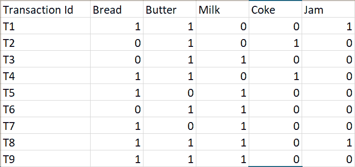

# ML | ECLAT 算法

> 原文:[https://www.geeksforgeeks.org/ml-eclat-algorithm/](https://www.geeksforgeeks.org/ml-eclat-algorithm/)

**先决条件:** [先验算法](https://www.geeksforgeeks.org/apriori-algorithm/)

ECLAT 算法代表**等价类聚类和自下而上的格遍历**。它是[关联规则挖掘](https://en.wikipedia.org/wiki/Association_rule_learning)的常用方法之一。它是 Apriori 算法的一个更高效、更可扩展的版本。Apriori 算法在水平方向上模仿图的广度优先搜索，而 ECLAT 算法在垂直方向上像图的深度优先搜索一样工作。ECLAT 算法的这种垂直方法使其成为比 Apriori 算法更快的算法。

**算法是如何工作的？:**
基本思想是利用事务 Id 集(tid set)交集计算候选的支持值，避免产生前缀树中不存在的子集。在函数的第一次调用中，所有单个项目都与其花絮一起使用。然后递归调用该函数，在每次递归调用中，验证每个项-tidset 对，并与其他项-tidset 对组合。这个过程一直持续到没有候选项目-tidset 对可以被组合。

现在让我们通过一个例子来理解上面所说的工作

考虑以下交易记录

上面给出的数据是一个布尔矩阵，其中对于每个单元格(I，j)，该值表示第 j 项是否包含在第 I 个事务中。1 表示真，0 表示假。

我们现在第一次调用该函数，并以表格的形式排列每个项目及其 tid set:-

**k = 1，最小支撑= 2**

| **项** | **时间** |
| --- | --- |
| 面包 | {T1、T4、T5、T7、T8、T9} |
| 黄油 | {T1、T2、T3、T4、T6、T8、T9} |
| 牛奶 | {T3、T5、T6、T7、T8、T9} |
| 焦炭 | T4 T2 |
| 困境 | {T1，T8} |

我们现在递归调用该函数，直到没有更多的项目-tidset 对可以被组合:-

**k = 2**

| **项** | **时间** |
| --- | --- |
| {面包、黄油} | {T1、T4、T8、T9} |
| {面包、牛奶} | {T5、T7、T8、T9} |
| {面包、可乐} | T4 |
| {面包、果酱} | {T1，T8} |
| {黄油、牛奶} | {T3、T6、T8、T9} |
| {黄油、可乐} | T4 T2 |
| {黄油、果酱} | {T1，T8} |
| {牛奶、果酱} | {T8} |

**k = 3**

| **项** | **时间** |
| --- | --- |
| {面包、黄油、牛奶} | {T8，T9} |
| {面包、黄油、果酱} | {T1，T8} |

**k = 4**

| **项** | **时间** |
| --- | --- |
| {面包、黄油、牛奶、果酱} | {T8} |

我们停止在 k = 4，因为没有更多的项目-tidset 对要组合。

由于最小支持度= 2，我们从给定的数据集得出以下规则

| **购买的物品** | **推荐产品** |
| --- | --- |
| 面包 | 黄油 |
| 面包 | 牛奶 |
| 面包 | 困境 |
| 黄油 | 牛奶 |
| 黄油 | 焦炭 |
| 黄油 | 困境 |
| 生计 | 牛奶 |
| 生计 | 困境 |

**优于 Apriori 算法:-**

1.  **内存需求:**由于 ECLAT 算法采用深度优先搜索方式，因此比 Apriori 算法占用的内存更少。
2.  **速度:**ECLAT 算法通常比 Apriori 算法更快。
3.  **计算次数:**ECLAT 算法不涉及重复扫描数据来计算单个支持值。