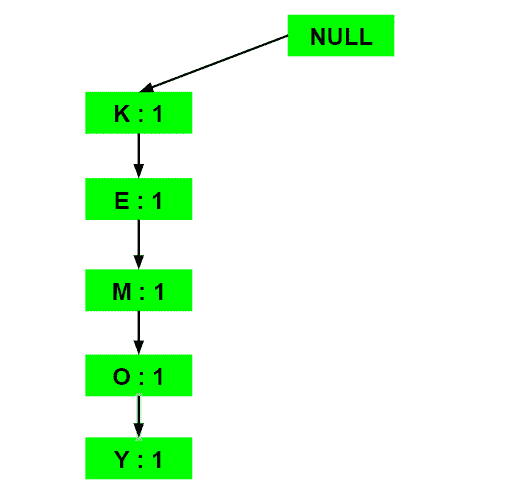
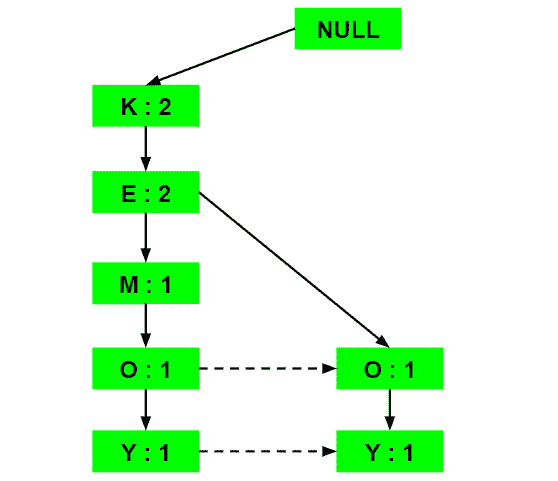
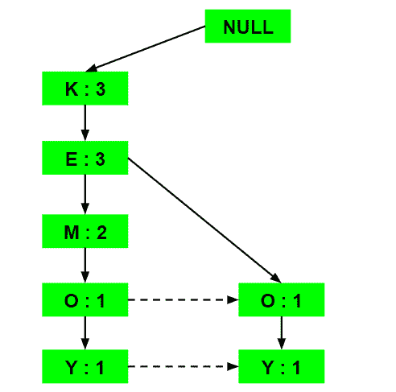
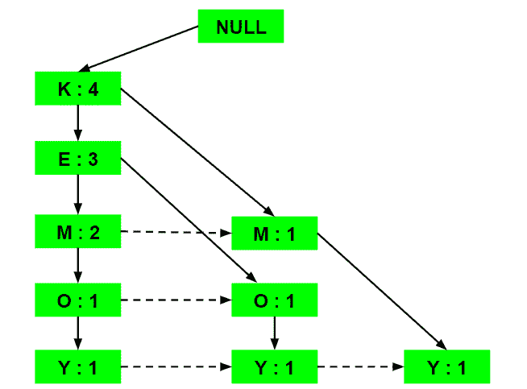
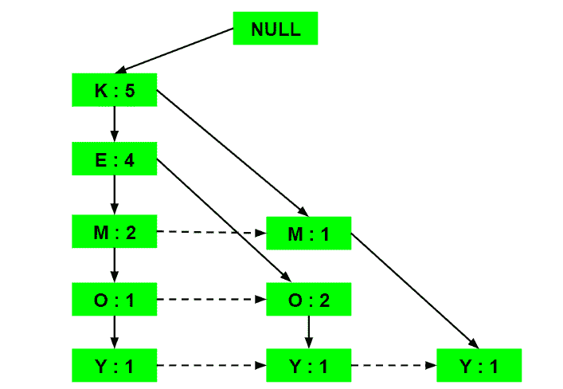
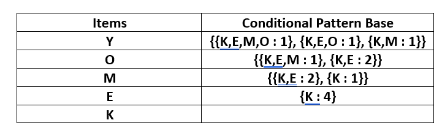
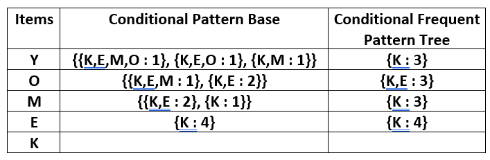
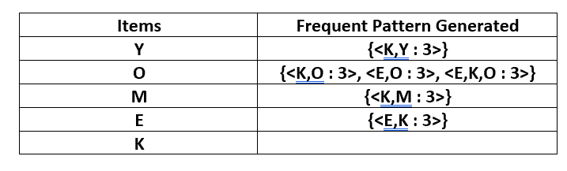

# ML |频繁模式增长算法

> 原文:[https://www . geesforgeks . org/ml-frequency-pattern-growth-algorithm/](https://www.geeksforgeeks.org/ml-frequent-pattern-growth-algorithm/)

**先决条件:** [先验算法](https://www.geeksforgeeks.org/apriori-algorithm/)

**先决条件:** [特里数据结构](https://www.geeksforgeeks.org/trie-insert-and-search/)

Apriori 算法的两个主要缺点是:

1.  在每一步，都必须建立候选集。
2.  为了建立候选集，算法必须重复扫描数据库。

这两个属性不可避免地会使算法变慢。为了克服这些冗余步骤，提出了一种新的关联规则挖掘算法——频繁模式增长算法。它通过将所有事务存储在一个 Trie 数据结构中，克服了 Apriori 算法的缺点。考虑以下数据:-

![\begin{tabular}{|c|c|} \hline \textbf{Transaction ID} & \textbf{Items} \\ \hline T1 & $\{\mathrm{E}, \mathrm{K}, \mathrm{M}, \mathrm{N}, \mathrm{O}, \mathrm{Y}\}$ \\ \hline T2 & $\{\mathrm{D}, \mathrm{E}, \mathrm{K}, \mathrm{N}, \mathbf{O}, \mathrm{Y}\}$ \\ \hline T3 & $\{\mathrm{A}, \mathrm{E}, \mathrm{K}, \mathrm{M}\}$ \\ \hline T4 & $\{\mathrm{C}, \mathrm{K}, \mathrm{M}, \mathrm{U}, \mathrm{Y}\}$ \\ \hline T5 & $\{\mathrm{C}, \mathrm{E}, \mathrm{I}, \mathrm{K}, \mathrm{O}, \mathrm{O}\}$ \\ \hline \end{tabular}](img/c1e9164c11e04ddc076ffec6f68974f4.png "Rendered by QuickLaTeX.com")

上面给出的数据是一个假设的交易数据集，每个字母代表一个项目。计算每个单项的频率:-

让最小支持为 3。建立一个**频繁模式集**，它将包含频率大于或等于最小支持度的所有元素。这些元素以其各自频率的降序存储。插入相关项目后，集合 L 看起来是这样的:-

**L = {K : 5，E : 4，M : 3，O : 4，Y : 3}**

现在，对于每个交易，构建各自的 **Ordered-Item 集合**。这是通过迭代频繁模式集并检查当前项目是否包含在所讨论的事务中来完成的。如果包含当前物料，该物料将插入当前事务处理的订购物料集中。下表是为所有交易建立的:

![\begin{tabular}{c|c|c}  \textbf {Transaction ID} & \textbf {Items} & \textbf {Ordered-Item Set} \\ \hline T1 & $\{\mathrm{E}, \mathrm{K}, \mathrm{M}, \mathrm{N}, \mathrm{O}, \mathrm{Y}\}$ & $\{\mathrm{K}, \mathrm{E}, \mathrm{M}, \mathrm{O}, \mathrm{Y}\}$ \\ \hline T2 & $\{\mathrm{D}, \mathrm{E}, \mathrm{K}, \mathrm{N}, \mathrm{O}, \mathrm{Y}\}$ & $\{\mathrm{K}, \mathrm{E}, \mathrm{O}, \mathrm{Y}\}$ \\ \hline $\mathrm{T} 3$ & $\{\mathrm{~A}, \mathrm{E}, \mathrm{K}, \mathrm{M}\}$ & $\{\mathrm{K}, \mathrm{E}, \mathrm{M}\}$ \\ \hline $\mathrm{T} 4$ & $\{\mathrm{C}, \mathrm{K}, \mathrm{M}, \mathrm{U}, \mathrm{Y}\}$ & $\{\mathrm{K}, \mathrm{M}, \mathrm{Y}\}$ \\ \hline $\mathrm{T} 5$ & $\{\mathrm{C}, \mathrm{E}, \mathrm{I}, \mathrm{K}, \mathrm{O}, \mathrm{O}\}$ & $\{\mathrm{K}, \mathrm{E}, \mathrm{O}\}$ \\ \hline \end{tabular}](img/d358e02eea804e61e7eaaa40351ce70e.png "Rendered by QuickLaTeX.com")

现在，所有有序项目集都被插入到一个 Trie 数据结构中。

a) **插入集合{K，E，M，O，Y}:**

这里，所有项目简单地按照集合中出现的顺序一个接一个地链接，并将每个项目的支持计数初始化为 1。

b) **插入集合{K，E，O，Y}:**

直到插入元素 K 和 E，简单地说，支持计数增加 1。在插入 O 时，我们可以看到 E 和 O 之间没有直接的链接，因此项 O 的新节点被初始化，支持计数为 1，项 E 链接到这个新节点。在插入 Y 时，我们首先为支持计数为 1 的项 Y 初始化一个新节点，并将 O 的新节点与 Y 的新节点链接起来。

c) **插入集合{K，E，M}:**

这里简单地将每个元素的支持计数增加 1。

d) **插入集合{K，M，Y}:**

类似于步骤 b)，首先增加 K 的支持计数，然后初始化 M 和 Y 的新节点并相应地链接。

e) **插入集合{K，E，O}:**

这里简单地增加了各个元素的支持计数。注意增加了 O 项新节点的支持计数。

现在，对于每个项目，计算**条件模式库**，它是通向频繁模式树中给定项目的任何节点的所有路径的路径标签。请注意，下表中的项目按照频率的升序排列。

现在为每个项目建立**条件频繁模式树。**取该项目的条件模式库中所有路径共有的元素集，通过对条件模式库中所有路径的支持计数求和来计算其支持计数。

从条件频繁模式树中，**频繁模式规则**是通过将条件频繁模式树的项目配对到对应于下表中给出的项目而生成的。

对于每一行，可以推断出两种类型的关联规则，例如，对于包含元素的第一行，可以推断出规则 K -> Y 和 Y -> K。为了确定有效规则，计算两个规则的置信度，并且保留置信度大于或等于最小置信度值的规则。