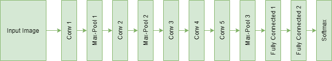

# ML | AlexNet 入门

> 原文:[https://www . geeksforgeeks . org/ml-入门使用-alexnet/](https://www.geeksforgeeks.org/ml-getting-started-with-alexnet/)

本文主要介绍 AlexNet 架构。它的名字来自 AlexNet [论文](https://papers.nips.cc/paper/4824-imagenet-classification-with-deep-convolutional-neural-networks.pdf)的主要作者之一——Alex Krizhevsky。它以 15.3%*的前 5 名错误率(击败了前 5 名错误率为 26.2% 的亚军)赢得了 2012 年 ImageNet 大规模视觉识别挑战赛(ILSVRC)。*

*AlexNet 论文最重要的特点是:*

*   *由于模型要训练*6000 万个*参数(这是相当多的)，容易出现过拟合。根据该论文，辍学和数据增加的使用大大有助于减少过度拟合。因此，该架构中的第一和第二完全连接层为此使用了 *0.5* 的退线。通过数据扩充人工增加图像数量有助于在运行时动态扩展数据集，这有助于模型更好地推广。*
*   *另一个明显的因素是使用 ReLU 激活函数而不是 tanh 或 sigmoid，这导致了更快的训练时间(训练时间减少了 *6 倍*)。深度学习网络通常采用 ReLU 非线性来实现更快的训练时间，因为其他网络在达到更高的激活值时开始饱和。*

### *建筑*

*该体系结构由 5 个卷积层组成，第 1、第 2 和第 5 层具有最大池层，用于适当的特征提取。最大汇集层是*重叠的*，其步长为 *2* ，滤波器尺寸为 *3×3* 。与非重叠最大池层相比，这导致 *top-1 和 top-5* 错误率分别降低了 ***0.4%*** 和 ***0.3%*** 。接下来是 *2* 全连接层(每个层都有脱落)和预测末端的软最大值层。*

*下图显示了定义了所有层的 AlexNet 的体系结构。*

**

***代码:实现对象分类 AlexNet 的 Python 代码***

```
*model = Sequential()

# 1st Convolutional Layer
model.add(Conv2D(filters = 96, input_shape = (224, 224, 3), 
            kernel_size = (11, 11), strides = (4, 4), 
            padding = 'valid'))
model.add(Activation('relu'))
# Max-Pooling 
model.add(MaxPooling2D(pool_size = (2, 2),
            strides = (2, 2), padding = 'valid'))
# Batch Normalisation
model.add(BatchNormalization())

# 2nd Convolutional Layer
model.add(Conv2D(filters = 256, kernel_size = (11, 11), 
            strides = (1, 1), padding = 'valid'))
model.add(Activation('relu'))
# Max-Pooling
model.add(MaxPooling2D(pool_size = (2, 2), strides = (2, 2), 
            padding = 'valid'))
# Batch Normalisation
model.add(BatchNormalization())

# 3rd Convolutional Layer
model.add(Conv2D(filters = 384, kernel_size = (3, 3), 
            strides = (1, 1), padding = 'valid'))
model.add(Activation('relu'))
# Batch Normalisation
model.add(BatchNormalization())

# 4th Convolutional Layer
model.add(Conv2D(filters = 384, kernel_size = (3, 3), 
            strides = (1, 1), padding = 'valid'))
model.add(Activation('relu'))
# Batch Normalisation
model.add(BatchNormalization())

# 5th Convolutional Layer
model.add(Conv2D(filters = 256, kernel_size = (3, 3), 
            strides = (1, 1), padding = 'valid'))
model.add(Activation('relu'))
# Max-Pooling
model.add(MaxPooling2D(pool_size = (2, 2), strides = (2, 2), 
            padding = 'valid'))
# Batch Normalisation
model.add(BatchNormalization())

# Flattening
model.add(Flatten())

# 1st Dense Layer
model.add(Dense(4096, input_shape = (224*224*3, )))
model.add(Activation('relu'))
# Add Dropout to prevent overfitting
model.add(Dropout(0.4))
# Batch Normalisation
model.add(BatchNormalization())

# 2nd Dense Layer
model.add(Dense(4096))
model.add(Activation('relu'))
# Add Dropout
model.add(Dropout(0.4))
# Batch Normalisation
model.add(BatchNormalization())

# Output Softmax Layer
model.add(Dense(num_classes))
model.add(Activation('softmax'))*
```