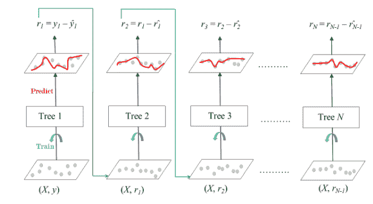

# ML–梯度增强

> 原文:[https://www.geeksforgeeks.org/ml-gradient-boosting/](https://www.geeksforgeeks.org/ml-gradient-boosting/)

**梯度增强**是一种流行的增强算法。在梯度增强中，每个预测器都会纠正其前身的错误。与 Adaboost 相反，训练实例的权重没有调整，而是使用前一个的残差作为标签来训练每个预测器。

有一种称为**梯度增强树**的技术，其基础学习者是 CART(分类和回归树)。

下图解释了如何针对回归问题训练梯度增强树。



用于回归的梯度增强树

整体由 *N* 棵树组成。使用特征矩阵 *X* 和标签 *y* 训练树 1。标记为 *y1(hat)* 的预测用于确定训练集残差 *r1* 。然后使用树 1 的特征矩阵 *X* 和残差 *r1* 作为标签来训练树 2。预测结果 *r1(hat)* 然后用于确定残差 *r2* 。重复该过程，直到形成集合的所有 *N* 树都被训练。

这项技术中使用了一个重要的参数，称为**收缩**。

**Shrinkage** refers to the fact that the prediction of each tree in the ensemble is shrunk after it is multiplied by the learning rate (eta) which ranges between 0 to 1\. There is a trade-off between eta and number of estimators, decreasing learning rate needs to be compensated with increasing estimators in order to reach certain model performance. Since all trees are trained now, predictions can be made.

每棵树预测一个标签，最终预测由公式给出，

```py
y(pred) = y1 + (eta *  r1) + (eta * r2) + ....... + (eta * rN)

```

scikit-learn 中的梯度增强回归类是**梯度增强回归器**。一个类似的算法被用于被称为**梯度增强分类器**的分类。

**代码:梯度增强回归器的 Python 代码**

```py
# Import models and utility functions
from sklearn.ensemble import GradientBoostingRegressor
from sklearn.model_selection import train_test_split
from sklearn.metrics import mean_squared_error as MSE
from sklearn import datasets

# Setting SEED for reproducibility
SEED = 1

# Importing the dataset 
bike = datasets.load_bike()
X, y = bike.data, bike.target

# Splitting dataset
train_X, test_X, train_y, test_y = train_test_split(X, y, test_size = 0.3, random_state = SEED)

# Instantiate Gradient Boosting Regressor
gbr = GradientBoostingRegressor(n_estimators = 200, max_depth = 1, random_state = SEED)

# Fit to training set
gbr.fit(train_X, train_y)

# Predict on test set
pred_y = gbr.predict(test_X)

# test set RMSE
test_rmse = MSE(test_y, pred_y) ** (1 / 2)

# Print rmse
print('RMSE test set: {:.2f}'.format(test_rmse))
```

**输出:**

```py
RMSE test set: 4.01

```