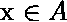
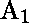
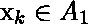
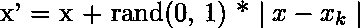

# ML |用 Python 中的 SMOTE 和 Miss 算法处理不平衡数据

> 原文:[https://www . geeksforgeeks . org/ml-处理不平衡数据-采用 python 中的 smote-miss 算法/](https://www.geeksforgeeks.org/ml-handling-imbalanced-data-with-smote-and-near-miss-algorithm-in-python/)

在机器学习和数据科学中，我们经常遇到一个叫做**不平衡数据分布**的术语，通常发生在一个类中的观察值比其他类高得多或低得多的时候。由于机器学习算法倾向于通过减少误差来提高精度，因此它们不考虑类分布。这个问题在**欺诈检测**、**异常检测**、**面部识别**等例子中普遍存在。

标准的最大似然技术，如决策树和逻辑回归，偏向于**多数**类，它们倾向于忽略少数类。他们倾向于只预测多数阶级，因此，与多数阶级相比，少数阶级有很大的错误分类。用更专业的话来说，如果我们的数据集中存在不平衡的数据分布，那么我们的模型就更容易出现少数民族可以忽略或很少**回忆**的情况。

**不平衡数据处理技术:**主要有 2 种主要算法被广泛用于处理不平衡的类分布。

1.  重击
2.  未遂事件算法

## **SMOTE(合成少数过采样技术)–过采样**

合成少数过采样技术是解决不平衡问题最常用的过采样方法之一。
旨在通过复制随机增加的少数民族阶级例子来平衡阶级分布。
SMOTE 在现有的少数民族实例之间合成新的少数民族实例。它通过线性插值为少数民族班级生成**虚拟训练记录。这些合成训练记录是通过为少数类中的每个示例随机选择一个或多个 k 近邻来生成的。在过采样过程之后，数据被重建，并且几个分类模型可以被应用于被处理的数据。
**更多关于 SMOTE 算法工作原理的深刻见解！****

*   **第一步:**设置少数类集合 **A** ，对于每个 **** ，通过计算 **x** 与集合 **A** 中每隔一个样本之间的**欧氏距离**得到 x 的 **k 近邻。***   **第二步:**采样率 **N** 根据不平衡比例设置。对于每个 **** ， **N** 个例子(即 x1，x2，…xn)从其 k 个最近邻中随机选择，它们构成集合。*   **Step 3:** For each example **** (k=1, 2, 3…N), the following formula is used to generate a new example:
    
    in which rand(0, 1) represents the random number between 0 and 1.

    ## **接近缺失算法–欠采样**

    接近缺失是一种欠采样技术。它旨在通过随机消除多数类示例来平衡类分布。当两个不同类的实例彼此非常接近时，我们移除多数类的实例来增加两个类之间的空间。这有助于分类过程。
    为了防止**信息丢失的问题**在大多数欠采样技术中，**近邻**方法被广泛使用。
    **关于近邻方法工作的基本直觉如下:**

    *   **步骤 1:** 该方法首先找到多数类的所有实例和少数类的实例之间的距离。这里，多数类将被欠采样。*   **步骤 2:** 然后，选择与少数民族类中的实例距离最小的多数民族类的 **n** 个实例。*   **Step 3:** If there are k instances in the minority class, the nearest method will result in **k*n** instances of the majority class.

    **为了在多数类中找到 n 个最接近的实例，有几种应用接近缺失算法的变体:**

    1.  **接近缺失–版本 1 :** 它选择多数类的样本，对于这些样本，到 k **最近的少数类**实例的平均距离最小。
    2.  **接近缺失–版本 2 :** 它选择多数类的样本，对于这些样本，到 k **最远的**少数类实例的平均距离最小。
    3.  **接近缺失–版本 3 :** 它分两步工作。首先，对于每个少数民族类实例，它们的 **M 最近邻**将被存储。最后，选择到 N 个最近邻的平均距离最大的多数类实例。

    **本文有助于更好地理解和实践如何在不同的不平衡数据处理技术之间做出最佳选择。**

    ### 加载库和数据文件

    数据集由信用卡交易组成。该数据集在 284，807 笔交易中有 **492 笔欺诈交易。这使得它高度不平衡，正类(欺诈)占所有交易的 0.172%。
    数据集可以从 **[这里](https://www.kaggle.com/mlg-ulb/creditcardfraud)** 下载。**

    ```
    # import necessary modules 
    import pandas  as pd
    import matplotlib.pyplot as plt
    import numpy as np
    from sklearn.linear_model import LogisticRegression
    from sklearn.preprocessing import StandardScaler
    from sklearn.metrics import confusion_matrix, classification_report

    # load the data set
    data = pd.read_csv('creditcard.csv')

    # print info about columns in the dataframe
    print(data.info())
    ```

    **输出:**

    ```
    RangeIndex: 284807 entries, 0 to 284806
    Data columns (total 31 columns):
    Time      284807 non-null float64
    V1        284807 non-null float64
    V2        284807 non-null float64
    V3        284807 non-null float64
    V4        284807 non-null float64
    V5        284807 non-null float64
    V6        284807 non-null float64
    V7        284807 non-null float64
    V8        284807 non-null float64
    V9        284807 non-null float64
    V10       284807 non-null float64
    V11       284807 non-null float64
    V12       284807 non-null float64
    V13       284807 non-null float64
    V14       284807 non-null float64
    V15       284807 non-null float64
    V16       284807 non-null float64
    V17       284807 non-null float64
    V18       284807 non-null float64
    V19       284807 non-null float64
    V20       284807 non-null float64
    V21       284807 non-null float64
    V22       284807 non-null float64
    V23       284807 non-null float64
    V24       284807 non-null float64
    V25       284807 non-null float64
    V26       284807 non-null float64
    V27       284807 non-null float64
    V28       284807 non-null float64
    Amount    284807 non-null float64
    Class     284807 non-null int64

    ```

    ```
    # normalise the amount column
    data['normAmount'] = StandardScaler().fit_transform(np.array(data['Amount']).reshape(-1, 1))

    # drop Time and Amount columns as they are not relevant for prediction purpose 
    data = data.drop(['Time', 'Amount'], axis = 1)

    # as you can see there are 492 fraud transactions.
    data['Class'].value_counts()
    ```

    **输出:**

    ```
           0    284315
           1       492

    ```

    ### 将数据分成测试集和训练集

    ```
    from sklearn.model_selection import train_test_split

    # split into 70:30 ration
    X_train, X_test, y_train, y_test = train_test_split(X, y, test_size = 0.3, random_state = 0)

    # describes info about train and test set
    print("Number transactions X_train dataset: ", X_train.shape)
    print("Number transactions y_train dataset: ", y_train.shape)
    print("Number transactions X_test dataset: ", X_test.shape)
    print("Number transactions y_test dataset: ", y_test.shape)
    ```

    **输出:**

    ```
          Number transactions X_train dataset:  (199364, 29)
          Number transactions y_train dataset:  (199364, 1)
          Number transactions X_test dataset:  (85443, 29)
          Number transactions y_test dataset:  (85443, 1)

    ```

    ### 现在在不处理不平衡的类分布的情况下训练模型

    ```
    # logistic regression object
    lr = LogisticRegression()

    # train the model on train set
    lr.fit(X_train, y_train.ravel())

    predictions = lr.predict(X_test)

    # print classification report
    print(classification_report(y_test, predictions))
    ```

    **输出:**

    ```

                    precision   recall   f1-score  support

               0       1.00      1.00      1.00     85296
               1       0.88      0.62      0.73       147

        accuracy                           1.00     85443
       macro avg       0.94      0.81      0.86     85443
    weighted avg       1.00      1.00      1.00     85443

    ```

    **准确率出来是 100%，但是你注意到什么奇怪的吗？**
    对少数民族阶级的回忆在很少。证明该模型更偏向多数人阶层。所以，证明这不是最好的模式。
    现在，我们将应用不同的**不平衡数据处理技术**，看看它们的准确性和召回结果。

    ### 使用 SMOTE 算法

    您可以从[这里](https://imbalanced-learn.readthedocs.io/en/stable/generated/imblearn.over_sampling.SMOTE.html)查看所有参数。

    ```
    print("Before OverSampling, counts of label '1': {}".format(sum(y_train == 1)))
    print("Before OverSampling, counts of label '0': {} \n".format(sum(y_train == 0)))

    # import SMOTE module from imblearn library
    # pip install imblearn (if you don't have imblearn in your system)
    from imblearn.over_sampling import SMOTE
    sm = SMOTE(random_state = 2)
    X_train_res, y_train_res = sm.fit_sample(X_train, y_train.ravel())

    print('After OverSampling, the shape of train_X: {}'.format(X_train_res.shape))
    print('After OverSampling, the shape of train_y: {} \n'.format(y_train_res.shape))

    print("After OverSampling, counts of label '1': {}".format(sum(y_train_res == 1)))
    print("After OverSampling, counts of label '0': {}".format(sum(y_train_res == 0)))
    ```

    **输出:**

    ```
    Before OverSampling, counts of label '1': [345]
    Before OverSampling, counts of label '0': [199019] 

    After OverSampling, the shape of train_X: (398038, 29)
    After OverSampling, the shape of train_y: (398038, ) 

    After OverSampling, counts of label '1': 199019
    After OverSampling, counts of label '0': 199019

    ```

    **看！【SMOTE 算法对少数实例进行过采样，使其等于多数类。两个类别的记录数量相等。更具体地说，少数民族已经增加到多数民族的总数。
    现在看看应用 SMOTE 算法(过采样)后的准确率和召回率结果。**

    #### 预测和回忆

    ```
    lr1 = LogisticRegression()
    lr1.fit(X_train_res, y_train_res.ravel())
    predictions = lr1.predict(X_test)

    # print classification report
    print(classification_report(y_test, predictions))
    ```

    **输出:**

    ```
                    precision   recall   f1-score  support

               0       1.00      0.98      0.99     85296
               1       0.06      0.92      0.11       147

        accuracy                           0.98     85443
       macro avg       0.53      0.95      0.55     85443
    weighted avg       1.00      0.98      0.99     85443

    ```

    **哇**我们相比之前的模型准确率降低到了 98%，但是小众类的召回值也提升到了 92 %。与前一个相比，这是一个很好的模型。回忆很棒。
    现在，我们将应用 NearMiss 技术对多数类进行欠采样，并查看其准确性和召回结果。

    ### 接近缺失算法:

    您可以从[这里](https://imbalanced-learn.org/en/stable/generated/imblearn.under_sampling.NearMiss.html)查看所有参数。

    ```
    print("Before Undersampling, counts of label '1': {}".format(sum(y_train == 1)))
    print("Before Undersampling, counts of label '0': {} \n".format(sum(y_train == 0)))

    # apply near miss
    from imblearn.under_sampling import NearMiss
    nr = NearMiss()

    X_train_miss, y_train_miss = nr.fit_sample(X_train, y_train.ravel())

    print('After Undersampling, the shape of train_X: {}'.format(X_train_miss.shape))
    print('After Undersampling, the shape of train_y: {} \n'.format(y_train_miss.shape))

    print("After Undersampling, counts of label '1': {}".format(sum(y_train_miss == 1)))
    print("After Undersampling, counts of label '0': {}".format(sum(y_train_miss == 0)))
    ```

    **输出:**

    ```
    Before Undersampling, counts of label '1': [345]
    Before Undersampling, counts of label '0': [199019] 

    After Undersampling, the shape of train_X: (690, 29)
    After Undersampling, the shape of train_y: (690, ) 

    After Undersampling, counts of label '1': 345
    After Undersampling, counts of label '0': 345

    ```

    **接近缺失算法**对多数实例进行了欠采样，使其等于多数类。在这里，多数类已经减少到少数类的总数，这样两个类的记录数将相等。

    #### 预测和回忆

    ```
    # train the model on train set
    lr2 = LogisticRegression()
    lr2.fit(X_train_miss, y_train_miss.ravel())
    predictions = lr2.predict(X_test)

    # print classification report
    print(classification_report(y_test, predictions))
    ```

    **输出:**

    ```
                   precision    recall   f1-score   support

               0       1.00      0.56      0.72     85296
               1       0.00      0.95      0.01       147

        accuracy                           0.56     85443
       macro avg       0.50      0.75      0.36     85443
    weighted avg       1.00      0.56      0.72     85443

    ```

    该模型比第一个模型更好，因为它分类更好，而且少数类的召回率为 95 %。但由于多数类的欠采样，其召回率已降至 56 %。因此，在这种情况下，SMOTE 给了我很高的准确性和召回率，我将继续使用该模型！🙂