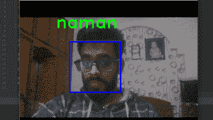

# ML |使用带 scikit-learn 的 k-NN 实现人脸识别

> 原文:[https://www . geesforgeks . org/ml-机具-人脸识别-使用-k-nn-with-scikit-learn/](https://www.geeksforgeeks.org/ml-implement-face-recognition-using-k-nn-with-scikit-learn/)

**k-最近邻居:**

k-NN 是机器学习中最基本的分类算法之一。它属于机器学习的监督学习范畴。k-NN 通常用于搜索应用程序，在这些应用程序中，您正在寻找“相似”的项目。我们测量相似性的方法是创建项目的向量表示，然后使用适当的距离度量(例如，像欧几里德距离)来比较向量。

它通常用于数据挖掘、模式识别、推荐系统和入侵检测。

> **使用的库有:**
> 
> OpenCV2
> 熊猫
> Numpy
> Scikit-learn

**使用的数据集:**
我们使用了`haarcascade_frontalface_default.xml`数据集，这个数据集在网上很容易找到，你也可以从[这个链接](https://github.com/opencv/opencv/tree/master/data/haarcascades)下载。

**Scikit-learn:**
*Scikit-learn*通过 Python 中一致的接口提供了一系列有监督和无监督的学习算法。
该库基于 SciPy 构建，必须安装在您的设备上才能使用 scikit_learn。

**人脸识别:**
这包括三个 Python 文件，其中*第一个*用于检测人脸并将其存储为列表格式，*第二个*第一个用于存储数据。csv '文件格式和第三个*一个用来识别人脸。*

人脸检测. py

```
# this file is used to detect face 
# and then store the data of the face
import cv2
import numpy as np

# import the file where data is
# stored in a csv file format
import npwriter

name = input("Enter your name: ")

# this is used to access the web-cam
# in order to capture frames
cap = cv2.VideoCapture(0)

classifier = cv2.CascadeClassifier("../dataset/haarcascade_frontalface_default.xml")

# this is class used to detect the faces as provided
# with a haarcascade_frontalface_default.xml file as data
f_list = []

while True:
    ret, frame = cap.read()

    # converting the image into gray
    # scale as it is easy for detection
    gray = cv2.cvtColor(frame, cv2.COLOR_BGR2GRAY)

    # detect multiscale, detects the face and its coordinates
    faces = classifier.detectMultiScale(gray, 1.5, 5)

    # this is used to detect the face which
    # is closest to the web-cam on the first position
    faces = sorted(faces, key = lambda x: x[2]*x[3],
                                     reverse = True)

    # only the first detected face is used
    faces = faces[:1]  

    # len(faces) is the number of
    # faces showing in a frame
    if len(faces) == 1:   
        # this is removing from tuple format      
        face = faces[0]   

        # storing the coordinates of the
        # face in different variables
        x, y, w, h = face 

        # this is will show the face
        # that is being detected     
        im_face = frame[y:y + h, x:x + w] 

        cv2.imshow("face", im_face)

    if not ret:
        continue

    cv2.imshow("full", frame)

    key = cv2.waitKey(1)

    # this will break the execution of the program
    # on pressing 'q' and will click the frame on pressing 'c'
    if key & 0xFF == ord('q'):
        break
    elif key & 0xFF == ord('c'):
        if len(faces) == 1:
            gray_face = cv2.cvtColor(im_face, cv2.COLOR_BGR2GRAY)
            gray_face = cv2.resize(gray_face, (100, 100))
            print(len(f_list), type(gray_face), gray_face.shape)

            # this will append the face's coordinates in f_list
            f_list.append(gray_face.reshape(-1)) 
        else:
            print("face not found")

        # this will store the data for detected
        # face 10 times in order to increase accuracy
        if len(f_list) == 10:
            break

# declared in npwriter
npwriter.write(name, np.array(f_list)) 

cap.release()
cv2.destroyAllWindows()
```

**npwriter . py–**创建/更新。' csv ':文件

```
import pandas as pd
import numpy as np
import os.path

f_name = "face_data.csv"

# storing the data into a csv file
def write(name, data):

    if os.path.isfile(f_name):

        df = pd.read_csv(f_name, index_col = 0)

        latest = pd.DataFrame(data, columns = map(str, range(10000)))
        latest["name"] = name

        df = pd.concat((df, latest), ignore_index = True, sort = False)

    else:

        # Providing range only because the data
        # here is already flattened for when
        # it was store in f_list
        df = pd.DataFrame(data, columns = map(str, range(10000)))
        df["name"] = name

    df.to_csv(f_name)
```

**人脸识别器**

```
# this one is used to recognize the 
# face after training the model with
# our data stored using knn
import cv2
import numpy as np
import pandas as pd

from npwriter import f_name
from sklearn.neighbors import KNeighborsClassifier

# reading the data
data = pd.read_csv(f_name).values

# data partition
X, Y = data[:, 1:-1], data[:, -1]

print(X, Y)

# Knn function calling with k = 5
model = KNeighborsClassifier(n_neighbors = 5)

# fdtraining of model
model.fit(X, Y)

cap = cv2.VideoCapture(0)

classifier = cv2.CascadeClassifier("../dataset/haarcascade_frontalface_default.xml")

f_list = []

while True:

    ret, frame = cap.read()

    gray = cv2.cvtColor(frame, cv2.COLOR_BGR2GRAY)

    faces = classifier.detectMultiScale(gray, 1.5, 5)

    X_test = []

    # Testing data
    for face in faces:
        x, y, w, h = face
        im_face = gray[y:y + h, x:x + w]
        im_face = cv2.resize(im_face, (100, 100))
        X_test.append(im_face.reshape(-1))

    if len(faces)>0:
        response = model.predict(np.array(X_test))
        # prediction of result using knn

        for i, face in enumerate(faces):
            x, y, w, h = face

            # drawing a rectangle on the detected face
            cv2.rectangle(frame, (x, y), (x + w, y + h),
                                         (255, 0, 0), 3)

            # adding detected/predicted name for the face
            cv2.putText(frame, response[i], (x-50, y-50),
                              cv2.FONT_HERSHEY_DUPLEX, 2,
                                         (0, 255, 0), 3)

    cv2.imshow("full", frame)

    key = cv2.waitKey(1)

    if key & 0xFF == ord("q") :
        break

cap.release()
cv2.destroyAllWindows()
```

**输出:**
