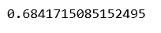
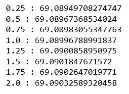
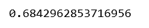
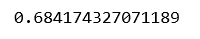
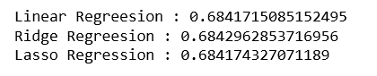
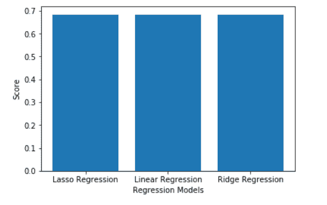

# ML |使用 Sklearn 实现 L1 和 L2 正则化

> 原文:[https://www . geeksforgeeks . org/ml-implementing-L1-and-L2-正则化-using-sklearn/](https://www.geeksforgeeks.org/ml-implementing-l1-and-l2-regularization-using-sklearn/)

**先决条件:L2 和 L1 正则化**
本文旨在使用 Python 库 **Sklearn** 的 Ridge 和 Lasso 模块实现线性回归的 L2 和 L1 正则化。
**数据集–**[房价数据集](https://www.kaggle.com/shivachandel/kc-house-data)。
**第一步:导入需要的库**

## 蟒蛇 3

```
import pandas as pd
import numpy as np
import matplotlib.pyplot as plt
from sklearn.linear_model import LinearRegression, Ridge, Lasso
from sklearn.model_selection import train_test_split, cross_val_score
from statistics import mean
```

**第二步:加载并清理数据**

## 蟒蛇 3

```
# Changing the working location to the location of the data
cd C:\Users\Dev\Desktop\Kaggle\House Prices

# Loading the data into a Pandas DataFrame
data = pd.read_csv('kc_house_data.csv')

# Dropping the numerically non-sensical variables
dropColumns = ['id', 'date', 'zipcode']
data = data.drop(dropColumns, axis = 1)

# Separating the dependent and independent variables
y = data['price']
X = data.drop('price', axis = 1)

# Dividing the data into training and testing set
X_train, X_test, y_train, y_test = train_test_split(X, y, test_size = 0.25)
```

**第三步:构建和评估不同的模型**
a) **线性回归:**T5】

## 蟒蛇 3

```
# Building and fitting the Linear Regression model
linearModel = LinearRegression()
linearModel.fit(X_train, y_train)

# Evaluating the Linear Regression model
print(linearModel.score(X_test, y_test))
```



b) **岭(L2)回归:**T2】

## 蟒蛇 3

```
# List to maintain the different cross-validation scores
cross_val_scores_ridge = []

# List to maintain the different values of alpha
alpha = []

# Loop to compute the different values of cross-validation scores
for i in range(1, 9):
    ridgeModel = Ridge(alpha = i * 0.25)
    ridgeModel.fit(X_train, y_train)
    scores = cross_val_score(ridgeModel, X, y, cv = 10)
    avg_cross_val_score = mean(scores)*100
    cross_val_scores_ridge.append(avg_cross_val_score)
    alpha.append(i * 0.25)

# Loop to print the different values of cross-validation scores
for i in range(0, len(alpha)):
    print(str(alpha[i])+' : '+str(cross_val_scores_ridge[i]))
```



**从上面的输出，我们可以得出数据的最佳α值为 2。**

## 蟒蛇 3

```
# Building and fitting the Ridge Regression model
ridgeModelChosen = Ridge(alpha = 2)
ridgeModelChosen.fit(X_train, y_train)

# Evaluating the Ridge Regression model
print(ridgeModelChosen.score(X_test, y_test))
```



c) **拉索(L1)回归:**T2】

## 蟒蛇 3

```
# List to maintain the cross-validation scores
cross_val_scores_lasso = []

# List to maintain the different values of Lambda
Lambda = []

# Loop to compute the cross-validation scores
for i in range(1, 9):
    lassoModel = Lasso(alpha = i * 0.25, tol = 0.0925)
    lassoModel.fit(X_train, y_train)
    scores = cross_val_score(lassoModel, X, y, cv = 10)
    avg_cross_val_score = mean(scores)*100
    cross_val_scores_lasso.append(avg_cross_val_score)
    Lambda.append(i * 0.25)

# Loop to print the different values of cross-validation scores
for i in range(0, len(alpha)):
    print(str(alpha[i])+' : '+str(cross_val_scores_lasso[i]))
```


**从上面的输出，我们可以得出λ的最佳值是 2。**

## 蟒蛇 3

```
# Building and fitting the Lasso Regression Model
lassoModelChosen = Lasso(alpha = 2, tol = 0.0925)
lassoModelChosen.fit(X_train, y_train)

# Evaluating the Lasso Regression model
print(lassoModelChosen.score(X_test, y_test))
```



**第四步:比较和可视化结果**

## 蟒蛇 3

```
# Building the two lists for visualization
models = ['Linear Regression', 'Ridge Regression', 'Lasso Regression']
scores = [linearModel.score(X_test, y_test),
         ridgeModelChosen.score(X_test, y_test),
         lassoModelChosen.score(X_test, y_test)]

# Building the dictionary to compare the scores
mapping = {}
mapping['Linear Regression'] = linearModel.score(X_test, y_test)
mapping['Ridge Regression'] = ridgeModelChosen.score(X_test, y_test)
mapping['Lasso Regression'] = lassoModelChosen.score(X_test, y_test)

# Printing the scores for different models
for key, val in mapping.items():
    print(str(key)+' : '+str(val))
```



## 蟒蛇 3

```
# Plotting the scores
plt.bar(models, scores)
plt.xlabel('Regression Models')
plt.ylabel('Score')
plt.show()
```

