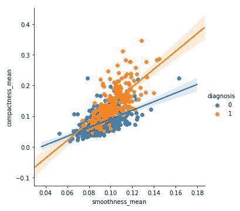
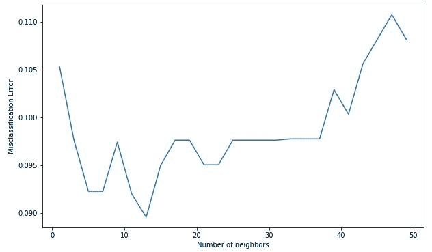

# ML | Kaggle 乳腺癌威斯康星诊断使用 KNN 和交叉验证

> 原文:[https://www . geesforgeks . org/ml-kaggle-乳腺癌-威斯康星州-诊断-使用-knn/](https://www.geeksforgeeks.org/ml-kaggle-breast-cancer-wisconsin-diagnosis-using-knn/)

**数据集:**
这是来自 UCI 机器学习资源库的 Kaggle 在其挑战之一中给出的。
[https://www.kaggle.com/uciml/breast-cancer-wisconsin-data](https://www.kaggle.com/uciml/breast-cancer-wisconsin-data)。这是一个由患有恶性和良性肿瘤的乳腺癌患者组成的数据集。
K 近邻算法用于预测患者是否患有癌症(恶性肿瘤)或良性肿瘤。

**实现 KNN 算法进行分类。**

**代码:导入库**

```
# performing linear algebra
import numpy as np 

# data processing
import pandas as pd

# visualisation
import matplotlib.pyplot as plt
```

**代码:加载数据集**

```
df = pd.read_csv("..\\breast-cancer-wisconsin-data\\data.csv")

print (data.head)
```

**输出:**


**代码:数据信息**

```
df.info()
```

**输出:**

```
RangeIndex: 569 entries, 0 to 568
Data columns (total 33 columns):
id                         569 non-null int64
diagnosis                  569 non-null object
radius_mean                569 non-null float64
texture_mean               569 non-null float64
perimeter_mean             569 non-null float64
area_mean                  569 non-null float64
smoothness_mean            569 non-null float64
compactness_mean           569 non-null float64
concavity_mean             569 non-null float64
concave points_mean        569 non-null float64
symmetry_mean              569 non-null float64
fractal_dimension_mean     569 non-null float64
radius_se                  569 non-null float64
texture_se                 569 non-null float64
perimeter_se               569 non-null float64
area_se                    569 non-null float64
smoothness_se              569 non-null float64
compactness_se             569 non-null float64
concavity_se               569 non-null float64
concave points_se          569 non-null float64
symmetry_se                569 non-null float64
fractal_dimension_se       569 non-null float64
radius_worst               569 non-null float64
texture_worst              569 non-null float64
perimeter_worst            569 non-null float64
area_worst                 569 non-null float64
smoothness_worst           569 non-null float64
compactness_worst          569 non-null float64
concavity_worst            569 non-null float64
concave points_worst       569 non-null float64
symmetry_worst             569 non-null float64
fractal_dimension_worst    569 non-null float64
Unnamed: 32                0 non-null float64
dtypes: float64(31), int64(1), object(1)
memory usage: 146.8+ KB

```

**代码:我们正在删除列–“id”和“未命名:32”，因为它们在预测中没有作用**

```
df.drop(['Unnamed: 32', 'id'], axis = 1)
print(df.shape)
```

**输出:**

```
(569, 31)
```

**代码:将 M 和 B 的诊断值转换为数值，其中 M(恶性)= 1，B(良性)= 0**

```
def diagnosis_value(diagnosis):
    if diagnosis == 'M':
        return 1
    else:
        return 0

df['diagnosis'] = df['diagnosis'].apply(diagnosis_value)
```

**代码:**

```
sns.lmplot(x = 'radius_mean', y = 'texture_mean', hue = 'diagnosis', data = df)
```

**输出:**

**代码:**

```
sns.lmplot(x ='smoothness_mean', y = 'compactness_mean', 
           data = df, hue = 'diagnosis')
```

**输出:**


**代码:输入输出数据**

```
X = np.array(df.iloc[:, 1:])
y = np.array(df['diagnosis'])
```

**代码:拆分数据进行训练测试**

```
from sklearn.model_selection import train_test_split
X_train, X_test, y_train, y_test = train_test_split(
    X, y, test_size = 0.33, random_state = 42)
```

**代码:使用 Sklearn**

```
knn = KNeighborsClassifier(n_neighbors = 13)
knn.fit(X_train, y_train)
```

**输出:**

```
KNeighborsClassifier(algorithm='auto', leaf_size=30, 
             metric='minkowski', metric_params=None, 
             n_jobs=None, n_neighbors=13, p=2, 
             weights='uniform')

```

**代码:预测得分**

```
knn.score(X_test, y_test)
```

**输出:**

```
0.9627659574468085

```

**代码:执行交叉验证**

```
neighbors = []
cv_scores = []

from sklearn.model_selection import cross_val_score
# perform 10 fold cross validation
for k in range(1, 51, 2):
    neighbors.append(k)
    knn = KNeighborsClassifier(n_neighbors = k)
    scores = cross_val_score(
        knn, X_train, y_train, cv = 10, scoring = 'accuracy')
    cv_scores.append(scores.mean())
```

**代码:误分类错误对 k**

```
MSE = [1-x for x in cv_scores]

# determining the best k
optimal_k = neighbors[MSE.index(min(MSE))]
print('The optimal number of neighbors is % d ' % optimal_k)

# plot misclassification error versus k
plt.figure(figsize = (10, 6))
plt.plot(neighbors, MSE)
plt.xlabel('Number of neighbors')
plt.ylabel('Misclassification Error')
plt.show()
```

**输出:**

```
The optimal number of neighbors is 13 

```

