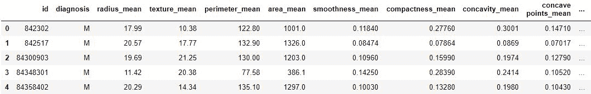
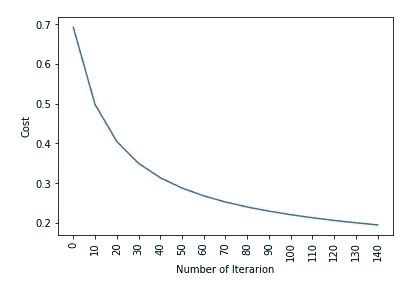

# ML | Kaggle 乳腺癌威斯康星诊断使用逻辑回归

> 原文:[https://www . geesforgeks . org/ml-kaggle-乳腺癌-威斯康星-诊断-使用-逻辑回归/](https://www.geeksforgeeks.org/ml-kaggle-breast-cancer-wisconsin-diagnosis-using-logistic-regression/)

**数据集:**
它是由来自 UCI 机器学习存储库的卡格尔在其挑战之一
[https://www.kaggle.com/uciml/breast-cancer-wisconsin-data](https://www.kaggle.com/uciml/breast-cancer-wisconsin-data)中给出的。这是一个由患有恶性和良性肿瘤的乳腺癌患者组成的数据集。

逻辑回归用于根据给定数据集中的属性预测给定患者是患有恶性肿瘤还是良性肿瘤。

**Code : Loading Libraries**

```
# performing linear algebra
import numpy as np 

# data processing
import pandas as pd

# visualisation
import matplotlib.pyplot as plt
```

**代码:加载数据集**

```
data = pd.read_csv("..\\breast-cancer-wisconsin-data\\data.csv")

print (data.head)
```

**输出:**


**代码:加载数据集**

```
data.info()
```

**输出:**

```

RangeIndex: 569 entries, 0 to 568
Data columns (total 33 columns):
id                         569 non-null int64
diagnosis                  569 non-null object
radius_mean                569 non-null float64
texture_mean               569 non-null float64
perimeter_mean             569 non-null float64
area_mean                  569 non-null float64
smoothness_mean            569 non-null float64
compactness_mean           569 non-null float64
concavity_mean             569 non-null float64
concave points_mean        569 non-null float64
symmetry_mean              569 non-null float64
fractal_dimension_mean     569 non-null float64
radius_se                  569 non-null float64
texture_se                 569 non-null float64
perimeter_se               569 non-null float64
area_se                    569 non-null float64
smoothness_se              569 non-null float64
compactness_se             569 non-null float64
concavity_se               569 non-null float64
concave points_se          569 non-null float64
symmetry_se                569 non-null float64
fractal_dimension_se       569 non-null float64
radius_worst               569 non-null float64
texture_worst              569 non-null float64
perimeter_worst            569 non-null float64
area_worst                 569 non-null float64
smoothness_worst           569 non-null float64
compactness_worst          569 non-null float64
concavity_worst            569 non-null float64
concave points_worst       569 non-null float64
symmetry_worst             569 non-null float64
fractal_dimension_worst    569 non-null float64
Unnamed: 32                0 non-null float64
dtypes: float64(31), int64(1), object(1)
memory usage: 146.8+ KB

```

**代码:我们正在删除列–“id”和“未命名:32”，因为它们在预测中没有作用**

```
data.drop(['Unnamed: 32', 'id'], axis = 1)
data.diagnosis = [1 if each == "M" else 0 for each in data.diagnosis]
```

**代码:输入输出数据**

```
y = data.diagnosis.values
x_data = data.drop(['diagnosis'], axis = 1)
```

代码:标准化

```
x = (x_data - np.min(x_data))/(np.max(x_data) - np.min(x_data)).values
```

**代码:拆分数据进行训练和测试。**

```
from sklearn.model_selection import train_test_split
x_train, x_test, y_train, y_test = train_test_split(
    x, y, test_size = 0.15, random_state = 42)

x_train = x_train.T
x_test = x_test.T
y_train = y_train.T
y_test = y_test.T

print("x train: ", x_train.shape)
print("x test: ", x_test.shape)
print("y train: ", y_train.shape)
print("y test: ", y_test.shape)
```

**代码:重量和偏差**

```
def initialize_weights_and_bias(dimension):
    w = np.full((dimension, 1), 0.01)
    b = 0.0
    return w, b
```

**代码:Sigmoid 函数–计算 z 值。**

```
# z = np.dot(w.T, x_train)+b
def sigmoid(z):
    y_head = 1/(1 + np.exp(-z))
    return y_head
```

**代码:前向-后向传播**

```
def forward_backward_propagation(w, b, x_train, y_train):
    z = np.dot(w.T, x_train) + b
    y_head = sigmoid(z)
    loss = - y_train * np.log(y_head) - (1 - y_train) * np.log(1 - y_head)
    # x_train.shape[1]  is for scaling
    cost = (np.sum(loss)) / x_train.shape[1]      

    # backward propagation
    derivative_weight = (np.dot(x_train, (
        (y_head - y_train).T))) / x_train.shape[1] 
    derivative_bias = np.sum(
        y_head-y_train) / x_train.shape[1]                 
    gradients = {"derivative_weight": derivative_weight,
                 "derivative_bias": derivative_bias}
    return cost, gradients
```

**代码:更新参数**

```
def update(w, b, x_train, y_train, learning_rate, number_of_iterarion):
    cost_list = []
    cost_list2 = []
    index = []

    # updating(learning) parameters is number_of_iterarion times
    for i in range(number_of_iterarion):
        # make forward and backward propagation and find cost and gradients
        cost, gradients = forward_backward_propagation(w, b, x_train, y_train)
        cost_list.append(cost)

        # lets update
        w = w - learning_rate * gradients["derivative_weight"]
        b = b - learning_rate * gradients["derivative_bias"]
        if i % 10 == 0:
            cost_list2.append(cost)
            index.append(i)
            print ("Cost after iteration % i: % f" %(i, cost))

    # update(learn) parameters weights and bias
    parameters = {"weight": w, "bias": b}
    plt.plot(index, cost_list2)
    plt.xticks(index, rotation ='vertical')
    plt.xlabel("Number of Iterarion")
    plt.ylabel("Cost")
    plt.show()
    return parameters, gradients, cost_list
```

**代码:预测**

```
def predict(w, b, x_test):
    # x_test is a input for forward propagation
    z = sigmoid(np.dot(w.T, x_test)+b)
    Y_prediction = np.zeros((1, x_test.shape[1]))

    # if z is bigger than 0.5, our prediction is sign one (y_head = 1),
    # if z is smaller than 0.5, our prediction is sign zero (y_head = 0),
    for i in range(z.shape[1]):
        if z[0, i]<= 0.5:
            Y_prediction[0, i] = 0
        else:
            Y_prediction[0, i] = 1

    return Y_prediction
```

**代码:逻辑回归**

```
def logistic_regression(x_train, y_train, x_test, y_test, 
                        learning_rate,  num_iterations):

    dimension = x_train.shape[0]
    w, b = initialize_weights_and_bias(dimension)

    parameters, gradients, cost_list = update(
        w, b, x_train, y_train, learning_rate, num_iterations)

    y_prediction_test = predict(
        parameters["weight"], parameters["bias"], x_test)
    y_prediction_train = predict(
        arameters["weight"], parameters["bias"], x_train)

    # train / test Errors
    print("train accuracy: {} %".format(
        100 - np.mean(np.abs(y_prediction_train - y_train)) * 100))
    print("test accuracy: {} %".format(
        100 - np.mean(np.abs(y_prediction_test - y_test)) * 100))

logistic_regression(x_train, y_train, x_test, 
                    y_test, learning_rate = 1, num_iterations = 100) 
```

**输出:**

```
Cost after iteration 0: 0.692836
Cost after iteration 10: 0.498576
Cost after iteration 20: 0.404996
Cost after iteration 30: 0.350059
Cost after iteration 40: 0.313747
Cost after iteration 50: 0.287767
Cost after iteration 60: 0.268114
Cost after iteration 70: 0.252627
Cost after iteration 80: 0.240036
Cost after iteration 90: 0.229543
Cost after iteration 100: 0.220624
Cost after iteration 110: 0.212920
Cost after iteration 120: 0.206175
Cost after iteration 130: 0.200201
Cost after iteration 140: 0.194860

```



**输出:**

```
train accuracy: 95.23809523809524 %
test accuracy: 94.18604651162791 %

```

**代码:用线性模型检查结果。物流配送**

```
from sklearn import linear_model
logreg = linear_model.LogisticRegression(random_state = 42, max_iter = 150)
print("test accuracy: {} ".format(
    logreg.fit(x_train.T, y_train.T).score(x_test.T, y_test.T)))
print("train accuracy: {} ".format(
    logreg.fit(x_train.T, y_train.T).score(x_train.T, y_train.T)))
```