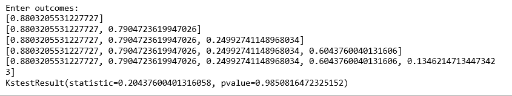
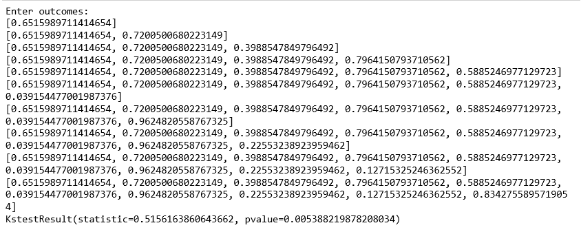

# ML | Kolmogorov-Smirnov 测试

> 哎哎哎:# t0]https://www . geeksforgeeks . org/ml-Kolmogorov-Smirnov-test/

科尔莫戈罗夫-斯米尔诺夫测试是一种非常有效的方法，可以确定两个样本是否存在明显差异。它通常用于检查随机数的一致性。均匀性是任何随机数发生器最重要的特性之一，可以使用 Kolmogorov-Smirnov 测试来测试它。
Kolmogorov–Smirnov 检验也可用于检验两个基础一维概率分布是否不同。这是一种非常有效的方法，可以确定两个样本是否存在显著差异。

> **科尔莫戈罗夫-斯米尔诺夫统计量**量化样本的经验分布函数和参考分布的累积分布函数之间的距离，或者两个样本的经验分布函数之间的距离。

为了使用检验随机数一致性的测试，我们使用了 U[0，1]的 CDF(累积分布函数)。

```
F(x)=x  for 0<=x<=1 
```

经验 CDF，`Sn(x)= (number of R1, R2...Rn < x) / N array of random numbers`，随机数必须在[0，1]范围内。

### 使用的假设–

**H <sub>0</sub> (零假设):**零假设假设数字在 0-1 之间均匀分布。
如果我们能够拒绝零假设，这意味着数字不是均匀分布在 0-1 之间。未能拒绝零假设，虽然不一定意味着数字遵循均匀分布。

### `*kstest*`scipy Python 中的函数–

**参数:**

> **统计:**这是 D 的计算值，其中`D=|F(x)-Sn(x)|`。
> - >这个 *D* 和 D<sub>α</sub>比较，其中α是显著性水平。α定义为假设零假设(H <sub>0</sub> )为真，拒绝零假设的概率。对于大多数实际应用，α被选择为 0.05。
> 
> **p 值:**这是借助 D.
> - >计算出来的如果 p 值>α，我们就无法拒绝零假设。否则，我们得出结论，这些数字是不一致的。理想情况下，p 值应该尽可能大。对于完美均匀分布，p 值=1，Statisitics = 0。

```
from scipy.stats import kstest
import random

# N = int(input("Enter number of random numbers: "))
N = 5

actual =[]
print("Enter outcomes: ")
for i in range(N):
    # x = float(input("Outcomes of class "+str(i + 1)+": "))
    actual.append(random.random())

print(actual)
x = kstest(actual, "uniform")   
print(x)
```

**输出:**


**KS Test**是一种非常强大的自动区分不同分布样本的方法。 *kstest* 功能也可以用来检查给定的数据是否符合正态分布。它比较了正态分布的观察到的和预期的累积相对频率。科尔莫戈罗夫-斯米尔诺夫检验使用观察到的和预期的累积分布之间的最大绝对差。

*   这里使用的零假设假设数字遵循正态分布。
*   该功能的功能保持完全相同。它再次返回统计数据和 p 值。如果 p 值

```
from scipy.stats import kstest
import random

# N = int(input("Enter number of random numbers: "))
N = 10

actual =[]
print("Enter outcomes: ")

for i in range(N):
    # x = float(input("Outcomes of class "+str(i + 1)+": "))
    actual.append(random.random())

print(actual)
x = kstest(actual, "norm")   
print(x)
```

**输出:**
