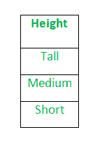
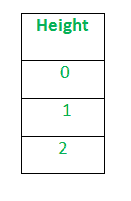

# ML | Python 中数据集的标签编码

> 原文:[https://www . geesforgeks . org/ml-label-encoding-of-dataset-in-python/](https://www.geeksforgeeks.org/ml-label-encoding-of-datasets-in-python/)

在机器学习中，我们通常处理在一列或多列中包含多个标签的数据集。这些标签可以是单词或数字的形式。为了使数据易于理解或以人类可读的形式出现，训练数据通常用文字标注。

**标签编码**是指将标签转换成数字形式，从而转换成机器可读的形式。然后，机器学习算法可以以更好的方式决定这些标签必须如何操作。在监督学习中，结构化数据集的预处理是一个重要的步骤。

**示例:**
假设我们在某个数据集中有一列*高度*。



应用标签编码后，“高度”列将转换为:



其中 0 是高的标签，1 是中等的标签，2 是矮的标签。

我们将*标签编码*应用于目标列(即物种)上的虹膜数据集。它包含三个种类*鸢尾-濑户鸢尾、云芝鸢尾、弗吉尼亚鸢尾*。

## 蟒蛇 3

```py
# Import libraries
import numpy as np
import pandas as pd

# Import dataset
df = pd.read_csv('../../data/Iris.csv')

df['species'].unique()
```

**输出:**

```py
array(['Iris-setosa', 'Iris-versicolor', 'Iris-virginica'], dtype=object)
```

应用标签编码后–

## 蟒蛇 3

```py
# Import label encoder
from sklearn import preprocessing

# label_encoder object knows how to understand word labels.
label_encoder = preprocessing.LabelEncoder()

# Encode labels in column 'species'.
df['species']= label_encoder.fit_transform(df['species'])

df['species'].unique()
```

**输出:**

```py
array([0, 1, 2], dtype=int64)
```

**标签编码的限制**
标签编码将数据转换为机器可读的形式，但它为每类数据分配一个唯一的数字(从 0 开始)。这可能导致在数据集的训练中产生优先问题。具有较高值的标签可以被认为比具有较低值的标签具有更高的优先级。

**示例**
一个具有输出类的属性**墨西哥、巴黎、迪拜**。标签编码上，此栏让**墨西哥**替换为 *0* 、**巴黎**替换为 *1* 、**迪拜**替换为 2。
有了这个，可以解释为**迪拜**在训练模型的时候优先级比**墨西哥****巴黎**高，但实际上这里这些城市之间并没有这样的优先级关系。