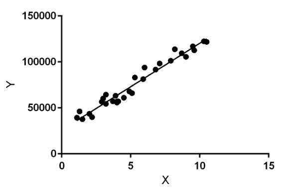
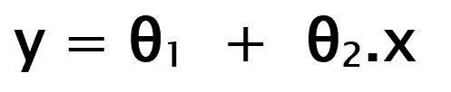

# ML |线性回归

> 原文:[https://www.geeksforgeeks.org/ml-linear-regression/](https://www.geeksforgeeks.org/ml-linear-regression/)

**线性回归**是基于**监督学习**的机器学习算法。它执行**回归任务**。回归基于自变量对目标预测值建模。它主要用于找出变量之间的关系并进行预测。不同的回归模型会因所考虑的因变量和自变量之间的关系类型以及所使用的自变量数量而有所不同。

线性回归执行根据给定的自变量(x)预测因变量值(y)的任务。因此，这种回归技术找出了 x(输入)和 y(输出)之间的线性关系。因此，这个名字叫做线性回归。
上图中，X(输入)是工作经历，Y(输出)是一个人的工资。回归线是我们模型的最佳拟合线。

**线性回归的假设函数:**

在训练模型时，我们被给予:
**x:** 输入训练数据(单变量–一个输入变量(参数))
**y:** 数据标签(监督学习)

当训练模型时——它拟合最佳线来预测给定值 x 的 y 值。模型通过找到最佳θ 1 和θ 2 值来获得最佳回归拟合线。
T5】θ1:截距
**θ2:**x 系数

一旦我们找到最佳θ 1 和θ 2 值，我们就得到最佳拟合线。因此，当我们最终使用我们的模型进行预测时，它将预测输入值 x 的 y 值。

**如何更新θ 1 和θ 2 值，得到最佳拟合线？**

**成本函数(J):**
通过获得最佳拟合回归线，模型旨在预测 y 值，使得预测值和真实值之间的误差差最小。因此，更新θ 1 和θ 2 值非常重要，以达到使预测 y 值(pred)和真实 y 值(y)之间的误差最小的最佳值。

线性回归的成本函数(J)是预测 y 值(pred)和真实 y 值(y)之间的**均方根误差(RMSE)** 。

**[梯度下降](https://www.geeksforgeeks.org/gradient-descent-in-linear-regression/) :**
为了更新θ 1 和θ 2 值，以减少成本函数(最小化 RMSE 值)并获得最佳拟合线，模型使用梯度下降。思路是从随机的θ 1 和θ 2 值开始，然后迭代更新这些值，达到最小成本。