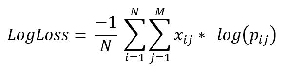
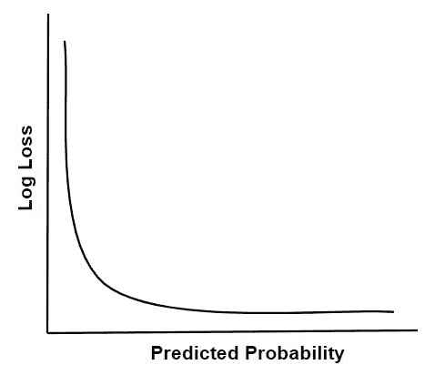
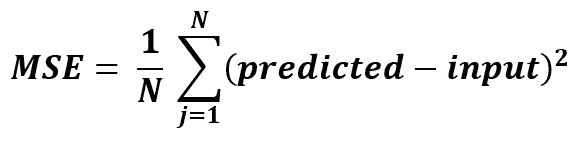

# ML |对数损失和均方误差

> 原文:[https://www . geesforgeks . org/ml-对数损失和均方误差/](https://www.geeksforgeeks.org/ml-log-loss-and-mean-squared-error/)

# **日志丢失**

它是检验分类模型性能的评价尺度。它测量预测概率与实际标签的偏离量。所以对数损失值越小，模型越完善。对于完美模型，对数损失值= 0。例如，由于准确性是正确预测的计数，即与实际标签相匹配的预测，因此对数损失值是根据预测标签与实际标签的差异来衡量预测标签的不确定性。


```py
where, 
N  : no. of samples.
M  : no. of attributes.
y<sub>ij</sub> : indicates whether ith sample belongs to jth class or not.
p<sub>ij</sub> : indicates probability of ith sample belonging to jth class.

```



**Implementation of LogLoss using sklearn**

```py
from sklearn.metrics import log_loss:

LogLoss = log_loss(y_true, y_pred, eps = 1e-15,
    normalize = True, sample_weight = None, labels = None)
```

# **均方误差**

它只是原始值和预测值之差的平方的平均值。


**使用 sklearn 实现均方误差**

```py
from sklearn.metrics import mean_squared_error

MSE = mean_squared_error(y_true, y_pred)
```