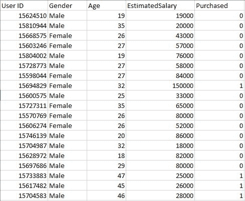
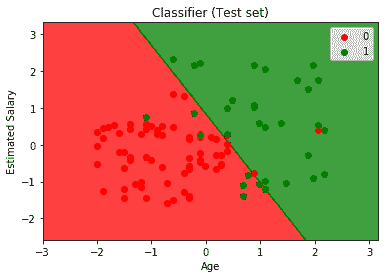

# ML |使用 Python 的逻辑回归

> 原文:[https://www . geesforgeks . org/ml-logistic-回归-使用-python/](https://www.geeksforgeeks.org/ml-logistic-regression-using-python/)

前提条件:[理解逻辑回归](https://www.geeksforgeeks.org/understanding-logistic-regression/)

**用户数据库–**该数据集包含公司数据库中的用户信息。它包含用户标识、性别、年龄、估计工资、购买的信息。我们使用这个数据集来预测用户是否会购买该公司新推出的产品。

数据–[用户 _ 数据](https://drive.google.com/open?id=1Upqoz2gIAYq6LByD7YjHU-9_9K4EOhOh)


让我们建立逻辑回归模型，预测用户是否会购买产品。

输入库

```py
import pandas as pd
import numpy as np
import matplotlib.pyplot as plt
```

正在加载数据集–用户数据

```py
dataset = pd.read_csv('...\\User_Data.csv')
```

现在，要预测用户是否会购买该产品，需要找出年龄和预计工资之间的关系。在这里，用户标识和性别不是发现这一点的重要因素。

```py
# input
x = dataset.iloc[:, [2, 3]].values

# output
y = dataset.iloc[:, 4].values
```

分割数据集进行训练和测试。75%的数据用于训练模型，25%的数据用于测试我们模型的性能。

```py
from sklearn.cross_validation import train_test_split
xtrain, xtest, ytrain, ytest = train_test_split(
        x, y, test_size = 0.25, random_state = 0)
```

现在，在这里执行要素缩放非常重要，因为年龄和估计薪资值位于不同的范围内。如果我们不缩放特征，那么当模型找到数据空间中数据点的最近邻居时，估计工资特征将主导年龄特征。

```py
from sklearn.preprocessing import StandardScaler
sc_x = StandardScaler()
xtrain = sc_x.fit_transform(xtrain) 
xtest = sc_x.transform(xtest)

print (xtrain[0:10, :])
```

**输出:**

```py
[[ 0.58164944 -0.88670699]
 [-0.60673761  1.46173768]
 [-0.01254409 -0.5677824 ]
 [-0.60673761  1.89663484]
 [ 1.37390747 -1.40858358]
 [ 1.47293972  0.99784738]
 [ 0.08648817 -0.79972756]
 [-0.01254409 -0.24885782]
 [-0.21060859 -0.5677824 ]
 [-0.21060859 -0.19087153]]
```

这里曾经看到年龄和估计工资特征值被囊化，现在在-1 到 1 之间。因此，每个特征在决策(即最终确定假设)中的作用是相同的。

最后，我们正在训练我们的逻辑回归模型。

```py
from sklearn.linear_model import LogisticRegression
classifier = LogisticRegression(random_state = 0)
classifier.fit(xtrain, ytrain)
```

训练好模型后，就该用它对测试数据做预测了。

```py
y_pred = classifier.predict(xtest)
```

让我们测试一下我们的模型——混淆矩阵的性能

```py
from sklearn.metrics import confusion_matrix
cm = confusion_matrix(ytest, y_pred)

print ("Confusion Matrix : \n", cm)
```

**输出:**

```py
Confusion Matrix : 
 [[65  3]
 [ 8 24]]
```

满分 100 分:
真阳性+真阴性= 65 + 24
假阳性+假阴性= 3 + 8

性能测量-准确性

```py
from sklearn.metrics import accuracy_score
print ("Accuracy : ", accuracy_score(ytest, y_pred))
```

**输出:**

```py
Accuracy :  0.89
```

可视化我们模型的性能。

```py
from matplotlib.colors import ListedColormap
X_set, y_set = xtest, ytest
X1, X2 = np.meshgrid(np.arange(start = X_set[:, 0].min() - 1, 
                               stop = X_set[:, 0].max() + 1, step = 0.01),
                     np.arange(start = X_set[:, 1].min() - 1, 
                               stop = X_set[:, 1].max() + 1, step = 0.01))

plt.contourf(X1, X2, classifier.predict(
             np.array([X1.ravel(), X2.ravel()]).T).reshape(
             X1.shape), alpha = 0.75, cmap = ListedColormap(('red', 'green')))

plt.xlim(X1.min(), X1.max())
plt.ylim(X2.min(), X2.max())

for i, j in enumerate(np.unique(y_set)):
    plt.scatter(X_set[y_set == j, 0], X_set[y_set == j, 1],
                c = ListedColormap(('red', 'green'))(i), label = j)

plt.title('Classifier (Test set)')
plt.xlabel('Age')
plt.ylabel('Estimated Salary')
plt.legend()
plt.show()
```

**输出:**

分析性能指标——准确性和混淆矩阵以及图表，我们可以清楚地说我们的模型表现非常好。