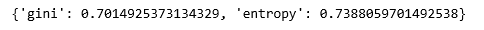

# ML |逻辑回归 v/s 决策树分类

> 原文:[https://www . geesforgeks . org/ml-logistic-回归-v-s-决策树-分类/](https://www.geeksforgeeks.org/ml-logistic-regression-v-s-decision-tree-classification/)

[逻辑回归](https://www.geeksforgeeks.org/understanding-logistic-regression/)和[决策树分类](https://www.geeksforgeeks.org/decision-tree-introduction-example/)是当今使用的两种最流行和最基本的分类算法。没有一种算法比另一种更好，一种算法的优异性能通常归功于所处理数据的性质。

**我们可以在不同的类别上比较这两种算法–**

<figure class="table">

| 标准 | 逻辑回归 | 决策树分类 |
| --- | --- | --- |
| **可解释性** | 不太容易解释 | 更容易解释 |
| **决策边界** | 线性和单一决策边界 | 将空间分成更小的空间 |
| **决策的简易性** | 必须设置决策阈值 | 自动处理决策 |
| **过拟合** | 不容易过度拟合 | 容易过度拟合 |
| **对噪声的鲁棒性** | 对噪声鲁棒 | 主要受噪音影响 |
| **可扩展性** | 需要足够大的训练集 | 可以在一个小的训练集上训练 |

</figure>

作为一个简单的实验，我们在同一数据集上运行这两个模型，并比较它们的性能。

**步骤 1:导入所需的库**

## 蟒蛇 3

```py
import numpy as np
import pandas as pd
from sklearn.model_selection import train_test_split
from sklearn.linear_model import LogisticRegression
from sklearn.tree import DecisionTreeClassifier
```

**第二步:读取并清理数据集**

## 蟒蛇 3

```py
cd C:\Users\Dev\Desktop\Kaggle\Sinking Titanic
# Changing the working location to the location of the file
df = pd.read_csv('_train.csv')
y = df['Survived']

X = df.drop('Survived', axis = 1)
X = X.drop(['Name', 'Ticket', 'Cabin', 'Embarked'], axis = 1)

X = X.replace(['male', 'female'], [2, 3])
# Hot-encoding the categorical variables

X.fillna(method ='ffill', inplace = True)
# Handling the missing values
```

**第三步:训练和评估逻辑回归模型**

## 蟒蛇 3

```py
X_train, X_test, y_train, y_test = train_test_split(
            X, y, test_size = 0.3, random_state = 0)

lr = LogisticRegression()
lr.fit(X_train, y_train)
print(lr.score(X_test, y_test))
```


**第四步:训练和评估决策树分类器模型**

## 蟒蛇 3

```py
criteria = ['gini', 'entropy']
scores = {}

for c in criteria:
    dt = DecisionTreeClassifier(criterion = c)
    dt.fit(X_train, y_train)
    test_score = dt.score(X_test, y_test)
    scores = test_score

print(scores)
```



通过比较得分，我们可以看到逻辑回归模型在当前数据集上表现更好，但情况可能并非总是如此。