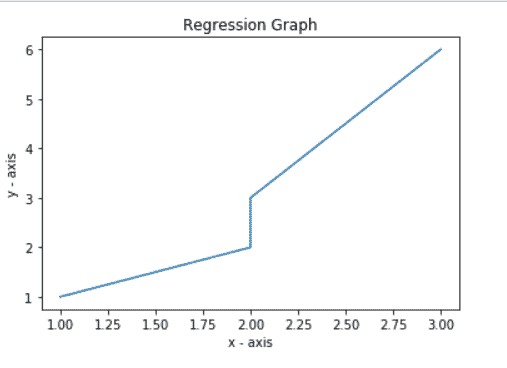
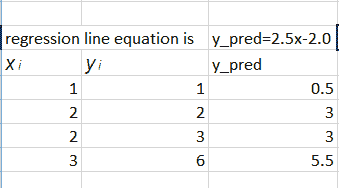
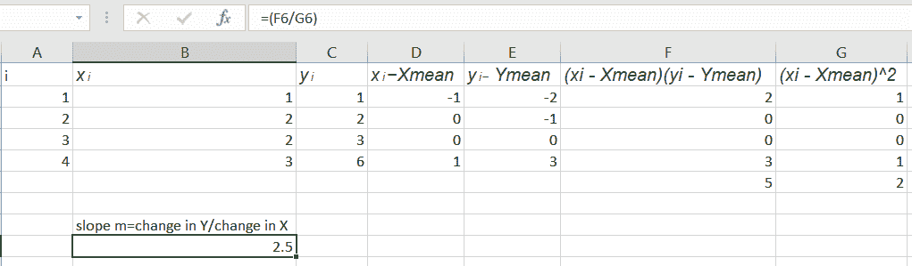
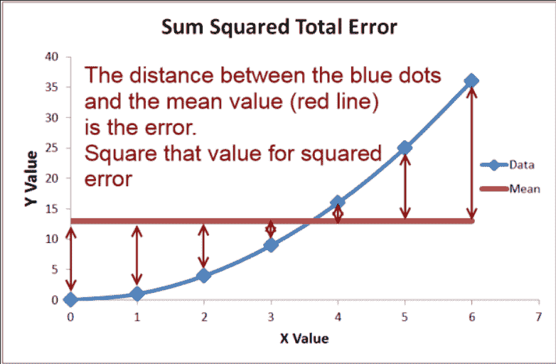

# ML | RMSE 和 R 平方误差的数学解释

> 原文:[https://www . geeksforgeeks . org/ml-RMSE 和 r 平方误差的数学解释/](https://www.geeksforgeeks.org/ml-mathematical-explanation-of-rmse-and-r-squared-error/)

**RMSE:均方根误差**是回归线与数据点拟合程度的量度。RMSE 也可以解释为残差中的标准差。
考虑给定的数据点:(1，1)、(2，2)、(2，3)、(3，6)。
让我们把上面的数据点分成一维列表。
**输入:**

```py
x = [1, 2, 2, 3]
y = [1, 2, 3, 6]
```

**代码:回归图**

## 计算机编程语言

```py
import matplotlib.pyplot as plt
import math

# plotting the points 
plt.plot(x, y)

# naming the x axis
plt.xlabel('x - axis')

# naming the y axis
plt.ylabel('y - axis')

# giving a title to my graph
plt.title('Regression Graph')

# function to show the plot
plt.show()
```



**代码:均值计算**

## 计算机编程语言

```py
# in the next step we will find the equation of the best fit line
# we will use Linear algebra's Point slope form to find regression line equation
# point-slope form is represented by y = mx + c
# where m is slope means (change in y) / (change in x)
# c is constant, it represents at which point line will intercept y-axis
# slope m can be formulated as below:
'''
   n
m =? (xi - Xmean) (yi - Ymean)/?(xi - Xmean)^2
 i = 1
'''
# calculate Xmean and Ymean
ct = len(x)
sum_x = 0
sum_y = 0

for i in x:
    sum_x = sum_x + i
x_mean = sum_x / ct
print('Value of X mean', x_mean)

for i in y:
    sum_y = sum_y + i
y_mean = sum_y / ct
print('value of Y mean', y_mean)

# we have the values of x mean and y_mean
```

**输出:**

```py
Value of X mean 2.0
value of Y mean 3.0
```

**代码:直线方程**

## 计算机编程语言

```py
# below is the process of finding line equation in mathematical terms
# slope of our line is 2.5
# calculate c to find out the equation

m = 2.5
c = y_mean - m * x_mean
print('Intercept', c)
```

**输出:**

```py
Intercept -2.0
```

**代码:均方误差**

## 计算机编程语言

```py
# equation of our Regression line comes out to be as below:
# y_pred = 2.5x-2.0
# we call the line y_pred
# paste regression line graph
from sklearn.metrics import mean_squared_error
# y_pred for our exusting data points is as below

y =[1, 2, 3, 6]
y_pred =[0.5, 3, 3, 5.5]
```



## 计算机编程语言

```py
# root mean square calculated by sklearn package
mse = math.sqrt(mean_squared_error(y, y_pred))
print('Root mean square error', mse)
```

**输出:**

```py
Root mean square error 0.6123724356957945
```

**代码:RMSE 计算**T2】

## 计算机编程语言

```py
# lets check how the Root mean square is calculated mathematically
# lets introduce a term called residuals
# residual are basically the distance of data point from the regression line
# residuals are denoted by red marked line in below graph
# root mean square and residuals are calculated as below
# we have 4 data points
'''
r = 1, ri = yi-y_pred
y_pred is mx + c
ri = yi-(mx + c)
e.g. x = 1, we have value of y as 1
we want to evaluate what exactly our model has predicted for x = 1
(1, 1)r1 = 1, x = 2
'''
# y_pred1 = 1-(2.5 * 1-2.0)= 0.5
r1 = 1-(2.5 * 1-2.0)

#(2, 2) r2 = 2, x = 2
# y_pred2 = 2-(2.5 * 2-2.0)=-1
r2 = 2-(2.5 * 2-2.0)

#(2, 3) r3 = 3, x = 2
# y_pred3 = 3-(2.5 * 2-2.0)= 0
r3 = 3-(2.5 * 2-2.0)

#(3, 6) r4 = 4, x = 3
# y_pred4 = 6-(2.5 * 3-2.0)=.5
r4 = 6-(2.5 * 3-2.0)

# from above calculation we have values of residuals
residuals =[0.5, -1, 0, .5]

# now calculate root mean square error
# N = 4 data points
N = 4
rmse = math.sqrt((r1**2 + r2**2 + r3**2 + r4**2)/N)
print('Root Mean square error using maths', rmse)

# root mean square actually calculated using mathematics
# both of RMSE calculated are same
```



**输出:**

```py
Root Mean square error using maths 0.6123724356957945
```

r 平方误差或确定系数
R2 误差回答了以下问题。
y 的多少随 x 的变化而变化，基本上是 y 随 x 变化的%变化



**代码:R 平方误差**

## 计算机编程语言

```py
# SEline =(y1-(mx1 + b)**2 + y2-(mx2 + b)**2...+yn-(mxn + b)**2)
# SE_line =(1-(2.5 * 1+(-2))**2 + (2-(2.5 * 2+(-2))**2) +(3-(2.5*(2)+(-2))**2) + (6-(2.5*(3)+(-2))**2))

val1 =(1-(2.5 * 1+(-2)))**2
val2 =(2-(2.5 * 2+(-2)))**2
val3 =(3-(2.5 * 2+(-2)))**2
val4 =(6-(2.5 * 3+(-2)))**2
SE_line = val1 + val2 + val3 + val4
print('val', val1, val2, val3, val4)

# next to calculate total variation in Y from mean value
# variation in y is calculated as
# y_var =(y1-ymean)**2+(y2-ymean)**2...+(yn-ymean)2

y =[1, 2, 3, 6]

y_var =(1-3)**2+(2-3)**2+(3-3)**2+(6-3)**2
SE_mean = y_var

# by calculating y_var we are calculating the distance
# between y data points and mean value of y
# so answer to our question, % of the total variation
# of wrt x is denoted as below:
r_squared = 1-(SE_line / SE_mean)

# [SE_line / SE_mean] -->tells us the what % of variation
# in y is not described by regression line
# 1-(SE_line / SE_mean) --> gives us the exact value of
# how much % y varies with variation in x
print('Rsquared error', r_squared)
```

**输出:**

```py
Rsquared error 0.8928571428571429
```

**代码:sklearn 的 R 平方误差**

## 计算机编程语言

```py
from sklearn.metrics import r2_score

# r2 error calculated by sklearn is similar
# to ours mathematically calculated r2 error
# calculate r2 error using sklearn
r2_score(y, y_pred)
```

**输出:**

```py
0.8928571428571429
```