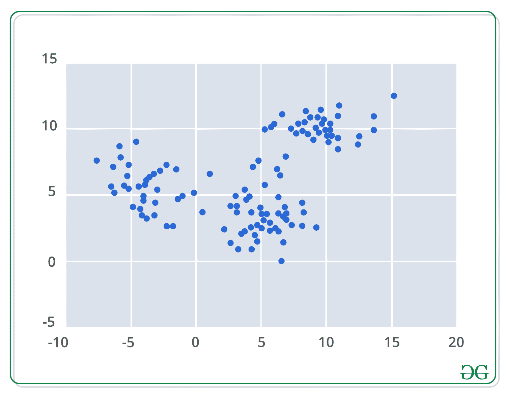
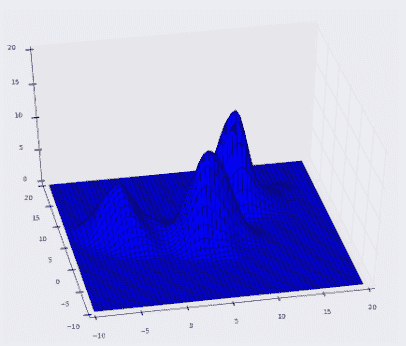
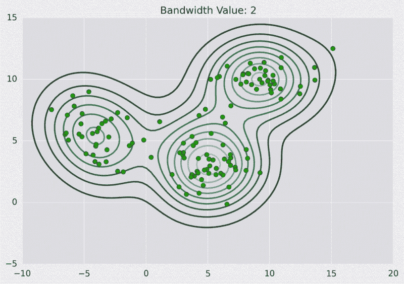
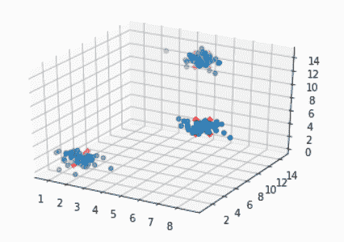
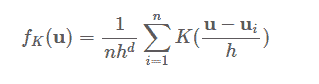
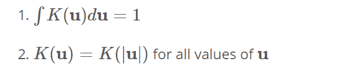
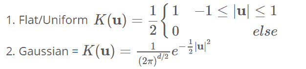
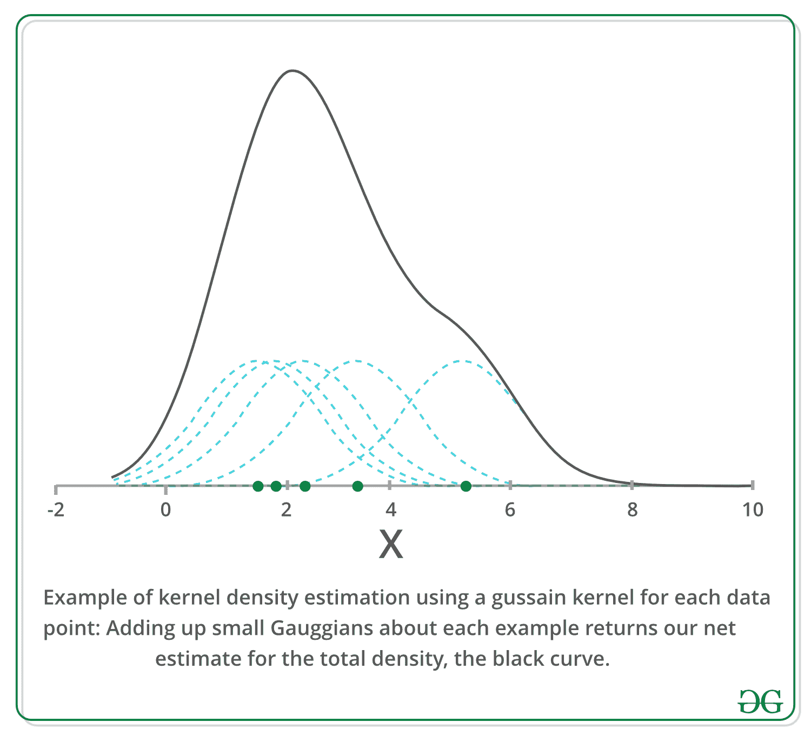
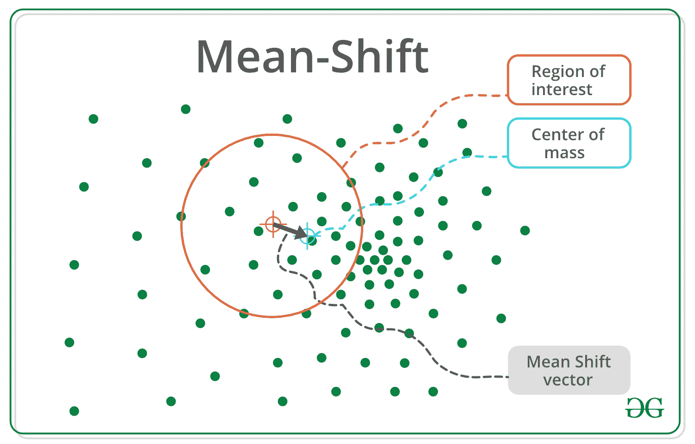

# ML |均值漂移聚类

> 原文:[https://www.geeksforgeeks.org/ml-mean-shift-clustering/](https://www.geeksforgeeks.org/ml-mean-shift-clustering/)

**均值漂移**属于聚类算法的范畴，与无监督学习相反，无监督学习通过向模式移动点来迭代地将数据点分配给聚类(在均值漂移的上下文中，模式是区域中数据点的最高密度)。因此，它也被称为**寻模算法**。均值漂移算法在图像处理和计算机视觉领域有着广泛的应用。

> 给定一组数据点，该算法迭代地将每个数据点分配给最近的聚类质心，并且最近的聚类质心的方向由附近大多数点的位置来确定。因此，每次迭代，每个数据点都将移向最多点所在的位置，这是或将导致集群中心。当算法停止时，每个点被分配给一个簇。

与流行的 K-Means 聚类算法不同，均值漂移不需要预先指定聚类的数量。聚类的数量由算法根据数据决定。

**注:**均值漂移的缺点是计算量大 O(n)。

### 内核密度估计–

应用均值漂移聚类算法的第一步是以数学方式表示您的数据，这意味着将您的数据表示为如下所示的点。



均值漂移建立在核密度估计的概念上，就是排序 KDE。假设上面的数据是从概率分布中取样的。KDE 是一种估计潜在分布的方法，也称为一组数据的概率密度函数。

它通过在数据集中的每个点上放置一个内核来工作。核是卷积中通常使用的加权函数的一个奇特的数学术语。有许多不同类型的核，但最流行的是高斯核。将所有的单个核相加生成一个概率表面示例密度函数。根据所使用的内核带宽参数，得到的密度函数会有所不同。

下面是我们上面使用高斯核的点的 KDE 曲面，核带宽为 2。

**表面图:**



**等高线图:**



下面是 Python 实现:

```
import numpy as np
import pandas as pd
from sklearn.cluster import MeanShift
from sklearn.datasets.samples_generator import make_blobs
from matplotlib import pyplot as plt
from mpl_toolkits.mplot3d import Axes3D

# We will be using the make_blobs method
# in order to generate our own data.

clusters = [[2, 2, 2], [7, 7, 7], [5, 13, 13]]

X, _ = make_blobs(n_samples = 150, centers = clusters,
                                   cluster_std = 0.60)

# After training the model, We store the
# coordinates for the cluster centers
ms = MeanShift()
ms.fit(X)
cluster_centers = ms.cluster_centers_

# Finally We plot the data points
# and centroids in a 3D graph.
fig = plt.figure()

ax = fig.add_subplot(111, projection ='3d')

ax.scatter(X[:, 0], X[:, 1], X[:, 2], marker ='o')

ax.scatter(cluster_centers[:, 0], cluster_centers[:, 1],
           cluster_centers[:, 2], marker ='x', color ='red',
           s = 300, linewidth = 5, zorder = 10)

plt.show()
```

**[在这里试码](https://colab.research.google.com/notebooks/welcome.ipynb#scrollTo=xitplqMNk_Hc)**

**输出:**



举例来说，假设给我们一个 d 维空间中的数据集{ui}，从一些较大的总体中采样，并且我们选择了一个具有带宽参数 h 的核 K。这些数据和核函数一起返回完整总体密度函数的以下核密度估计量。



这里的内核函数需要满足以下两个条件:



> ->第一个要求是需要确保我们的估计是正常的。
> - >第二个与我们空间的对称性有关。

**满足这些条件的两个流行的内核函数由-** 给出



下面我们绘制一个一维的例子，使用高斯核来估计 x 轴上一些人口的密度。我们可以看到，每个样本点都给我们的估计增加了一个小高斯，以它为中心，上面的等式可能看起来有点吓人，但是这里的图形应该澄清这个概念非常简单。



**迭代模式搜索–**

```
1\. Initialize random seed and window W.
2\. Calculate the center of gravity (mean) of W.    
3\. Shift the search window to the mean.    
4\. Repeat Step 2 until convergence.
```



通用算法大纲–

```
for p in copied_points:
    while not at_kde_peak:
        p = shift(p, original_points)
```

**换挡功能如下–**

```
def shift(p, original_points):
    shift_x = float(0)
    shift_y = float(0)
    scale_factor = float(0)

    for p_temp in original_points:
        # numerator
        dist = euclidean_dist(p, p_temp)
        weight = kernel(dist, kernel_bandwidth)
        shift_x += p_temp[0] * weight
        shift_y += p_temp[1] * weight
        # denominator
        scale_factor += weight

    shift_x = shift_x / scale_factor
    shift_y = shift_y / scale_factor
    return [shift_x, shift_y]
```

**优点:**

*   查找可变数量的模式
*   对异常值稳健
*   通用、独立于应用程序的工具
*   无模型，不采用任何先前的形状，如球形、椭圆形等。关于数据集群
*   只有一个参数(窗口大小 h)，其中 h 有物理意义(不像 k 均值)

cons:t1]

*   输出取决于窗口大小
*   窗口大小(带宽)选择不是微不足道的
*   计算(相对)昂贵(约 2 秒/图像)
*   不能很好地根据特征空间的维度进行缩放。