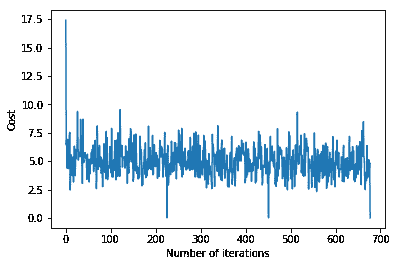
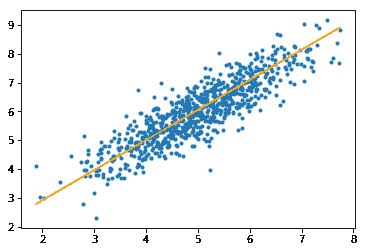

# ML | Python 小批量梯度下降

> 原文:[https://www . geesforgeks . org/ml-mini-batch-gradient-down-with-python/](https://www.geeksforgeeks.org/ml-mini-batch-gradient-descent-with-python/)

在机器学习中，梯度下降是一种优化技术，用于计算线性回归、逻辑回归、神经网络等算法的模型参数(系数和偏差)。在这种技术中，我们重复迭代训练集，并根据相对于训练集的误差梯度更新模型参数。

根据更新模型参数时考虑的训练示例数量，我们有 3 种梯度下降:

1.  **批量梯度下降:**在计算相对于整个训练集的误差梯度后，更新参数
2.  **随机梯度下降:**在计算相对于单个训练示例的误差梯度后，更新参数
3.  **小批量梯度下降:**在计算相对于训练集子集的误差梯度后，更新参数

| **批量梯度下降** | **随机梯度下降** | **小批量梯度下降** |
| --- | --- | --- |
| 由于在向梯度方向迈出一步之前会考虑整个训练数据，因此进行一次更新需要大量时间。 | 由于在向梯度方向迈出一步之前只考虑一个训练示例，我们被迫在训练集上循环，因此无法利用与代码矢量化相关的速度。 | 由于考虑了训练示例的子集，它可以快速更新模型参数，还可以利用与代码矢量化相关的速度。 |
| 它可以平滑更新模型参数 | 它会对参数进行非常嘈杂的更新 | 根据批量大小，更新可以变得噪音更小–批量越大，更新噪音越小 |

因此，小批量梯度下降在快速收敛和与梯度更新相关联的噪声之间做出了折衷，这使得它成为更灵活和鲁棒的算法。

**小批量梯度下降:**

**算法-**

> 设θ=模型参数，max_iters =纪元数。
> 
> 对于 itr = 1，2，3，…，max_iters:
> 对于 mini_batch (X_mini，y_mini):
> 
> *   批次 X_mini 的向前传递:
>     *   对小批量进行预测
>     *   用参数的当前值计算预测误差(J(θ))
> *   向后通过:
>     *   计算梯度(θ)= J(θ)的偏导数 w . r . t .θ
> *   更新参数:
>     *   θ=θ–学习率*梯度(θ)

**下面是 Python 实现:**

**步骤#1:** 第一步是导入依赖关系，生成线性回归的数据，并将生成的数据可视化。我们已经生成了 8000 个数据示例，每个示例都有 2 个属性/特征。这些数据示例进一步分为训练集(X_train，y_train)和测试集(X_test，y_test)，分别有 7200 个和 800 个示例。

```py
# importing dependencies
import numpy as np
import matplotlib.pyplot as plt

# creating data
mean = np.array([5.0, 6.0])
cov = np.array([[1.0, 0.95], [0.95, 1.2]])
data = np.random.multivariate_normal(mean, cov, 8000)

# visualising data
plt.scatter(data[:500, 0], data[:500, 1], marker = '.')
plt.show()

# train-test-split
data = np.hstack((np.ones((data.shape[0], 1)), data))

split_factor = 0.90
split = int(split_factor * data.shape[0])

X_train = data[:split, :-1]
y_train = data[:split, -1].reshape((-1, 1))
X_test = data[split:, :-1]
y_test = data[split:, -1].reshape((-1, 1))

print("Number of examples in training set = % d"%(X_train.shape[0]))
print("Number of examples in testing set = % d"%(X_test.shape[0]))
```

**输出:**

训练集中的示例数= 7200
测试集中的示例数= 800

**步骤#2:** 接下来，我们编写使用小批量梯度下降实现线性回归的代码。
`gradientDescent()`是主要驱动函数，其他函数是辅助函数，用于进行预测–`hypothesis()`、计算梯度–`gradient()`、计算误差–`cost()`和创建小批量–`create_mini_batches()`。驱动函数初始化参数，计算模型的最佳参数集，并在参数更新时返回这些参数以及包含错误历史的列表。

```py
# linear regression using "mini-batch" gradient descent
# function to compute hypothesis / predictions
def hypothesis(X, theta):
    return np.dot(X, theta)

# function to compute gradient of error function w.r.t. theta
def gradient(X, y, theta):
    h = hypothesis(X, theta)
    grad = np.dot(X.transpose(), (h - y))
    return grad

# function to compute the error for current values of theta
def cost(X, y, theta):
    h = hypothesis(X, theta)
    J = np.dot((h - y).transpose(), (h - y))
    J /= 2
    return J[0]

# function to create a list containing mini-batches
def create_mini_batches(X, y, batch_size):
    mini_batches = []
    data = np.hstack((X, y))
    np.random.shuffle(data)
    n_minibatches = data.shape[0] // batch_size
    i = 0

    for i in range(n_minibatches + 1):
        mini_batch = data[i * batch_size:(i + 1)*batch_size, :]
        X_mini = mini_batch[:, :-1]
        Y_mini = mini_batch[:, -1].reshape((-1, 1))
        mini_batches.append((X_mini, Y_mini))
    if data.shape[0] % batch_size != 0:
        mini_batch = data[i * batch_size:data.shape[0]]
        X_mini = mini_batch[:, :-1]
        Y_mini = mini_batch[:, -1].reshape((-1, 1))
        mini_batches.append((X_mini, Y_mini))
    return mini_batches

# function to perform mini-batch gradient descent
def gradientDescent(X, y, learning_rate = 0.001, batch_size = 32):
    theta = np.zeros((X.shape[1], 1))
    error_list = []
    max_iters = 3
    for itr in range(max_iters):
        mini_batches = create_mini_batches(X, y, batch_size)
        for mini_batch in mini_batches:
            X_mini, y_mini = mini_batch
            theta = theta - learning_rate * gradient(X_mini, y_mini, theta)
            error_list.append(cost(X_mini, y_mini, theta))

    return theta, error_list
```

调用`gradientDescent()`函数计算模型参数(θ)并可视化误差函数的变化。

```py
theta, error_list = gradientDescent(X_train, y_train)
print("Bias = ", theta[0])
print("Coefficients = ", theta[1:])

# visualising gradient descent
plt.plot(error_list)
plt.xlabel("Number of iterations")
plt.ylabel("Cost")
plt.show()
```

**输出:**
偏差= [0.81830471]
系数= [[1.04586595]]


**步骤#3 :** 最后，我们对测试集进行预测，并计算预测的平均绝对误差。

```py
# predicting output for X_test
y_pred = hypothesis(X_test, theta)
plt.scatter(X_test[:, 1], y_test[:, ], marker = '.')
plt.plot(X_test[:, 1], y_pred, color = 'orange')
plt.show()

# calculating error in predictions
error = np.sum(np.abs(y_test - y_pred) / y_test.shape[0])
print("Mean absolute error = ", error)
```

**输出:**

平均绝对误差= 0.4366644295854125

橙色线表示最终假设函数: **theta[0] + theta[1]*X_test[:，1] + theta[2]*X_test[:，2] = 0**