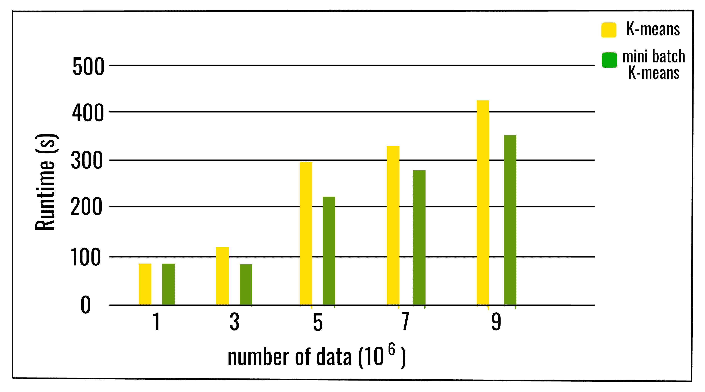
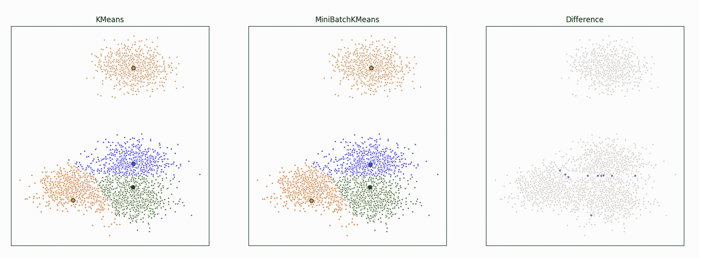

# ML |迷你批量 K 均值聚类算法

> 原文:[https://www . geesforgeks . org/ml-mini-batch-k-means-clustering-algorithm/](https://www.geeksforgeeks.org/ml-mini-batch-k-means-clustering-algorithm/)

前提条件:[K 均值聚类中 K 的最优值](https://www.geeksforgeeks.org/ml-determine-the-optimal-value-of-k-in-k-means-clustering/)

[K-means](https://www.geeksforgeeks.org/k-means-clustering-introduction/) 是目前最流行的聚类算法之一，主要是因为其良好的时间性能。随着被分析数据集规模的增加，K 均值算法的计算时间会增加，因为它的约束是需要整个数据集在内存中。为此，已经提出了几种方法来降低算法的时间和空间成本。一种不同的方法是 ***迷你批量 K-means 算法*** 。

**Mini Batch K-means 算法**的主要思想是使用固定大小的随机小批量数据，这样就可以存储在内存中。每次迭代都会从数据集中获得一个新的随机样本，并用于更新聚类，重复这一过程直到收敛。每个小批量使用原型值和数据的凸组合来更新集群，应用的学习速率随迭代次数而降低。该学习速率是在该过程中分配给集群的数据数量的倒数。随着迭代次数的增加，新数据的影响会降低，因此当在几次连续迭代中聚类没有发生变化时，可以检测到收敛。
经验结果表明，它可以在损失一些聚类质量的情况下获得计算时间的实质性节省，但是还没有对算法进行广泛的研究来衡量数据集的特征(例如聚类的数量或其大小)如何影响划分质量。


该算法在每次迭代中随机抽取少量数据集。批次中的每个数据被分配给簇，这取决于簇质心的先前位置。然后，它根据批次中的新点更新聚类质心的位置。更新为梯度下降更新，明显快于正常*批次 K 均值更新*。

**以下是*小批量 K-means*–**的算法

```py
Given a dataset D = {d1, d2, d3, .....dn},
                       no. of iterations t,
                       batch size b, 
                       no. of clusters k.

k clusters C = {c1, c2, c3, ......ck}

initialize k cluster centers O = {o1, o2, .......ok}
# _initialize each cluster
Ci = Φ (1=< i =< k)
# _initialize no. of data in each cluster
Nc<sub>i</sub> = 0 (1=< i =< k)

for j=1 to t do:
    # M is the batch dataset and xm
    # is the sample randomly chosen from D
    M = {xm | 1 =< m =< b}

    # catch cluster center for each
    # sample in the batch data set
    for m=1 to b do:
        oi(xm) = sum(xm)/|c|i (xm ε M and xm ε ci)
    end for
    # update the cluster center with each batch set

     for m=1 to b do:
        # get the cluster center for xm
        oi = oi(xm)
        # update number of data for each cluster center
        Nc<sub>i</sub> = Nc<sub>i</sub> + 1
        #calculate learning rate for each cluster center
        lr=1/Nc<sub>i</sub>
        # take gradient step to update cluster center
        oi = (1-lr)oi + lr*xm
     end for
end for
```

Python 实现上述算法使用 *scikit-learn* 库:

```py
from sklearn.cluster import MiniBatchKMeans, KMeans
from sklearn.metrics.pairwise import pairwise_distances_argmin
from sklearn.datasets.samples_generator import make_blobs

# Load data in X 
batch_size = 45
centers = [[1, 1], [-2, -1], [1, -2], [1, 9]]
n_clusters = len(centers)
X, labels_true = make_blobs(n_samples = 3000,
                            centers = centers,
                            cluster_std = 0.9)

# perform the mini batch K-means
mbk = MiniBatchKMeans(init ='k-means++', n_clusters = 4,
                      batch_size = batch_size, n_init = 10,
                      max_no_improvement = 10, verbose = 0)

mbk.fit(X)
mbk_means_cluster_centers = np.sort(mbk.cluster_centers_, axis = 0)
mbk_means_labels = pairwise_distances_argmin(X, mbk_means_cluster_centers)

# print the labels of each data
print(mbk_means_labels)
```

小批量 K-means 比普通批量 K-means 更快，但给出的结果略有不同。
这里我们对一组数据进行聚类，先用 K-means，再用 mini batch K-means，并绘制结果。我们还将绘制两种算法之间不同标记的点。

随着聚类数和数据量的增加，计算时间的相对节省也随之增加。只有当集群的数量非常大时，计算时间的节省才更加明显。当集群数量较大时，批量大小对计算时间的影响也更加明显。可以得出这样的结论:增加聚类的数量会降低小批量 K-means 解与 K-means 解的相似性。尽管分区之间的一致性随着集群数量的增加而降低，但目标函数不会以相同的速度降级。这意味着最终的分区不同，但质量更接近。

**参考文献:**
[https://upcommons . UPC . edu/bitstream/handle/2117/23414/R13-8 . pdf](https://upcommons.upc.edu/bitstream/handle/2117/23414/R13-8.pdf)
[https://sci kit-learn . org/stable/modules/generated/sklearn . cluster . minibatch kmeans . html](https://scikit-learn.org/stable/modules/generated/sklearn.cluster.MiniBatchKMeans.html)