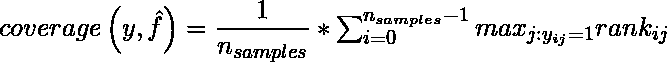
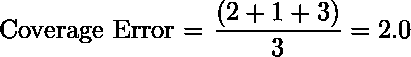

# ML |多标签排名指标–覆盖率错误

> 原文:[https://www . geesforgeks . org/ml-multi label-ranking-metrics-coverage-error/](https://www.geeksforgeeks.org/ml-multilabel-ranking-metrics-coverage-error/)

覆盖误差告诉我们有多少得分最高的最终预测标签，我们必须包括在内，而不会遗漏任何基本事实标签。如果我们想知道预测所需的最高得分预测的平均数量，以便不遗漏任何基础事实标签，这是有用的。
给定一个基本事实标签的二进制指示矩阵。与每个标签相关的分数由表示，其中，

<center>

</center>

The coverage error is defined as:

<center>

</center>

where rank is defined as

<center>

</center>

**代码:使用 scikit-learn 检查任何带有真实标签的预测分数的覆盖率误差。**

```
# Import dataset
import numpy as np
from sklearn.metrics import coverage_error

# Create Imaginary prediction and truth dataset
y_true = np.array([[1, 0, 1], [0, 0, 1], [0, 1, 1]])
y_pred_score = np.array([[0.75, 0.5, 1], [1, 1, 1.2], [2.3, 1.2, 0.1]])
print(coverage_error(y_true, y_pred_score))
```

**输出:**

```
coverage error of *2.0*
```

让我们手动计算上述示例的覆盖误差
我们的第一个样本具有*【1，0，1】*的地面真值。为了涵盖这两个真正的标签，我们需要将我们的预测*(这里是【0.75，0.5，1】)*按照降序排列。因此，我们需要这个样本中的前 2 个预测标签。同样，对于第二个和第三个样本，我们需要 top-1 和 top-2 预测样本。对多个样本的这些结果进行平均，得到 *2.0* 的输出。

<center>

</center>

The best value of coverage is when it is equal to average number of true class labels.